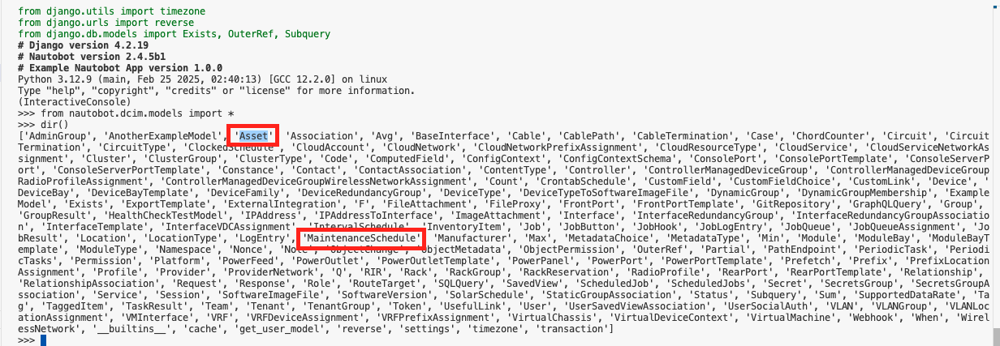

# Nautobot Database Model Part 2: Custom Data Model

At some point, we will want to create our own data models. Custom data models offers several advantages: 

- **Customization and Flexibility**: Custom data models allow you to tailor the database schema to fit the specific needs of your application. This flexibility enables you to define fields, relationships, and behaviors that are unique to your use case.

- **Data Integrity and Validation**: By defining your own data models, you can enforce data integrity and validation rules at the database level (we will discuss data integrity more in tomorrow's challenge). This ensures that the data stored in your database is consistent and adheres to the defined constraints.

- **Optimized Queries**: Custom data models allow you to optimize database queries for performance (we will discuss performance in [Day 65](../Day065_Database_Models_5_Performance_and_Scalability/README.md)). You can define indexes, constraints, and relationships that make data retrieval more efficient.

- **Enhanced Functionality**: With custom data models, you can add custom methods and properties to your models, enhancing the functionality of your application. This allows you to encapsulate business logic within the model itself.

- **Seamless Integration with Nautobot Data Models**: Perhaps the biggest advantage, if you already have data in Nautobot, custom data models integrate seamlessly with Nautobot's existing data models, such as `devices` and `circuits`. 

Other advantages include security, manageability, and security. 

The custom data models can be created as part of a custom app or just stand-alone data models we can use with Nautobot Jobs. 

Let's see a few examples of custom data models. Keep in mind these models are for illustrative purposes, many of them are already a part of existing Nautobot apps and core models. 

## Environment Setup

We will use a combination of [Scenario 2](../Lab_Setup/scenario_2_setup/README.md) lab, [https://demo.nautobot.com/](https://demo.nautobot.com/), and [Nautobot Documentation](https://docs.nautobot.com/projects/core/en/latest/user-guide/core-data-model/overview/introduction/) for today's challenge. 

```
$ cd nautobot
$ poetry shell
$ poetry install
$ invoke build
(be patient with this step)
$ invoke debug
(be patient with this step as well)
```

## Database Relationships

When we model real world objects, one of the important aspect we have to consider is the relationship between the objects. 

In Django, database relationships are defined using specific field types in models, which represent the relationships between different tables. Here are the main types of database relationships and their corresponding Django ORM commands:

> [!INFORMATION]
> These are for illustrative purposes, no need to enter them. 

1. One-to-Many Relationship (ForeignKey)
A one-to-many relationship is when a record in one table can be related to multiple records in another table. This is represented by a *ForeignKey* in Django.

Here is a classic author and books example, where one "author" can have many "books". 

> [!INFORMATION]
> These are easy enough to understand without creating them, but feel free to create them in the Codespace environment. 

```python
from django.db import models

class Author(models.Model):
    name = models.CharField(max_length=200)

    def __str__(self):
        return self.name

class Book(models.Model):
    title = models.CharField(max_length=200)
    author = models.ForeignKey(Author, on_delete=models.CASCADE)

    def __str__(self):
        return self.title
```

In Django, a *ForeignKey* is used to create a many-to-one relationship between two models. This means that each instance of the model with the *ForeignKey* field is related to one instance of the referenced model, but the referenced model can be related to multiple instances of the model with the *ForeignKey*. In our example, Book is the *many* to author's *one*, we use *ForeignKey* on the Book model. 

The *on_delete* argument specifies the behavior when the referenced object (in this case, an Author) is deleted. In our example, *CASCADE* means when the referenced object is deleted, we also delete the objects that have foreign keys to it. 

Here is the corresponding example of creating an Author and his/her books: 

```python
author = Author.objects.create(name="J.K. Rowling")
book1 = Book.objects.create(title="Harry Potter and the Philosopher's Stone", author=author)
book2 = Book.objects.create(title="Harry Potter and the Chamber of Secrets", author=author)

# retrieving books by an author
books = Book.objects.filter(author=author)
```

2. Many-to-Many Relationship (ManyToManyField)
A many-to-many relationship is when records in one table can be related to multiple records in another table and vice versa. This is represented by a *ManyToManyField* in Django.

Here is an example of (many) courses to (many) students: 

```python 
from django.db import models

class Student(models.Model):
    name = models.CharField(max_length=200)

    def __str__(self):
        return self.name

class Course(models.Model):
    title = models.CharField(max_length=200)
    students = models.ManyToManyField(Student)

    def __str__(self):
        return self.title
```

Creating students and courses: 

```python 
student1 = Student.objects.create(name="Alice")
student2 = Student.objects.create(name="Bob")
course = Course.objects.create(title="Django 101")
course.students.add(student1, student2)
```

Retrieving courses and students: 

```python 
courses = student1.course_set.all()
students = course.students.all()
```

3. One-to-One Relationship (OneToOneField)
A one-to-one relationship is when a record in one table is related to exactly one record in another table. This is represented by a *OneToOneField* in Django.

```python 
from django.db import models

class User(models.Model):
    username = models.CharField(max_length=200)

    def __str__(self):
        return self.username

class Profile(models.Model):
    user = models.OneToOneField(User, on_delete=models.CASCADE)
    bio = models.TextField()

    def __str__(self):
        return self.user.username
```

ORM commands: 

```python
user = User.objects.create(username="john_doe")
profile = Profile.objects.create(user=user, bio="Software Developer")

profile = user.profile

user = profile.user
```

These relationships allow you to structure your database in a way that reflects the real-world relationships between entities, and Django's ORM makes it easy to interact with these relationships using Python code.

Let's try out a data model in the network engineering context in Nautobot. 

## Asset Model

We can try to create an **Asset Model**. It would be a model used to track physical assets, where each asset is associated with a specific device.

```python
from django.db import models

class Asset(models.Model):
    device = models.ForeignKey(Device, on_delete=models.CASCADE)
    serial_number = models.CharField(max_length=100, unique=True)
    purchase_date = models.DateField()
    warranty_expiration = models.DateField()

    def __str__(self):
        return f"Asset {self.serial_number} for {self.device}"
```

We can put the above code under `nautobot -> dcim -> models -> devices.py `:


We will need to do the database migration: 

```shell
(nautobot-py3.10) @ericchou1 ➜ ~/nautobot (develop) $ invoke makemigrations

(nautobot-py3.10) @ericchou1 ➜ ~/nautobot (develop) $ invoke migrate

...
```

Let's try to make another custom model. 

## Maintenance Schedule Model

**Maintenance Schedule Model**: A model to schedule and track maintenance activities for devices within a location.

```python 
from django.db import models

class MaintenanceSchedule(models.Model):
    device = models.ForeignKey(Device, on_delete=models.CASCADE)
    maintenance_date = models.DateField()
    description = models.TextField()

    def __str__(self):
        return f"Maintenance for {self.device} on {self.maintenance_date}"
```

Migrate the database: 

```shell
(nautobot-py3.10) @ericchou1 ➜ ~/nautobot (develop) $ invoke makemigrations
Running docker compose command "exec nautobot nautobot-server makemigrations"
PYTHON_VER=3.12 \
NAUTOBOT_VER=2.4 \
docker compose \
    --project-name "nautobot-2-4" \
    --project-directory "/home/vscode/nautobot/development/" \
    -f "/home/vscode/nautobot/development/docker-compose.yml" \
    -f "/home/vscode/nautobot/development/docker-compose.postgres.yml" \
    -f "/home/vscode/nautobot/development/docker-compose.dev.yml" \
    -f "/home/vscode/nautobot/development/docker-compose.static-ports.yml" exec nautobot nautobot-server makemigrations
Migrations for 'dcim':
  nautobot/dcim/migrations/0069_maintenanceschedule.py
    - Create model MaintenanceSchedule

(nautobot-py3.10) @ericchou1 ➜ ~/nautobot (develop) $ invoke migrate
Running docker compose command "exec nautobot nautobot-server migrate"
PYTHON_VER=3.12 \
NAUTOBOT_VER=2.4 \
docker compose \
    --project-name "nautobot-2-4" \
    --project-directory "/home/vscode/nautobot/development/" \
    -f "/home/vscode/nautobot/development/docker-compose.yml" \
    -f "/home/vscode/nautobot/development/docker-compose.postgres.yml" \
    -f "/home/vscode/nautobot/development/docker-compose.dev.yml" \
    -f "/home/vscode/nautobot/development/docker-compose.static-ports.yml" exec nautobot nautobot-server migrate
Operations to perform:
  Apply all migrations: admin, auth, circuits, cloud, constance, contenttypes, dcim, django_celery_beat, django_celery_results, example_app, extras, ipam, sessions, silk, social_django, taggit, tenancy, users, virtualization, wireless
Running migrations:
  Applying dcim.0069_maintenanceschedule... OK
16:06:44.665 INFO    nautobot.extras.utils utils.py        refresh_job_model_from_job_class() :
...
```

Let's verify the custom models are created. 

## Verification

We can verify the models are created by using `nbshell`: 

```shell
(nautobot-py3.10) @ericchou1 ➜ ~/nautobot (develop) $ invoke nbshell
...
>>> from nautobot.dcim.models import *
>>> dir()
['AdminGroup', 'AnotherExampleModel', 'Asset', 'Association', 'Avg', 'BaseInterface', 'Cable', 'CablePath', 'CableTermination', 'Case', 'ChordCounter', 'Circuit', 'CircuitTermination', 'CircuitType', 'ClockedSchedule', 'CloudAccount', 'CloudNetwork', 'CloudNetworkPrefixAssignment', 'CloudResourceType', 'CloudService', 'CloudServiceNetworkAssignment', 'Cluster', 'ClusterGroup', 'ClusterType', 'Code', 'ComputedField', 'ConfigContext', 'ConfigContextSchema', 'ConsolePort', 'ConsolePortTemplate', 'ConsoleServerPort', 'ConsoleServerPortTemplate', 'Constance', 'Contact', 'ContactAssociation', 'ContentType', 'Controller', 'ControllerManagedDeviceGroup', 'ControllerManagedDeviceGroupRadioProfileAssignment', 'ControllerManagedDeviceGroupWirelessNetworkAssignment', 'Count', 'CrontabSchedule', 'CustomField', 'CustomFieldChoice', 'CustomLink', 'Device', 'DeviceBay', 'DeviceBayTemplate', 'DeviceFamily', 'DeviceRedundancyGroup', 'DeviceType', 'DeviceTypeToSoftwareImageFile', 'DynamicGroup', 'DynamicGroupMembership', 'ExampleModel', 'Exists', 'ExportTemplate', 'ExternalIntegration', 'F', 'FileAttachment', 'FileProxy', 'FrontPort', 'FrontPortTemplate', 'GitRepository', 'GraphQLQuery', 'Group', 'GroupResult', 'HealthCheckTestModel', 'IPAddress', 'IPAddressToInterface', 'ImageAttachment', 'Interface', 'InterfaceRedundancyGroup', 'InterfaceRedundancyGroupAssociation', 'InterfaceTemplate', 'InterfaceVDCAssignment', 'IntervalSchedule', 'InventoryItem', 'Job', 'JobButton', 'JobHook', 'JobLogEntry', 'JobQueue', 'JobQueueAssignment', 'JobResult', 'Location', 'LocationType', 'LogEntry', 'MaintenanceSchedule', 'Manufacturer', 'Max', 'MetadataChoice', 'MetadataType', 'Min', 'Module', 'ModuleBay', 'ModuleBayTemplate', 'ModuleType', 'Namespace', 'Nonce', 'Note', 'ObjectChange', 'ObjectMetadata', 'ObjectPermission', 'OuterRef', 'Partial', 'PathEndpoint', 'PeriodicTask', 'PeriodicTasks', 'Permission', 'Platform', 'PowerFeed', 'PowerOutlet', 'PowerOutletTemplate', 'PowerPanel', 'PowerPort', 'PowerPortTemplate', 'Prefetch', 'Prefix', 'PrefixLocationAssignment', 'Profile', 'Provider', 'ProviderNetwork', 'Q', 'RIR', 'Rack', 'RackGroup', 'RackReservation', 'RadioProfile', 'RearPort', 'RearPortTemplate', 'Relationship', 'RelationshipAssociation', 'Request', 'Response', 'Role', 'RouteTarget', 'SQLQuery', 'SavedView', 'ScheduledJob', 'ScheduledJobs', 'Secret', 'SecretsGroup', 'SecretsGroupAssociation', 'Service', 'Session', 'SoftwareImageFile', 'SoftwareVersion', 'SolarSchedule', 'StaticGroupAssociation', 'Status', 'Subquery', 'Sum', 'SupportedDataRate', 'Tag', 'TaggedItem', 'TaskResult', 'Team', 'Tenant', 'TenantGroup', 'Token', 'UsefulLink', 'User', 'UserSavedViewAssociation', 'UserSocialAuth', 'VLAN', 'VLANGroup', 'VLANLocationAssignment', 'VMInterface', 'VRF', 'VRFDeviceAssignment', 'VRFPrefixAssignment', 'VirtualChassis', 'VirtualDeviceContext', 'VirtualMachine', 'Webhook', 'When', 'WirelessNetwork', '__builtins__', 'cache', 'get_user_model', 'reverse', 'settings', 'timezone', 'transaction']
>>>
```



Creating custom models in Nautobot is one of the major steps we can take to customize Nautobot. Great job! 

## Day 62 To Do

Remember to stop the codespace instance on [https://github.com/codespaces/](https://github.com/codespaces/). 

Go ahead and write a post the steps you took to create a custom data model for today's challenge on a social media of your choice, make sure you use the tag `#100DaysOfNautobot` `#JobsToBeDone` and tag `@networktocode`, so we can share your progress! 

In tomorrow's challenge, we will discuss data integrality and security. See you tomorrow! 

[X/Twitter](<https://twitter.com/intent/tweet?url=https://github.com/nautobot/100-days-of-nautobot&text=I+just+completed+Day+62+of+the+100+days+of+nautobot+challenge+!&hashtags=100DaysOfNautobot,JobsToBeDone>)

[LinkedIn](https://www.linkedin.com/) (Copy & Paste: I just completed Day 62 of 100 Days of Nautobot, https://github.com/nautobot/100-days-of-nautobot, challenge! @networktocode #JobsToBeDone #100DaysOfNautobot) 
