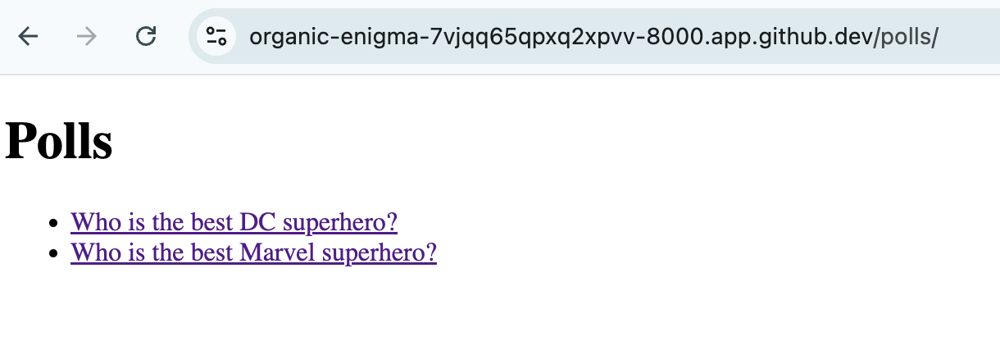
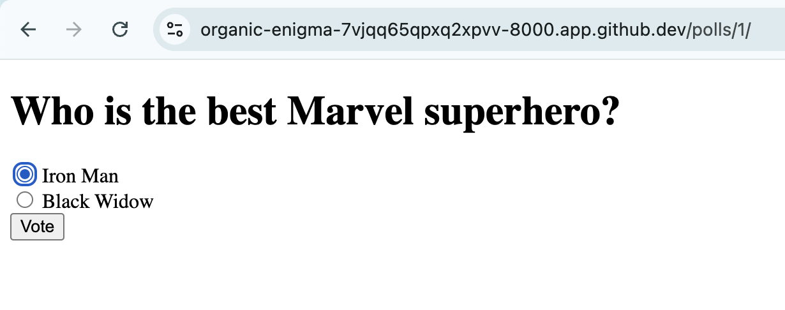

# Introduction to Django Class-Based Views

Django offers two primary ways to define views: function-based views (FBVs) and class-based views (CBVs). Each approach has its own strength and suitable for different scenarios. For nautobot, class-based views is what is predominately used. 

Up to this point, we have mostly been using function-based views. In today's challenge, we will introduce the basics of Django class-based views and how they differ from function-based views.

## Environment Setup

For today's challenge, we will convert [Day 49](https://github.com/nautobot/100-days-of-nautobot/blob/main/Day049_Django_Example_Part_4_Add_Forms/README.md)'s Python views from function-based views to class-based views. 

Please repeat the steps from [Day 46](https://github.com/nautobot/100-days-of-nautobot/blob/main/Day046_Django_Example_Part_1_Project_Setup_and_Creating_App/README.md) to [Day 49](https://github.com/nautobot/100-days-of-nautobot/blob/main/Day049_Django_Example_Part_4_Add_Forms/README.md) to create the `polls` app. 

## Review of Django Function-Based Views

Let us take a look at [Day 49](https://github.com/nautobot/100-days-of-nautobot/blob/main/Day049_Django_Example_Part_4_Add_Forms/README.md)'s `views.py` file using Python functions (function-based views): 

```python polls.views.py  
from django.shortcuts import render
from django.http import HttpResponseRedirect
from django.urls import reverse

from .models import Question, Choice

def index(request):
    latest_question_list = Question.objects.order_by('-pub_date')[:5]
    context = {'latest_question_list': latest_question_list}
    return render(request, 'polls/index.html', context)

def detail(request, question_id):
    question = Question.objects.get(pk=question_id)
    return render(request, 'polls/detail.html', {'question': question})

def vote(request, question_id):
    question = Question.objects.get(pk=question_id)
    try:
        selected_choice = question.choice_set.get(pk=request.POST['choice'])
    except (KeyError, Choice.DoesNotExist):
        return render(request, 'polls/detail.html', {
            'question': question,
            'error_message': "You didn't select a choice.",
        })
    else:
        selected_choice.votes += 1
        selected_choice.save()
        return HttpResponseRedirect(reverse('results', args=(question.id,)))

def results(request, question_id):
    question = Question.objects.get(pk=question_id)
    return render(request, 'polls/results.html', {'question': question})
```

The function-based views are simple to understand. The Python function takes at least the `request` object as an argument and return a response with a rendered HTML template. In the case of `detail()`, `vote()`, and `results()` views they also take a `questions_id` as an additional argument. 

By default, the `request.method` is assumed to be `GET`, if the methods are `POST`, `PUT`, or `DELETE` we will need to use `if/else` statements to add additional code. For example: 

```python 
from django.http import HttpResponse
from django.shortcuts import render

def my_view(request):
    if request.method == 'GET':
        # Logic for GET request
        return render(request, 'my_template.html')
    elif request.method == 'POST':
        # Logic for POST request
        return HttpResponse("Data received!")
    else:
         return HttpResponse("Method not allowed", status=405)
```

As simple as they are, Python functions lack advance features such as code reuse, inheritance, and become complex for more complex views. 

For those reasons, Django introduced a fresh approach with [class-based views](https://docs.djangoproject.com/en/5.1/topics/class-based-views/intro/) starting around Django version 1.3. 

## Django Class-Based Views

Class-based views provide an **object-oriented (OO)** approach to organizing your view code. They allow us to structure our views using Python classes rather than functions, which can lead to more reusable, maintainable, and testable code.

In class-based Views, views in Django are represented as classes. They provide a way to encapsulate view logic within a class, making it easier to reuse and extend. The drawback is if the user is not familiar with object-oriented programming, the learning curve can be steep. 

### Converting to Class-Based Views

We can convert the previous function-based views to class-based views (note the additional import of `generic` view from `django.views`). We can simply add the new views without deleting the previous function-based views: 

```python
from django.shortcuts import render
from django.http import HttpResponseRedirect
from django.urls import reverse

from django.views import generic #new

from .models import Question, Choice


class IndexView(generic.ListView):
    template_name = "polls/index.html"
    context_object_name = "latest_question_list"

    def get_queryset(self):
        """Return the last five published questions."""
        return Question.objects.order_by("-pub_date")[:5]


class DetailView(generic.DetailView):
    model = Question
    template_name = "polls/detail.html"


class ResultsView(generic.DetailView):
    model = Question
    template_name = "polls/results.html"

def vote(request, question_id):
    question = Question.objects.get(pk=question_id)
    try:
        selected_choice = question.choice_set.get(pk=request.POST['choice'])
    except (KeyError, Choice.DoesNotExist):
        return render(request, 'polls/detail.html', {
            'question': question,
            'error_message': "You didn't select a choice.",
        })
    else:
        selected_choice.votes += 1
        selected_choice.save()
        return HttpResponseRedirect(reverse('results', args=(question.id,)))

```

We will switch to the new views in `urls.py`: 

```python
from django.urls import path
from . import views

urlpatterns = [
    # path('', views.index, name='index'),
    # path('<int:question_id>/', views.detail, name='detail'),
    # path('<int:question_id>/results/', views.results, name='results'),
    # path('<int:question_id>/vote/', views.vote, name='vote'),
    path("", views.IndexView.as_view(), name="index"),
    path("<int:pk>/", views.DetailView.as_view(), name="detail"),
    path("<int:pk>/results/", views.ResultsView.as_view(), name="results"),
    path("<int:question_id>/vote/", views.vote, name="vote"),
]
```

Launch the `polls` app to verify the functionalities remain the same: 






We did not change the `vote()` FBV since it does not save us more work by switching, for more detail, take a look at [Django Tutorial Part 4](https://docs.djangoproject.com/en/5.1/intro/tutorial04/). 

### Advantages of Class-Based Views

It might not be obvious for simple views, but class-based views (CBVs) provides clear advantages over function-based views (FBVs) for all but the simplest views. 

Some advantages for CBVs are: 

1. **Reusability**: CBVs can be easily reused across different parts of your application. You can create base classes with common functionality and extend them as needed. As we saw in the example, we simply use `django.views.generic` for all of our CBVs. 

2. **Extensibility**: CBVs allow you to use inheritance to extend and customize views. This makes it easy to create complex views by combining and extending simpler ones.

3. **Maintainability**: CBVs promote a more organized and structured way of writing views, making your code easier to read and maintain.

We used `generic.ListView` and `generic.DetailView` in our example, but Django provides many other class-based views out of the box. 

### Common Class-Based Views in Django

Here is a summary of a few of the popular class-based views in Django: 

1. **TemplateView**: Renders a template. It's a simple view for rendering a template with a context.

2. **ListView**: Renders a list of objects. It's a view for displaying a list of objects from a *queryset*.

3. **DetailView**: Renders a detail page for a single object. It's used to display detailed information about a single object.

4. **CreateView**: Renders a form for creating a new object. It handles form submission and object creation.

5. **UpdateView**: Renders a form for updating an existing object. It handles form submission and object updating.

6. **DeleteView**: Renders a confirmation page for deleting an object. It handles object deletion upon confirmation.

### Resources

Class-based views can take a bit to get used to when one just started out in Django, which is the reason why we waited until **Day 66** to introduce it properly.

The advantages CBV provide over FBV out weight the learning curve in the long run. For newer projects, including Nautobot, class-based views is almost always the default choice. 

Here are some additional resources that can be helpful in learning more about class-based views: 

- [Introduction to Class-Based Views](https://docs.djangoproject.com/en/5.1/topics/class-based-views/intro/)

- [Built-in class-based generic views](https://docs.djangoproject.com/en/5.1/topics/class-based-views/generic-display/)

Congratulations on finishing Day 66! 

## Day 66 To Do

Remember to stop the codespace instance on [https://github.com/codespaces/](https://github.com/codespaces/). 

Go ahead and post a screenshot of the new class-based views for today's challenge on a social media of your choice, make sure you use the tag `#100DaysOfNautobot` `#JobsToBeDone` and tag `@networktocode`, so we can share your progress! 

In tomorrow's challenge, we will learn about Nautobot's class-based views. See you tomorrow! 

[X/Twitter](<https://twitter.com/intent/tweet?url=https://github.com/nautobot/100-days-of-nautobot&text=I+just+completed+Day+66+of+the+100+days+of+nautobot+challenge+!&hashtags=100DaysOfNautobot,JobsToBeDone>)

[LinkedIn](https://www.linkedin.com/) (Copy & Paste: I just completed Day 66 of 100 Days of Nautobot, https://github.com/nautobot/100-days-of-nautobot, challenge! @networktocode #JobsToBeDone #100DaysOfNautobot) 
