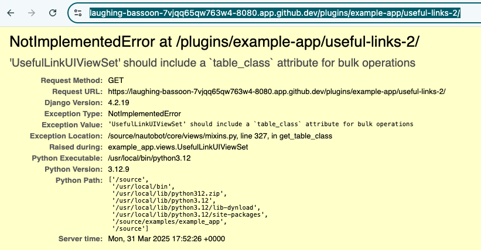

# Nautobot UI Component Framework - Part 1

[Nautobot UI Component Framework](https://docs.nautobot.com/projects/core/en/stable/development/core/ui-component-framework/) was introduced in Nautobot v2.4 and changes how Nautobot create object views in the applications. Instead of writing HTML templates, we *declare* the UI structure using Python objects. This allows us to have more consistent, maintainable, and responsive interfaces. 

**Why Use the UI Framework?**
  - Reduced Development Time
  - Consistency in design patterns
  - Reusable Components
  - Extensible and customizable

In today and tomorrow's challenges, we will try to gain an understanding of the Nautobot UI Framework, its components, and how to use it to create object detail views.

## Environment Setup

We will use a combination of [Scenario 2](../Lab_Setup/scenario_2_setup/README.md) lab, [https://demo.nautobot.com/](https://demo.nautobot.com/), and [Nautobot Documentation](https://docs.nautobot.com/projects/core/en/latest/user-guide/core-data-model/overview/introduction/) for today's challenge. 

```$ cd nautobot
$ poetry shell
$ poetry install
$ invoke build
(be patient with this step)
$ invoke debug
(be patient with this step as well)
```

## Example App with UI Component Framework

In the days between [Day 50](https://github.com/nautobot/100-days-of-nautobot/tree/main/Day050_Example_App_Overview) to [Day 59](https://github.com/nautobot/100-days-of-nautobot/tree/main/Day059_Example_App_Other_Considerations), we used the `Example App` in the nautobot repository to add useful links (model, view, URL, and navigation) to the app. Let's see how we can use the new UI Component to achieve the same goal. 

For `models.py` we will re-use the same `UsefulLink` model we created in [Day 52](https://github.com/nautobot/100-days-of-nautobot/blob/main/Day052_Example_App_Creating_Data_Models_Part_2/README.md). If you need to re-create it, remember to use `makemigrations` and `migrate` to update the database. 

Here is the code snippet for the model under `nautobot -> examples -> example_app -> models.py`: 

```python models.py
from django.db import models

class UsefulLink(BaseModel):
    url = models.URLField(unique=True)
    description = models.CharField(max_length=255)

    def __str__(self):
        return self.url
```

The next step would be to create the `views` for the model. This is where we can start to use Nautobot UI Component framework. We can add the following code to  `views.py` file under `example_app`: 

```python file=views.py
from nautobot.apps.ui import ObjectDetailContent, SectionChoices, ObjectFieldsPanel

class UsefulLinkUIViewSet(views.NautobotUIViewSet):
    queryset = UsefulLink.objects.all()

    object_detail_content = ObjectDetailContent(
        panels=[
            ObjectFieldsPanel(
                weight=100,
                section=SectionChoices.LEFT_HALF,
                fields=[
                    "url",
                    "description",
                ],
            )
        ]
    )
```

How do we know to use `object_detail_content` and `ObjectDetailContent` for our code? It was a combination of reading the doc for [Basic Setup](https://docs.nautobot.com/projects/core/en/stable/development/core/ui-component-framework/#basic-setup) and reading the code snippet for `ExampleModelUIViewSet` in the `example_app -> views.py` file. 

> [!TIP]
> [Panels](https://docs.nautobot.com/projects/core/en/stable/development/core/ui-component-framework/#panels) is the main building blocks for UI, along with [Tabs](https://docs.nautobot.com/projects/core/en/stable/development/core/ui-component-framework/#panels) and [Buttons](https://docs.nautobot.com/projects/core/en/stable/development/core/ui-component-framework/#buttons)

As with other `NautobotUIVIewSet` views, we will register the new `viewset` with `NautobotUIViewSetRouter` in `urls.py`. Notice we use `useful-link-2` as the endpoint (recall previous URL was `useful-link`): 

```python file=urls.py
app_name = "example_app"
router = NautobotUIViewSetRouter()
...
router.register("useful-links-2", views.UsefulLinkUIViewSet)
```

Notice in the `views.py` code we did not specify the exact HTML template to render, which is the point, the HTML base template is *implied*. 

We can now point our browser to `https://<name>.app.github.dev/plugins/example-app/useful-links-2/` to take a look at the page. 

Oops, there is an error: 



As it turns out, the components of `tables` and `filtersets` (that we will go over in future days) are tightly coupled with Nautobot UI component framework that we will need to include them here. Fortunately, they are not difficult to understand, even this is the first time we see their usage. 

Let's add the following code to `nautobot -> examples -> example_app -> tables.py`: 

```python file=tables.py
from example_app.models import AnotherExampleModel, ExampleModel, UsefulLink

class UsefulLinkModelTable(BaseTable):
    """Table for list view of `UsefulLink` objects."""

    pk = ToggleColumn()
    name = tables.LinkColumn()
    actions = ButtonsColumn(ExampleModel)

    class Meta(BaseTable.Meta):
        model = UsefulLink
        fields = ["url", "description"]
```

Add the following code to `nautobot -> examples -> example_app -> filters.py`:

```python file=filters.py
from example_app.models import AnotherExampleModel, ExampleModel, UsefulLink

class UsefulLinkModelFilterSet(BaseFilterSet):
    """API filter for filtering usefullink model objects."""

    q = SearchFilter(
        filter_predicates={
            "url": "icontains",
            "description": "icontains",
        },
    )

    class Meta:
        model = UsefulLink
        fields = [
            "url",
            "description",
        ]
```

We can now include them in the `views.py` code: 

```python views.py
class UsefulLinkUIViewSet(views.NautobotUIViewSet):
    queryset = UsefulLink.objects.all()
    table_class = tables.UsefulLinkModelTable #new
    filterset_class = filters.UsefulLinkModelFilterSet #new
    object_detail_content = ObjectDetailContent(
        panels=[
            ObjectFieldsPanel(
                weight=100,
                section=SectionChoices.LEFT_HALF,
                fields=[
                    "url",
                    "description",
                ],
            )
        ]
    )
```

We can navigate back to the `useful-link-2` page and see the page displayed: 


We can't perform operations such as edit the links directly in the page, but we can at least get a taste of the power of the workings of Nautobot UI component framework. 

Congratulations on completing Day 73!

## Resources 

- [Nautobot UI Component Framework](https://docs.nautobot.com/projects/core/en/stable/development/core/ui-component-framework/)
- [nautobot.apps.ui](https://docs.nautobot.com/projects/core/en/stable/code-reference/nautobot/apps/ui/)

## Day 73 To Do

Remember to stop the codespace instance on [https://github.com/codespaces/](https://github.com/codespaces/). 

Go ahead and post a screenshot of a new page that we rendered using Nautobot UI Component framework from today's challenge on a social media of your choice, make sure you use the tag `#100DaysOfNautobot` `#JobsToBeDone` and tag `@networktocode`, so we can share your progress! 

In tomorrow's challenge, we will be going over deeper into Nautobot UI Component framework. See you tomorrow! 

[X/Twitter](<https://twitter.com/intent/tweet?url=https://github.com/nautobot/100-days-of-nautobot&text=I+just+completed+Day+73+of+the+100+days+of+nautobot+challenge+!&hashtags=100DaysOfNautobot,JobsToBeDone>)

[LinkedIn](https://www.linkedin.com/) (Copy & Paste: I just completed Day 73 of 100 Days of Nautobot, https://github.com/nautobot/100-days-of-nautobot, challenge! @networktocode #JobsToBeDone #100DaysOfNautobot) 
