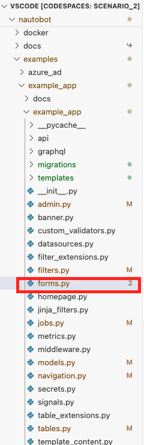
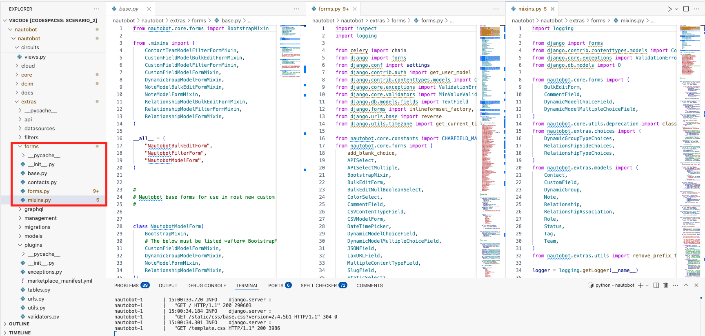

# Day 78: Nautobot Forms

In today's challenge, we will discuss how to use forms in Nautobot. 

## Environment Setup

We will use a combination of [Scenario 2](../Lab_Setup/scenario_2_setup/README.md) lab, [https://demo.nautobot.com/](https://demo.nautobot.com/), and [Nautobot Documentation](https://docs.nautobot.com/projects/core/en/latest/user-guide/core-data-model/overview/introduction/) for today's challenge. 

```
$ cd nautobot
$ poetry shell
$ poetry install
$ invoke build
(be patient with this step)
$ invoke debug
(be patient with this step as well)
```

## Forms in Nautobot

As with HTML in general, forms in Nautobot are used to handle user input and validate data before saving it to the database. Nautobot extends Django forms to provide additional functionality and customization options.

The forms code are mainly contained within the `forms.py` file within each of the apps, for example `nautobot -> examples -> example_app -> forms.py`: 



As with the DRY (Don't repeat yourself) concept, many of the shared code for forms can also be traced back to `nautobot -> extras -> forms`: 



### Key Components

1. **Form Classes**: Classes that represent forms in Nautobot.
2. **Fields**: Attributes of the form that represent individual input elements.
3. **Mixins**: Classes that add additional functionality to forms.

### Example: Using Forms

Let's try to modify a form to reinforce our learning. 

Going back to our `example_app`, we saw the `ExampleModelUIViewSet` contains form references for `forms.ExampleModelFilterForm` in the `views.py`: 

```python
from example_app import filters, forms, tables

class ExampleModelUIViewSet(views.NautobotUIViewSet):
    bulk_update_form_class = forms.ExampleModelBulkEditForm
    filterset_class = filters.ExampleModelFilterSet
    filterset_form_class = forms.ExampleModelFilterForm
    form_class = forms.ExampleModelForm
    queryset = ExampleModel.objects.all()
    serializer_class = serializers.ExampleModelSerializer
    table_class = tables.ExampleModelTable
...
```

Let us look at the code snippet `ExampleModelFilterForm` in `forms.py`: 

```python 
from django import forms

from nautobot.apps.constants import CHARFIELD_MAX_LENGTH
from nautobot.apps.forms import (
    BootstrapMixin,
    BulkEditForm,
    NautobotBulkEditForm,
    NautobotModelForm,
    TagsBulkEditFormMixin,
)

class ExampleModelFilterForm(BootstrapMixin, forms.Form):
    """Filtering/search form for `ExampleModel` objects."""

    model = ExampleModel
    q = forms.CharField(required=False, label="Search")
    name = forms.CharField(max_length=CHARFIELD_MAX_LENGTH, required=False)
    number = forms.IntegerField(required=False)
```

Building further from [Day 67](../Day067_Nautobot_Views_2_Nautobot_UI_ViewSet/README.md), we can add a `filter_form_class` for `UsefulLinkUIViewSet` to use a separate form. 

In Day 67, we map the URL for `https://<url>/plugins/example-app/useful-links-2` the `NautobotUIViewSet`. If we click on the `Filter` button: 


It leads us to a generic form: 


Let us create a new filter form in `forms.py`: 

```python 
from example_app.models import AnotherExampleModel, ExampleModel, UsefulLink


class UsefullinkModelFilterForm(BootstrapMixin, forms.Form):
    """Filtering/search form for `UsefullinkModel` objects."""

    model = UsefulLink
    q = forms.CharField(required=False, label="Search")
    url = forms.CharField(max_length=CHARFIELD_MAX_LENGTH, required=False)
    description = forms.CharField(max_length=CHARFIELD_MAX_LENGTH, required=False)
```

We can wire the new filter form to the `UsefulLinkUIViewSet` in the `views.py`: 

```python
class UsefulLinkUIViewSet(views.NautobotUIViewSet):
    queryset = UsefulLink.objects.all()
    table_class = tables.UsefulLinkModelTable
    filterset_class = filters.UsefulLinkModelFilterSet
    filterset_form_class = forms.UsefullinkModelFilterForm #new
    object_detail_content = ObjectDetailContent(
        panels=[
            ObjectFieldsPanel(
                weight=100,
                section=SectionChoices.LEFT_HALF,
                fields=[
                    "url",
                    "description",
                ],
            )
        ]
    )
```

By doing so, we can use the customized form when we click on the `filter` button: 


It is worth noting that we typically have to write HTML code (along with CSS and possibly JavaScript) when we work with forms, but Nautobot allows us to use Python objects to render HTML code, giving us a more clean, consistent look. 

Congratulations on completing Day 77! 

## Day 77 To Do

Remember to stop the codespace instance on [https://github.com/codespaces/](https://github.com/codespaces/). 

Go ahead and post a screenshot of the new filter form from today's challenge on a social media of your choice, make sure you use the tag `#100DaysOfNautobot` `#JobsToBeDone` and tag `@networktocode`, so we can share your progress! 

In tomorrow's challenge, we will be taking a look at Nautobot tables. See you tomorrow! 

[X/Twitter](<https://twitter.com/intent/tweet?url=https://github.com/nautobot/100-days-of-nautobot&text=I+just+completed+Day+77+of+the+100+days+of+nautobot+challenge+!&hashtags=100DaysOfNautobot,JobsToBeDone>)

[LinkedIn](https://www.linkedin.com/) (Copy & Paste: I just completed Day 77 of 100 Days of Nautobot, https://github.com/nautobot/100-days-of-nautobot, challenge! @networktocode #JobsToBeDone #100DaysOfNautobot) 
