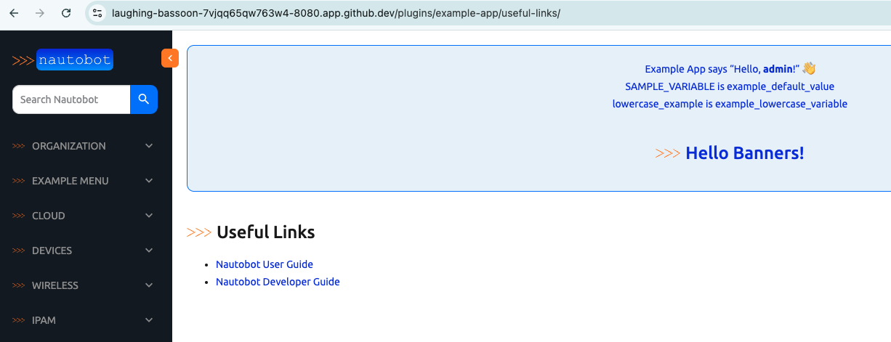
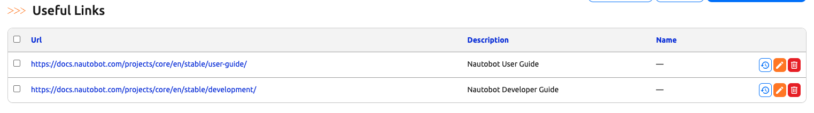

# Nautobot Tables

Tables in Nautobot are used to display lists of data in a tabular format. Nautobot extends Django tables to provide additional functionality and display options.

## Environment Setup

We will use a combination of [Scenario 2](../Lab_Setup/scenario_2_setup/README.md) lab, [https://demo.nautobot.com/](https://demo.nautobot.com/), and [Nautobot Documentation](https://docs.nautobot.com/projects/core/en/latest/user-guide/core-data-model/overview/introduction/) for today's challenge. 

```
$ cd nautobot
$ poetry shell
$ poetry install
$ invoke build
(be patient with this step)
$ invoke debug
(be patient with this step as well)
```

### Key Components

Here are the main components of Nautobot tables. 

1. **Table Classes**: Classes that represent tables in Nautobot.
2. **Columns**: Attributes of the table that represent individual columns.

### Example: Tables with HTML

Let's do a bit of a review from [Day 68](../Day068_Nautobot_Views_3_Nautobot_Views/README.md) when we used a `ListView` for the first view of `UsefulLink` model with `UsefulLinkListView` in `views.py`: 

```python
class UsefulLinkListView(ListView): 
    model = UsefulLink
    template_name = "example_app/useful_link_detail.html"
    context_object_name = "useful_links"

    def get_queryset(self):
        return UsefulLink.objects.all()
```

In that view, we referenced an HTML page that will render the view for the items when users access the content. We use an unordered list with `<ul>` to loop over the links in the `useful_link_detail.html`: 

```html



<h1>Useful Links</h1>
<ul>
    
    <li><a href="{{ link.url }}">{{ link.description }}</a></li>
    
</ul>


```

Here is a screenshot of the view: 



If we wanted to make the list in a more presentable table view, we can modify the HTML code accordingly with `table head <thead>` `table row <tr>` `table head <th>` and a few other table-related HTML formatting tags for the `useful_link_detail.html`: 

```html



<h1>Useful Links</h1>
<table border="1" style="border-collapse: collapse; width: 100%;">
    <thead style="background-color: #f2f2f2;">
        <tr>
            <th>Description</th>
            <th>URL</th>
        </tr>
    </thead>
    <tbody>
        
        <tr>
            <td>{{ link.description }}</td>
            <td><a href="{{ link.url }}">{{ link.url }}</a></td>
        </tr>
        
    </tbody>
</table>


```

The end result is a better view with a table. 


That is a lot of HTML just to make a simple table. We will need more styling to make it similar to the other Nautobot HTML pages. More over, we will repeat the same HTML code pattern for all the HTML pages to make them look similar. 

### Example: Nautobot Table with Python 

Let's compare that to the `NautobotUIViewSet` that reference the same model with `table_class = tables.UsefulLinkModelTable`: 

> [!INFORMATION]
> We are not making any additional changes form previous days, just re-examining the code in the `views.py`. 

```python
class UsefulLinkUIViewSet(views.NautobotUIViewSet):
    queryset = UsefulLink.objects.all()
    table_class = tables.UsefulLinkModelTable
    ...
```

The `UsefulLinkModelTable` inherent the `BaseTable` with Meta class indicating the model and the fields in the `tables.py`: 

```python
class UsefulLinkModelTable(BaseTable):
    """Table for list view of `UsefulLink` objects."""

    pk = ToggleColumn()
    name = tables.LinkColumn()
    actions = ButtonsColumn(UsefulLink)

    class Meta(BaseTable.Meta):
        model = UsefulLink
        fields = ["url", "description"]
```

The result is the better formatted table, consistent with the proper styles. The best part is most of the code was already done for you: 



That is really the main idea of using tables with Python code. We can re-use code that was already done *and* it gives us consistent presentation. 

Congratulations on completing Day 78!

## Day 78 To Do

Remember to stop the codespace instance on [https://github.com/codespaces/](https://github.com/codespaces/). 

Go ahead and post your thoughts on using tables from today's challenge on a social media of your choice, make sure you use the tag `#100DaysOfNautobot` `#JobsToBeDone` and tag `@networktocode`, so we can share your progress! 

In tomorrow's challenge, we will be working with filters. See you tomorrow! 

[X/Twitter](<https://twitter.com/intent/tweet?url=https://github.com/nautobot/100-days-of-nautobot&text=I+just+completed+Day+78+of+the+100+days+of+nautobot+challenge+!&hashtags=100DaysOfNautobot,JobsToBeDone>)

[LinkedIn](https://www.linkedin.com/) (Copy & Paste: I just completed Day 78 of 100 Days of Nautobot, https://github.com/nautobot/100-days-of-nautobot, challenge! @networktocode #JobsToBeDone #100DaysOfNautobot) 
