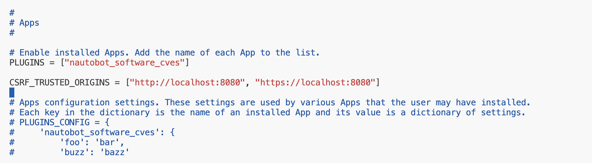
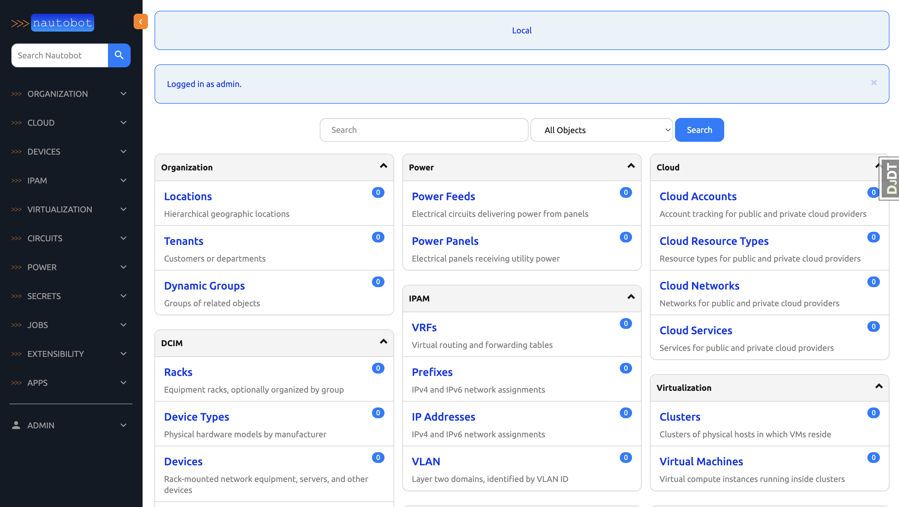

# Capstone Project Part 1. Overview: Nautobot Software CVE Management App

Welcome to the final stretch of our 100 Days of Nautobot journey! Over the next ten days, Days 80 - 92, we'll channel everything we've learned so far into creating a capstone project: Nautobot Software CVE Management APp. We'll guide you through the entire process. By the end of this segment, you'll have a fully functional Nautobot app to showcase your creativity and technical prowess. Let's embark on this journey and build something amazing together!

## Purpose of the App

**Note:** This app is intended for **demonstration and learning purposes** only. For a comprehensive solution, consider using the official [Nautobot Device Lifecycle Management App](https://docs.nautobot.com/projects/device-lifecycle/en/latest/), which provides a more robust approach to CVE tracking and software lifecycle management.

The **Nautobot Software CVE Management App** is designed to enhance security awareness by integrating software Common Vulnerabilities and Exposures (**CVEs**) directly into Nautobot. This app provides visibility into known vulnerabilities for the software stored in Nautobot, helping teams stay informed about security risks within their network environment.

## Environment Setup

For the Capstone for Days 80 - 92, we will use [Scenario 2](../Lab_Setup/scenario_2_setup/README.md) lab with Codespace as we have been doing. 

As we have seen in [Day 42](https://github.com/nautobot/100-days-of-nautobot/tree/main/Day042_Baking_an_App_Cookie), when we 'bake an app cookie' we will have a fully functional, self-contained Nautobot app development environment. 

### **Key Objectives:**
- Automatically retrieve and associate **published CVEs** with software records already stored in Nautobot.
- Enable **efficient tracking** of software vulnerabilities.
- Leverage Nautobot’s existing data models to avoid unnecessary complexity in the initial phase.

## Development Approach

### **Step 1: Baking the Cookie (Generating the Nautobot App)**
The first step in developing this app is to **bake a cookie**, which means generating a new Nautobot app using the official Cookiecutter template. This establishes a standardized project structure, making it easier to develop and maintain the app.

### **Step 2: Exploring the Nautobot Developer API**
For the initial implementation, we will **not** create custom models. Instead, we will:
- Use Nautobot’s built-in data models to populate CVE information.
- Focus on **fetching, storing, and displaying CVE data** using existing Nautobot structures.
- Ensure that future enhancements, such as automation workflows or integrations with external vulnerability databases, can be seamlessly incorporated.

By following this approach, we maintain a lightweight and efficient solution while leveraging Nautobot’s core capabilities. Future iterations may introduce custom models and additional features based on evolving requirements.

# Starting a Nautobot App with Cookiecutter

Cookiecutter is a tool designed to generate projects from templates, combining a predefined structure with user-provided input. In this case, we’ll use the **Nautobot Cookiecutter template** to create a new Nautobot app efficiently.

The Cookiecutter template we’ll be using is provided by Nautobot at:  
🔗 [Nautobot Cookiecutter Template](https://github.com/nautobot/cookiecutter-nautobot-app)

## Why Use Cookiecutter?

- **Standardized Structure** – Ensures best practices and consistency across Nautobot apps.
- **Automated Setup** – Reduces manual setup time by generating boilerplate code.
- **Customizable** – Allows you to tailor your app based on project-specific requirements.

## How It Works

1. **Cookiecutter downloads the Nautobot template** from GitHub.
2. **You’ll be prompted for information** such as your app name, author details, and project metadata.
3. **The tool generates a new project** with a structured directory and necessary files.

By following this guide, you'll learn how to use Cookiecutter to quickly scaffold a Nautobot app and get started with development.

# Generating the Nautobot App

We will need to install Cookiecutter first: 

```bash
@ericchou1 ➜ ~ $ python3 -m pip install --user cookiecutter
...
Successfully installed Jinja2-3.1.6 MarkupSafe-3.0.2 arrow-1.3.0 binaryornot-0.4.4 chardet-5.2.0 cookiecutter-2.6.0 python-dateutil-2.9.0.post0 python-slugify-8.0.4 pyyaml-6.0.2 six-1.17.0 text-unidecode-1.3 types-python-dateutil-2.9.0.20241206
```

To generate a new Nautobot app using Cookiecutter, run the following command in the user's home directory:

```bash
cookiecutter https://github.com/nautobot/cookiecutter-nautobot-app.git --directory=nautobot-app
```

Cookiecutter will prompt you for various configuration details. You can fill in your GitHub account username if you want to, or just hit Return to accept the default. This is just used to fill in some blanks in the project template; it doesn’t send data out to GitHub or anything like that.

1. **GitHub Username (optional):**  
   ```
   codeowner_github_usernames (): 
   ```
   You can enter your GitHub username or leave it blank. This is optional and only used for code ownership metadata in the generated files. Leave it blank if not needed.

2. **Full Name:**  
   ```
   full_name (Network to Code, LLC): 
   ```
   Enter your name or your organization’s name.

3. **Email Address:**  
   ```
   email (info@networktocode.com):
   ```
   Enter your email address.

4. **GitHub Organization:**  
   ```
   github_org (nautobot):
   ```
   The GitHub organization where this app would be published, if you decide to publish it later.

5. **App Name:**  
   ```
   app_name (my_app): nautobot_software_cves
   ```
   Here we recommend that for now, you enter nautobot_software_cves as the App name or you can use any name you want. This will be intelligently used to customize the defaults for the rest of the App template, as seen below:

6. **Additional Naming Parameters:**  
   ```
   verbose_name (Nautobot Software Cves): 
   app_slug (nautobot-software-cves): 
   project_slug (nautobot-app-nautobot-software-cves): nautobot-app-software-cves
   repo_url (https://github.com/nautobot/nautobot-app-software-cves):
   base_url (nautobot-software-cves): software-cves
   ```

7. **Nautobot Version Support:**  
   ```
   min_nautobot_version (2.0.0): 2.3.2
   max_nautobot_version (2.9999):
   ```
   Specify the Nautobot versions your app will support.

8. **Project Metadata:**  
   ```
   camel_name (NautobotSoftwareCves): 
   project_short_description (Nautobot Software Cves):
   ```

9. **Model Class (optional):**  
   ```
   model_class_name (NautobotSoftwareCvesExampleModel): None
   ```
   If you want an example model class to be generated, enter its name. Otherwise, enter `None` to skip this step. Select None for now.

10. **Open Source License:**  
   ```
   Select open_source_license
   1 - Apache-2.0
   2 - Not open source
   Choose from [1/2] (1): 1
   ```
   Select an appropriate license for your project.

11. **Documentation URLs:**  
   ```
   docs_base_url (https://docs.nautobot.com):
   docs_app_url (https://docs.nautobot.com/projects/nautobot-software-cves/en/latest):
   ```
   These determine where your app’s documentation will be hosted.

# Exploring the Nautobot App Folder Structure

After generating your Nautobot app, let's explore its directory structure and understand the purpose of each file and folder.

## Navigating to Your App Directory

Change into the newly created app directory:

```bash
cd nautobot-app-software-cves
```

Now, take a look at the project structure using the `tree` command:

```bash
tree .
```

## Project Structure Overview

```
nautobot-app-software-cves/
├── LICENSE
├── README.md
├── changes/
├── development/
│   ├── Dockerfile
│   ├── creds.example.env
│   ├── development.env
│   ├── development_mysql.env
│   ├── docker-compose.base.yml
│   ├── docker-compose.dev.yml
│   ├── docker-compose.mysql.yml
│   ├── docker-compose.postgres.yml
│   ├── docker-compose.redis.yml
│   ├── nautobot_config.py
│   ├── towncrier_template.j2
├── docs/
│   ├── admin/
│   ├── assets/
│   ├── dev/
│   ├── images/
│   │   └── icon-nautobot-software-cves.png
│   ├── index.md
│   ├── requirements.txt
│   ├── user/
├── invoke.example.yml
├── invoke.mysql.yml
├── mkdocs.yml
├── nautobot_software_cves/
│   ├── __init__.py
│   ├── tests/
│   │   ├── __init__.py
│   │   ├── test_api.py
│   │   ├── test_basic.py
├── pyproject.toml
└── tasks.py
```

### Folder and File Descriptions

#### **Top-Level Files**
- **LICENSE** – Specifies the software license (default is Apache-2.0).
- **README.md** – A generic template for your project's README file.
- **changes/** – Used for tracking changes to the project, managed via [towncrier](https://towncrier.readthedocs.io/en/stable/).

#### **Development Environment (`development/`)**
This directory contains files related to the development environment, primarily for Docker-based setups:
- **Dockerfile** – Defines the container setup for the app.
- **docker-compose.\*.yml** – Various Docker Compose configurations for different database backends.
- **nautobot_config.py** – Development-specific Nautobot configuration (not for production use).

#### **Documentation (`docs/`)**
This directory provides a starting point for writing documentation:
- **admin/** – Boilerplate for installation and administration guides.
- **dev/** – Templates for documenting development procedures.
- **user/** – User-facing documentation templates.
- **index.md** – The landing page for your app’s documentation.
- **requirements.txt** – Defines dependencies required for rendering documentation.

#### **Configuration & Automation Files**
- **invoke.example.yml / invoke.mysql.yml** – Example Invoke configuration files for automating common tasks.
- **mkdocs.yml** – Configuration for [MkDocs](https://www.mkdocs.org/) to generate project documentation.

#### **App Source Code (`nautobot_software_cves/`)**
- **`__init__.py`** – Marks the directory as a Python module.
- **tests/** – Contains example unit tests (`test_api.py`, `test_basic.py`).

#### **Project Metadata & Build System**
- **pyproject.toml** – Defines the app as a Python package, including dependencies and build instructions.
- **tasks.py** – Predefined tasks that can be executed using [Invoke](https://www.pyinvoke.org/).

## Summary

This structure provides a solid foundation for developing, testing, and documenting your Nautobot app. While some files may evolve over time, understanding this layout will help you manage and extend your app effectively.

## Finalizing the Setup

Once Cookiecutter has finished generating the project, follow these steps to complete the setup:

```bash
cd nautobot-app-software-cves
poetry lock
cp development/creds.example.env development/creds.env
cp invoke.example.yml invoke.yaml
```

🔹 Before proceeding, **please ensure that `nautobot_ver` in your `invoke.yaml` matches the Nautobot version defined in `pyproject.toml`**.  

```
(nautobot-software-cves-py3.10) @ericchou1 ➜ ~/nautobot-app-software-cves $ cat pyproject.toml 
...
[tool.poetry.dependencies]
python = ">=3.8,<3.13"
# Used for local development
nautobot = "^2.3.2"

(nautobot-software-cves-py3.10) @ericchou1 ➜ ~/nautobot-app-software-cves $ cat invoke.yaml 
---
nautobot_software_cves:
  nautobot_ver: "2.3.2"
  python_ver: "3.11"
  # local: false
  # compose_dir: "/full/path/to/nautobot-app-software-cves/development"
...
```

If they do not match, you can update `invoke.yaml` with the correct version using the following commands:

```bash
$ nautobot_version=$(awk -F'"' '/nautobot =/ {print $2}' pyproject.toml | tr -d '\n' | tr -d '*^')
$ sed -i "s/nautobot_ver: \".*\"/nautobot_ver: \"$nautobot_version\"/" invoke.yaml
```

Finally, we can run the `poetry` and `invoke` commands to build and start nautobot:

```bash
poetry shell 
poetry install
invoke build #be patient with this step
invoke makemigrations
invoke debug #be patient with this step
```

Let's leave the terminal window open, so we can observe all future messages generated by the different containers.

There is one more thing we need to do regarding the CSRF setting (as we did in Day 47) due to the port forwarding set up in Codespace. 

Use a separate terminal window to attach to the nautobot docker instance and make the following changes. Do not do this in production, we will only do this for the lab:

```
(nautobot-docker-compose-py3.10) @ericchou1 ➜ ~/nautobot-docker-compose (main) $ docker exec -it -u root nautobot-software-cves-nautobot-1 bash

root@1335a55d0eb1:/source# ls
LICENSE  README.md  changes  development  dist  docs  invoke.example.yml  invoke.mysql.yml  mkdocs.yml  my_awesome_app  poetry.lock  pyproject.toml  tasks.py

root@1335a55d0eb1:/source# cd /opt/nautobot/

root@1335a55d0eb1:/opt/nautobot# apt update
root@1335a55d0eb1:/opt/nautobot# apt install -y vim

root@1335a55d0eb1:/opt/nautobot# vim nautobot_config.py 

CSRF_TRUSTED_ORIGINS = ["http://localhost:8080", "https://localhost:8080"] 
```


Next, we will open Nautobot in a separate browser window using the forwarded port. To do this, go to ```PORTS``` and click on the globe icon. 


> [!NOTE] 
> Use admin/admin for username and password. 

We now have Nautobot running in debug mode with a browser window open to access the Nautobot UI. 



Congratulations on completing Part 1 of the Capstone project! 

## Day 80 To Do

Remember to stop the codespace instance on [https://github.com/codespaces/](https://github.com/codespaces/). We highly recommend to just stop the instance, **not** deleting the instance until we completed the whole Capstone project at Day 89, as the days will build on each other.  

Go ahead and post a screenshot of this new app instance you have built for today's challenge, make sure you use the tag `#100DaysOfNautobot` `#JobsToBeDone` and tag `@networktocode`, so we can share your progress! 

In tomorrow's challenge, we will continue on with the Capstone project. See you tomorrow! 

[X/Twitter](<https://twitter.com/intent/tweet?url=https://github.com/nautobot/100-days-of-nautobot&text=I+just+completed+Day+80+of+the+100+days+of+nautobot+challenge+!&hashtags=100DaysOfNautobot,JobsToBeDone>)

[LinkedIn](https://www.linkedin.com/) (Copy & Paste: I just completed Day 80 of 100 Days of Nautobot, https://github.com/nautobot/100-days-of-nautobot, challenge! @networktocode #JobsToBeDone #100DaysOfNautobot) 
