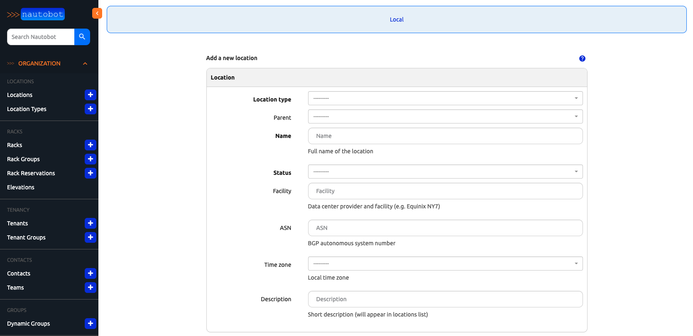
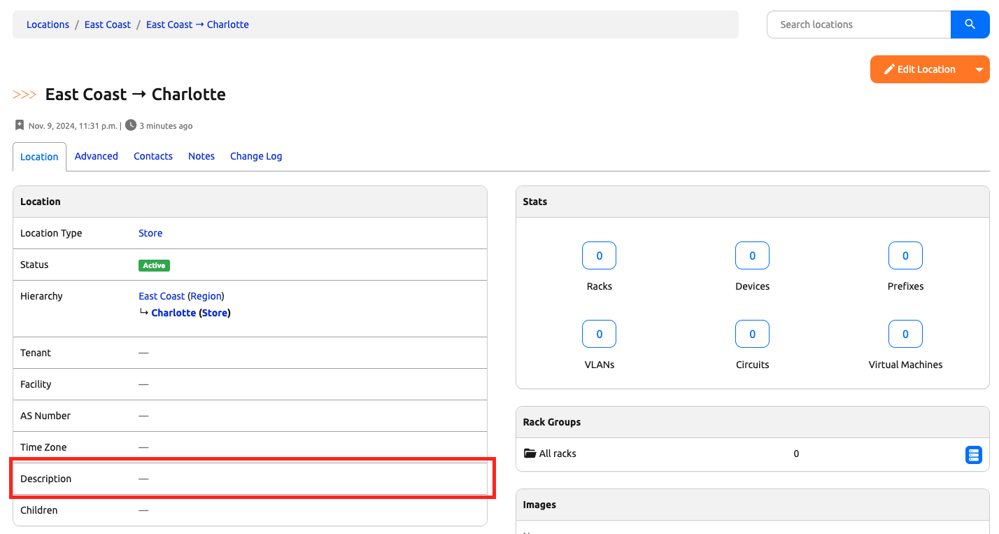
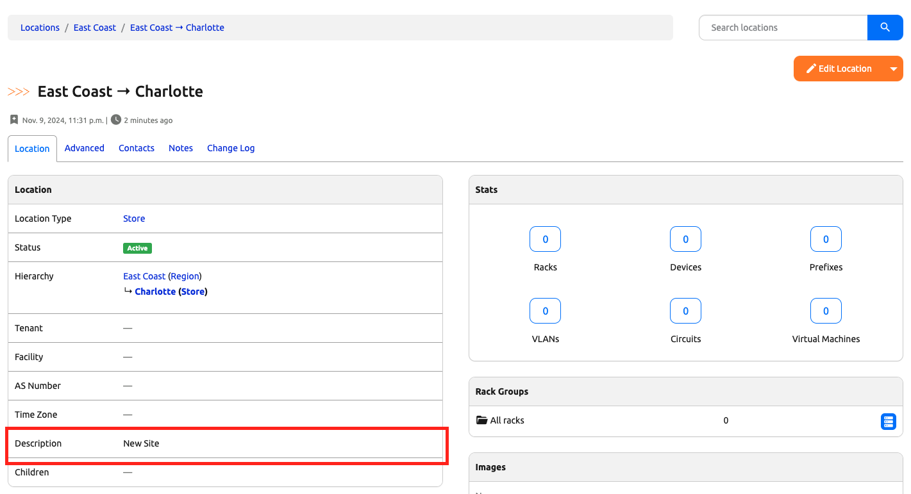

# Use Nautobot shell to work with Django ORM

In today's challenge, we will use the Nautobot shell to work with Django ORM.

Django ORM stands for `Object-Relational Mapping`, it is a feature that the Django web framework provides to abstract away the database layer between the code and database. By using Django ORM, we only have to worry about writing Python code and not database commands, in this case, SQL queries. 

What does it have to do with Nautobot jobs? There are several advantages of using Django ORM instead of raw SQL languages for code that we will write for Nautobot Jobs: 

- **Simplification**: It simplifies database interaction by using Python objects. The object can be a site, a circuit, an IP address, or anything else we can represent in code.  
- **Ease of use**: As we will see, we can define the database schema via Python classes, called models, that is more intuitive than manage database operations. 
- **Built-In**: Django ORM is a tool that is already built into the Django framework, and we can leverage all the development effort for features, security, code consistency, etc. 

The list goes on, we can dive into the additional security, object-oriented advantages, database portability, and many other advantages. But we will stop for now and move on with some examples, so we can see how it works. 

> [!NOTE]
> Since we are discussing Django ORM + Nautobot in today's challenge, I sometimes find it helpful to have the [Django ORM queries documentation](https://docs.djangoproject.com/en/5.1/topics/db/queries/) handy to see which of the features belong directly to the Django project. 

> [!NOTE]
> If you restarted a stopped Codespace instance for today's lab, you can skip the steps of `invoke build` and `invoke db-import` to move directly to `invoke debug` to start the containers. 

Let's start the codespace environment. Once Codespace is started, we can use the terminal window to build the development environment:  

```
$ cd nautobot-docker-compose/
$ poetry shell
$ invoke build
$ invoke db-import
$ invoke debug
```

Leave the terminal window open to let us monitor the logs, use a second terminal window to proceed with the following steps, remember to change to the right directory and start poetry: 

```
$ cd nautobot-docker-compose/
$ poetry shell
```

We can proceed to the next step. 

## Working with nbshell

There are a few command shortcuts provided for us via `invoke`, we can take a look at them using `invoke --list`: 

```
(nautobot-docker-compose-py3.10) @ericchou1 ➜ ~/nautobot-docker-compose (main) $ invoke --list
Available tasks:

  build                  Build Nautobot docker image.
  cli                    Launch a bash shell inside the running Nautobot container.
  createsuperuser        Create a new Nautobot superuser account (default: "admin"), will prompt for password.
  db-export              Export the database from the dev environment to nautobot.sql.
  db-import              Install the backup of Nautobot db into development environment.
  debug                  Start Nautobot and its dependencies in debug mode.
  destroy                Destroy all containers and volumes.
  import-nautobot-data   Import nautobot_data.json.
  migrate                Perform migrate operation in Django.
  nbshell                Launch an interactive nbshell session.
  post-upgrade           Nautobot common post-upgrade operations using a single entrypoint.
  restart                Gracefully restart all containers.
  start                  Start Nautobot and its dependencies in detached mode.
  stop                   Stop Nautobot and its dependencies.
```

We are interested in using a Nautobot interactive shell for today's challenge, we will start the interactive shell with the `invoke nbshell` command: 

```
(nautobot-docker-compose-py3.10) @ericchou1 ➜ ~/nautobot-docker-compose (main) $ invoke nbshell

Running docker compose command "ps --services --filter status=running"
Running docker compose command "exec nautobot nautobot-server shell_plus"
# Shell Plus Model Imports
from constance.models import Constance
from django.contrib.admin.models import LogEntry
from django.contrib.auth.models import Group, Permission
from django.contrib.contenttypes.models import ContentType
from django.contrib.sessions.models import Session
from django_celery_beat.models import ClockedSchedule, CrontabSchedule, IntervalSchedule, PeriodicTask, PeriodicTasks, SolarSchedule
from django_celery_results.models import ChordCounter, GroupResult, TaskResult
from nautobot.circuits.models import Circuit, CircuitTermination, CircuitType, Provider, ProviderNetwork
from nautobot.cloud.models import CloudAccount, CloudNetwork, CloudNetworkPrefixAssignment, CloudResourceType, CloudService, CloudServiceNetworkAssignment
from nautobot.dcim.models.cables import Cable, CablePath
from nautobot.dcim.models.device_component_templates import ConsolePortTemplate, ConsoleServerPortTemplate, DeviceBayTemplate, FrontPortTemplate, InterfaceTemplate, ModuleBayTemplate, PowerOutletTemplate, PowerPortTemplate, RearPortTemplate
from nautobot.dcim.models.device_components import ConsolePort, ConsoleServerPort, DeviceBay, FrontPort, Interface, InterfaceRedundancyGroup, InterfaceRedundancyGroupAssociation, InventoryItem, ModuleBay, PowerOutlet, PowerPort, RearPort
from nautobot.dcim.models.devices import Controller, ControllerManagedDeviceGroup, Device, DeviceFamily, DeviceRedundancyGroup, DeviceType, DeviceTypeToSoftwareImageFile, Manufacturer, Module, ModuleType, Platform, SoftwareImageFile, SoftwareVersion, VirtualChassis
from nautobot.dcim.models.locations import Location, LocationType
from nautobot.dcim.models.power import PowerFeed, PowerPanel
from nautobot.dcim.models.racks import Rack, RackGroup, RackReservation
from nautobot.extras.models.change_logging import ObjectChange
from nautobot.extras.models.contacts import Contact, ContactAssociation, Team
from nautobot.extras.models.customfields import ComputedField, CustomField, CustomFieldChoice
from nautobot.extras.models.datasources import GitRepository
from nautobot.extras.models.groups import DynamicGroup, DynamicGroupMembership, StaticGroupAssociation
from nautobot.extras.models.jobs import Job, JobButton, JobHook, JobLogEntry, JobResult, ScheduledJob, ScheduledJobs
from nautobot.extras.models.metadata import MetadataChoice, MetadataType, ObjectMetadata
from nautobot.extras.models.models import ConfigContext, ConfigContextSchema, CustomLink, ExportTemplate, ExternalIntegration, FileAttachment, FileProxy, GraphQLQuery, HealthCheckTestModel, ImageAttachment, Note, SavedView, UserSavedViewAssociation, Webhook
from nautobot.extras.models.relationships import Relationship, RelationshipAssociation
from nautobot.extras.models.roles import Role
from nautobot.extras.models.secrets import Secret, SecretsGroup, SecretsGroupAssociation
from nautobot.extras.models.statuses import Status
from nautobot.extras.models.tags import Tag, TaggedItem
from nautobot.ipam.models import IPAddress, IPAddressToInterface, Namespace, Prefix, PrefixLocationAssignment, RIR, RouteTarget, Service, VLAN, VLANGroup, VLANLocationAssignment, VRF, VRFDeviceAssignment, VRFPrefixAssignment
from nautobot.tenancy.models import Tenant, TenantGroup
from nautobot.users.models import AdminGroup, ObjectPermission, Token, User
from nautobot.virtualization.models import Cluster, ClusterGroup, ClusterType, VMInterface, VirtualMachine
from silk.models import Profile, Request, Response, SQLQuery
from social_django.models import Association, Code, Nonce, Partial, UserSocialAuth
# Shell Plus Django Imports
from django.core.cache import cache
from django.conf import settings
from django.contrib.auth import get_user_model
from django.db import transaction
from django.db.models import Avg, Case, Count, F, Max, Min, Prefetch, Q, Sum, When
from django.utils import timezone
from django.urls import reverse
from django.db.models import Exists, OuterRef, Subquery
Python 3.8.19 (default, Sep  4 2024, 06:05:29) 
[GCC 12.2.0] on linux
Type "help", "copyright", "credits" or "license" for more information.
(InteractiveConsole)
>>>
```

The first thing to notice from the nbshell command output is that it executed the `exec nautobot nautobot-server shell_plus` in the nautobot docker container. As mentioned, the invoke command behaves like a shortcut for full command line commands. 

> [!TIP] 
> If you are interested in the details of the invoke command configuration, take a look at the `tasks.py` file in the `nautobbot-docker-compose` folder. 

Many of us are familiar with the Python interactive shell when we type in the `python3` at a command prompt. The `nb_shell` is similar to the Python shell with additional features added by Django and Nautobot. 

Another thing to notice is all the `import` commands. As mentioned, the ORM allows us to represent database object with a Python `model` class. Nautobot has a ton of pre-defined models, or database objects, such as Locations, Users, Power panels, and Racks. They are automatically imported for us to save us time. 

> [!NOTE]
> The models also include the not-so-obvious database objects, such as permissions, computed fields, configuration context, etc. 

The best way to learn Django ORM and its usage in Nautobot is with some examples. So let's take Django ORM for a spin using the nbshell, shall we? 

We know we have some location data already populated, we can simply use the `objects.all()` query to retrieve them: 

```
>>> Location.objects.all()
<LocationQuerySet [<Location: Baltimore>, <Location: Boston>, <Location: Chicago>, <Location: Columbus>, <Location: East Coast>, <Location: Indianapolis>, <Location: Jacksonville>, <Location: New York City>, <Location: New York HQ>, <Location: Philadelphia>, <Location: Richmond>, <Location: Washington, D.C.>]>
```

What we got back is a [Django QuerySet](https://docs.djangoproject.com/en/5.1/ref/models/querysets/#django.db.models.query.QuerySet) that represents a collection of objects from the database, in this case, Location. In order to make use of it, we typically assign the result to a variable that can be iterated over: 

```
>>> locations = Location.objects.all()
>>> for location in locations: 
...     print(location)
... 
Baltimore
Boston
Chicago
Columbus
East Coast
Indianapolis
Jacksonville
New York City
New York HQ
Philadelphia
Richmond
Washington, D.C.
```

We can also apply filters for the returned data. Since we have two location types, `store` and `office`, we can filter via those two types: 

> [!IMPORTANT] 
> Notice the syntax of the filter is the name of the field (location_type), followed by a double underscore (`__`), followed by the name of the field (name). This is the [Django QuerySet API convention](https://docs.djangoproject.com/en/5.1/ref/models/querysets/#queryset-api-reference).  

```
>>> office_locations = Location.objects.filter(location_type__name="Office")
>>> store_locations = Location.objects.filter(location_type__name="Store")
>>> 

>>> for office in office_locations:
...     print(office)
... 
New York HQ
 
>>> 
>>> for store in store_locations: 
...     print(store)
... 
Baltimore
Boston
Chicago
Columbus
Indianapolis
Jacksonville
New York City
Philadelphia
Richmond
Washington, D.C.
```

We can also further chain the search filters: 

```
>>> bos_store_locations = Location.objects.filter(location_type__name="Store").get(name="Boston")

>>> bos_store_locations.name
'Boston'

>>> bos_store_locations.created
datetime.datetime(2024, 9, 21, 20, 51, 49, 674314, tzinfo=datetime.timezone.utc)
```

There are many more filters we can use, we can consult the [Django queries API documentation](https://docs.djangoproject.com/en/5.1/topics/db/queries/#retrieving-specific-objects-with-filters) for additional ways we can filter the `QuerySet` results. 

Now that we can read existing data, let's see how we can add and update the model data. 

## Adding, Deleting, and Updating Data 

Two methods are generally used in Django to create objects, `create()` and `get_or_create()`. 

The `create` method will create the object and return the object while the `get_or_create` method will either get the object if it exists or create the object if it does not, it will also return a second object to indicate whether the object was created. 

Let's see the creation in practice, let's go ahead and create another store. We can see from the Web UI that we would need to specify the "Location Type", "Name", "Status" as required fields, and an optional "Parent" field: 



Let's create a store with the name of "Charlotte", location type of "Store", with the parent of "East Coast" and set the status to active: 

```
>>> charlotte = Location.objects.get_or_create(name="Charlotte", location_type="Store", parent="East Coast", status="Active")
Traceback (most recent call last):
  File "/usr/local/lib/python3.8/site-packages/django/db/models/fields/__init__.py", line 2688, in to_python
    return uuid.UUID(**{input_form: value})
  File "/usr/local/lib/python3.8/uuid.py", line 171, in __init__
    raise ValueError('badly formed hexadecimal UUID string')
ValueError: badly formed hexadecimal UUID string

During handling of the above exception, another exception occurred:

Traceback (most recent call last):
  File "<console>", line 1, in <module>
  ...
  File "/usr/local/lib/python3.8/site-packages/django/db/models/fields/__init__.py", line 2690, in to_python
    raise exceptions.ValidationError(
django.core.exceptions.ValidationError: ['“Store” is not a valid UUID.']
```

Hum... we received an error of "Store is not a valid UUID." As it turns out, those are Python objects that are needed as inputs. 

Let's try that again by grabbing the necessary objects. Each of these objects are represented by their unique `UUID` in the system:  

```
>>> location_type_store = LocationType.objects.get(name="Store")
>>> location_type_store.id
UUID('b84942cf-4145-49e0-b511-9ac62b79ac63')
>>> location_eastcoast = Location.objects.get(name="East Coast")
>>> location_eastcoast.id
UUID('108625f7-15de-4546-9521-4e04125468de')
>>> status_active = Status.objects.get(name="Active")
>>> status_active.id
UUID('023e4472-398a-4351-a82f-743e69085cc3')
```

We can use the `get_or_create` method to create the location, remember we mention in the `get_or_create` method two objects are returned, one is the object itself (location) and the second is the status of whether the object is created or not (true or false), which is why we assign two variables to this command: 

```
>>> location, created = Location.objects.get_or_create(name="Charlotte", location_type=location_type_store, parent=location_eastcoast, status=status_active)

>>> location
<Location: Charlotte>
>>> location.name
'Charlotte'
>>> location.validated_save()
>>> created
True
```

We can either use the location query to see the newly created store or just browse to the Web UI: 


This location is created in the database as we entered the commands. But if you feel a bit strange to create database entries so easily in the shell, you are not alone. 

One of the features Django offers is to validate data before it is saved with `validated_save()` method. It helps to catch any error to see if, say, there are duplicated names. It is a good practice to use it before we commit the change. 

Let's go ahead and delete the previously created site: 

```
>>> Location.objects.filter(name="Charlotte").delete()
(1, {'dcim.Location': 1})
```

Then recreate and save it: 

```
>>> location, created = Location.objects.get_or_create(name="Charlotte", location_type=location_type_store, parent=location_eastcoast, status=status_active)
>>> location.validated_save()
```

We can also update the object by retrieving it and update it. We see the new location does not have a description: 



We can update the description with the following steps: 

```
>>> charlotte = Location.objects.get(name="Charlotte")
>>> charlotte.name
'Charlotte'
>>> charlotte.description
''
>>> charlotte.description = "New Site"
>>> charlotte.description
'New Site'
>>> charlotte.validated_save()
```

The description is added to the new site: 



If you are thinking, "Why would I not just update the site in the web interface?" I don't blame you. For simple operations, it is much easier to do it in the web interface. However, if we need to add multiple objects programmatically via scripts, or if we need to query information via script, `Django QuerySet` is our friend. 

We made a lot of progress today, Django QuerySet is definitely a powerful tool that we will use for future challenges. 

## Day 5 To Do

Remember to stop the codespace instance on [https://github.com/codespaces/](https://github.com/codespaces/). 

Go ahead and post a screenshot of your favorite ORM query on a social media of your choice, make sure you use the tag `#100DaysOfNautobot` `#JobsToBeDone` and tag `@networktocode`, so we can share your progress! 

In tomorrow's challenge, we get back to augment our Nautobot Jobs. See you tomorrow! 

[X/Twitter](<https://twitter.com/intent/tweet?url=https://github.com/nautobot/100-days-of-nautobot&text=I+just+completed+Day+5+of+the+100+days+of+nautobot+!&hashtags=100DaysOfNautobot,JobsToBeDone>)

[LinkedIn](https://www.linkedin.com/) (Copy & Paste: I just completed Day 5 of 100 Days of Nautobot, https://github.com/nautobot/100-days-of-nautobot, challenge! @networktocode #JobsToBeDone #100DaysOfNautobot)


