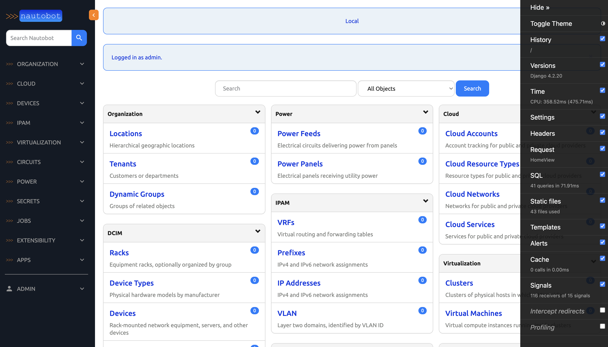
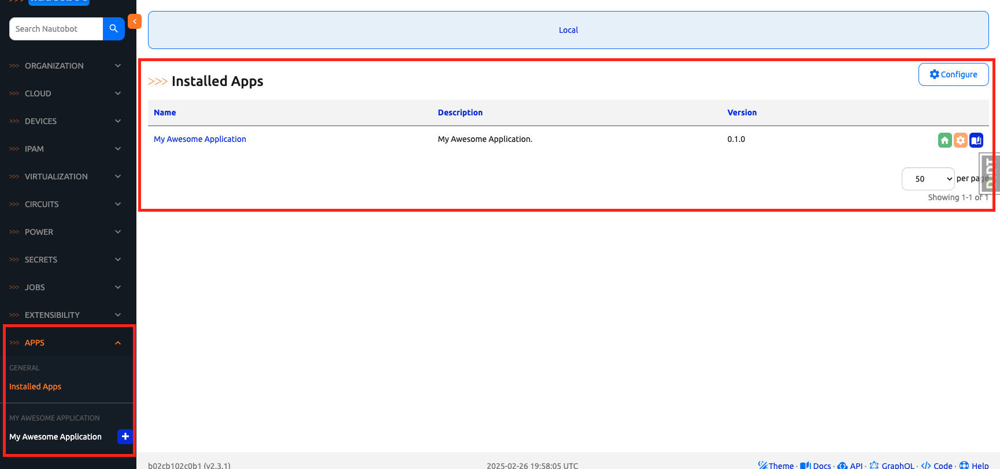

# Baking a Nautobot App Cookie

In today's challenge, we will use [Cookiecutter](https://github.com/cookiecutter/cookiecutter) to create our own Nautobot app. 

> [!INFORMATION]
> Cookiecutter is a command-line utility that simplifies the creation of new projects by generating them from predefined templates.

Network to Code announced the released a Nautobot App Cookiecutter [repository](https://github.com/nautobot/cookiecutter-nautobot-app/tree/develop) in early 2024, [Introducing Cookiecutter Project Template to Support Nautobot App Development for Network Automation](https://networktocode.com/blog/introducing-cookiecutter-nautobot-app/), and we will use it to create our app in today's challenge. 

> [!TIP]
> For more information on general Cookiecutter usage, feel free to check out [Cookiecutter Quick Start](https://docs.nautobot.com/projects/cookiecutter-nautobot-app/en/latest/user/quick-start/#help) and its related documenation. 

Let's get started. 

## Environment Setup

Please note we **DO NOT** need to start Nautobot and related docker containers under `nautobot-docker-compose` for the next few days. The application development environment includes an inclusive development environment similar to what we have been using.  

## Cookiecutter Example

We will follow the steps laid out in the [Nautobot Cookiecutter repository README](https://github.com/nautobot/cookiecutter-nautobot-app/blob/develop/README.md) to install and create the application: 

```
@ericchou1 ➜ ~ $ pip install cookiecutter
...
Successfully installed Jinja2-3.1.6 MarkupSafe-3.0.2 arrow-1.3.0 binaryornot-0.4.4 chardet-5.2.0 cookiecutter-2.6.0 python-dateutil-2.9.0.post0 python-slugify-8.0.4 pyyaml-6.0.2 six-1.17.0 text-unidecode-1.3 types-python-dateutil-2.9.0.20241206
```

We will create a `outputs` directory for out app: 

```
@ericchou1 ➜ ~ $ mkdir outputs
```

As we say in Cookiecutter land, let's "Bake a cookie": 

> [!IMPORTANT]
> Please use your own information, such as GitHub username, Full name, etc. when prompted. 

```
@ericchou1 ➜ ~ $ cookiecutter \
  --output-dir=./outputs \
  --directory=nautobot-app \
  https://github.com/nautobot/cookiecutter-nautobot-app

  [1/18] codeowner_github_usernames (): <your github username> 
  [2/18] full_name (Network to Code, LLC): <your full name>
  [3/18] email (info@networktocode.com): <your email address>
  [4/18] github_org (nautobot): 
  [5/18] app_name (my_app): my_awesome_app
  [6/18] verbose_name (My Awesome App): My Awesome Application
  [7/18] app_slug (my-awesome-app): 
  [8/18] project_slug (nautobot-app-my-awesome-app): 
  [9/18] repo_url (https://github.com/nautobot/nautobot-app-my-awesome-app): 
  [10/18] base_url (my-awesome-app): 
  [11/18] min_nautobot_version (2.0.0): 
  [12/18] max_nautobot_version (2.9999): 
  [13/18] camel_name (MyAwesomeApp): 
  [14/18] project_short_description (My Awesome Application): 
  [15/18] Camel case name of the model class to be created, enter None if no model is needed (MyAwesomeAppExampleModel): 
  [16/18] Select open_source_license
    1 - Apache-2.0
    2 - Not open source
    Choose from [1/2] (1): 1
  [17/18] docs_base_url (https://docs.nautobot.com): 
  [18/18] docs_app_url (https://docs.nautobot.com/projects/my-awesome-app/en/latest): 

Congratulations! Your cookie has now been baked. It is located at /home/vscode/outputs/nautobot-app-my-awesome-app

⚠️⚠️ Before you start using your cookie you must run the following commands inside your cookie:

* poetry lock
* cp development/creds.example.env development/creds.env
* poetry install
* poetry shell
* invoke makemigrations
* invoke ruff --fix # this will ensure all python files are formatted correctly, may require `sudo chown -R $USER ./` as migrations may be owned by root

The file `creds.env` will be ignored by git and can be used to override default environment variables.
```

Note the steps listed after the cookie is baked to start a development environment. 

Here are the contents in the `outputs` directory: 

```
@ericchou1 ➜ ~ $ ls outputs/
nautobot-app-my-awesome-app
@ericchou1 ➜ ~ $ ls -lia outputs/
total 16
1346745 drwxr-xr-x 3 vscode vscode 4096 Feb 26 18:34 .
1206645 drwxr-x--- 1 vscode vscode 4096 Feb 26 18:34 ..
1347229 drwxr-xr-x 7 vscode vscode 4096 Feb 26 18:34 nautobot-app-my-awesome-app

@ericchou1 ➜ ~ $ cd outputs/nautobot-app-my-awesome-app/
@ericchou1 ➜ ~/outputs/nautobot-app-my-awesome-app $ ls -l
total 80
drwxr-xr-x 2 vscode vscode  4096 Feb 26 18:34 changes
drwxr-xr-x 2 vscode vscode  4096 Feb 26 18:34 development
drwxr-xr-x 7 vscode vscode  4096 Feb 26 18:34 docs
-rw-r--r-- 1 vscode vscode   405 Feb 26 18:34 invoke.example.yml
-rw-r--r-- 1 vscode vscode   288 Feb 26 18:34 invoke.mysql.yml
-rw-r--r-- 1 vscode vscode   580 Feb 26 18:34 LICENSE
-rw-r--r-- 1 vscode vscode  4092 Feb 26 18:34 mkdocs.yml
drwxr-xr-x 6 vscode vscode  4096 Feb 26 18:34 my_awesome_app
-rw-r--r-- 1 vscode vscode  4870 Feb 26 18:34 pyproject.toml
-rw-r--r-- 1 vscode vscode  5108 Feb 26 18:34 README.md
-rw-r--r-- 1 vscode vscode 30961 Feb 26 18:34 tasks.py
```

Let's change to that directory. 

```
@ericchou1 ➜ ~ $ cd outputs/nautobot-app-my-awesome-app/
@ericchou1 ➜ ~/outputs/nautobot-app-my-awesome-app $
```

In the next step, we will launch the development environment for our app. 

## Development Environment

The directory contains a development docker environment: 

```
@ericchou1 ➜ ~/outputs/nautobot-app-my-awesome-app $ ls -l development/
total 48
-rw-r--r-- 1 vscode vscode 2678 Feb 26 18:34 app_config_schema.py
-rw-r--r-- 1 vscode vscode  992 Feb 26 18:34 creds.example.env
-rw-r--r-- 1 vscode vscode 1257 Feb 26 18:34 development.env
-rw-r--r-- 1 vscode vscode  150 Feb 26 18:34 development_mysql.env
-rw-r--r-- 1 vscode vscode 1430 Feb 26 18:34 docker-compose.base.yml
-rw-r--r-- 1 vscode vscode 2150 Feb 26 18:34 docker-compose.dev.yml
-rw-r--r-- 1 vscode vscode  934 Feb 26 18:34 docker-compose.mysql.yml
-rw-r--r-- 1 vscode vscode  500 Feb 26 18:34 docker-compose.postgres.yml
-rw-r--r-- 1 vscode vscode  295 Feb 26 18:34 docker-compose.redis.yml
-rw-r--r-- 1 vscode vscode 3123 Feb 26 18:34 Dockerfile
-rw-r--r-- 1 vscode vscode 4044 Feb 26 18:34 nautobot_config.py
-rw-r--r-- 1 vscode vscode 1303 Feb 26 18:34 towncrier_template.j2
```

We will use `poetry`, `invoke`, and other tools: 

```
@ericchou1 ➜ ~/outputs/nautobot-app-my-awesome-app $ poetry lock
Creating virtualenv my-awesome-app-TNUNvfeN-py3.10 in /home/vscode/.cache/pypoetry/virtualenvs
Updating dependencies
Resolving dependencies... (26.7s)

Writing lock file

@ericchou1 ➜ ~/outputs/nautobot-app-my-awesome-app $ cp development/creds.example.env development/creds.env

@ericchou1 ➜ ~/outputs/nautobot-app-my-awesome-app $ poetry install

@ericchou1 ➜ ~/outputs/nautobot-app-my-awesome-app $ poetry shell

@ericchou1 ➜ ~/outputs/nautobot-app-my-awesome-app $ invoke build
Building Nautobot with Python 3.11...
Running docker compose command "build"
#0 building with "default" instance using docker driver

#1 [nautobot internal] load build definition from Dockerfile
#1 transferring dockerfile: 3.16kB done
#1 DONE 0.0s
...

#13 naming to docker.io/my-awesome-app/nautobot:2.3.1-py3.11 done
#13 DONE 27.7s

#14 [nautobot] resolving provenance for metadata file
#14 DONE 0.0s

@ericchou1 ➜ ~/outputs/nautobot-app-my-awesome-app $ invoke makemigrations
Running docker compose command "ps --services --filter status=running"
Running docker compose command "run --rm --entrypoint='nautobot-server makemigrations my_awesome_app' nautobot"
[+] Creating 4/4
 ✔ Network my-awesome-app_default         Created                                                                                                 0.1s 
 ✔ Volume "my-awesome-app_postgres_data"  Created                                      
 ...
```

Finally, let's launch the containers: 

> [!TIP]
> It takes a while for the initial build, wait until you see the `nautobot-1  | Starting development server at http://0.0.0.0:8080/` message before moving on to the next step.  

```
@ericchou1 ➜ ~/outputs/nautobot-app-my-awesome-app $ invoke debug
Starting  in debug mode...
Running docker compose command "up"
 Network my-awesome-app_default  Creating
 Network my-awesome-app_default  Created
 Volume "my-awesome-app_postgres_data"  Creating
 Volume "my-awesome-app_postgres_data"  Created
 Container my-awesome-app-redis-1  Creating
 Container my-awesome-app-docs-1  Creating
 Container my-awesome-app-db-1  Creating
 Container my-awesome-app-docs-1  Created
 Container my-awesome-app-redis-1  Created
 Container my-awesome-app-db-1  Created
 Container my-awesome-app-nautobot-1  Creating
 Container my-awesome-app-nautobot-1  Created
 Container my-awesome-app-beat-1  Creating
 Container my-awesome-app-worker-1  Creating
 Container my-awesome-app-beat-1  Created
 Container my-awesome-app-worker-1  Created
Attaching to beat-1, db-1, docs-1, nautobot-1, redis-1, worker-1
redis-1     | 1:C 26 Feb 2025 18:58:23.513 # oO0OoO0OoO0Oo Redis is starting oO0OoO0OoO0Oo
redis-1     | 1:C 26 Feb 2025 18:58:23.513 # Redis version=6.2.17, bits=64, commit=00000000, modified=0, pid=1, just started
redis-1     | 1:C 26 Feb 2025 18:58:23.513 # Configuration loaded
redis-1     | 1:M 26 Feb 2025 18:58:23.514 * monotonic clock: POSIX clock_gettime
redis-1     | 1:M 26 Feb 2025 18:58:23.515 * Running mode=standalone, port=6379.
redis-1     | 1:M 26 Feb 2025 18:58:23.515 # Server initialized
...
```

There is one more thing we need to do regarding the CSRF setting. This is due to the port forwarding in Codespace that we will need to allow the localhost origin. Do not do this in product, we will only do this for the lab: 

```
(nautobot-docker-compose-py3.10) @ericchou1 ➜ ~/nautobot-docker-compose (main) $ docker exec -it -u root my-awesome-app-nautobot-1 bash

root@b02cb102c0b1:/source# ls
LICENSE  README.md  changes  development  dist  docs  invoke.example.yml  invoke.mysql.yml  mkdocs.yml  my_awesome_app  poetry.lock  pyproject.toml  tasks.py

root@b02cb102c0b1:/source# cd /opt/nautobot/

root@b02cb102c0b1:/opt/nautobot# apt update
root@b02cb102c0b1:/opt/nautobot# apt install -y vim

root@b02cb102c0b1:/opt/nautobot# vim nautobot_config.py 

CSRF_TRUSTED_ORIGINS = ["http://localhost:8080", "https://localhost:8080"] 

```


We can now launch the browser at `port 8080` and login with `admin/admin`, note we now also have a [Django Debug Toolbar](https://django-debug-toolbar.readthedocs.io/en/latest/) along with the app. We can hide it with the `Hide >>` button: 



If we navigate down to the `APPS -> Installed Apps` section, we will see our shining new app: 




Congratulations, that is one cool way to quickly launch a Nautobot app development environment. Not to mention we just learned another cool tool in the Python community! 

For the next 3 days (until Day 45), we will be using this cookie-cutter app. Unless you are running out of free Codespace storage credit, my recommendation is to stop the Codespace instance to come back to it for the next few days. 

## Day 42 To Do

Remember to stop the codespace instance on [https://github.com/codespaces/](https://github.com/codespaces/). 

Go ahead and post a screenshot of a new app that you have built for today's challenge, make sure you use the tag `#100DaysOfNautobot` `#JobsToBeDone` and tag `@networktocode`, so we can share your progress! 

In tomorrow's challenge, we will be taking a closer look at the file structure for our app. See you tomorrow! 

[X/Twitter](<https://twitter.com/intent/tweet?url=https://github.com/nautobot/100-days-of-nautobot&text=I+just+completed+Day+42+of+the+100+days+of+nautobot+challenge+!&hashtags=100DaysOfNautobot,JobsToBeDone>)

[LinkedIn](https://www.linkedin.com/) (Copy & Paste: I just completed Day 42 of 100 Days of Nautobot, https://github.com/nautobot/100-days-of-nautobot, challenge! @networktocode #JobsToBeDone #100DaysOfNautobot) 
