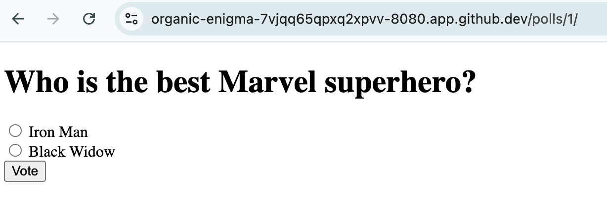
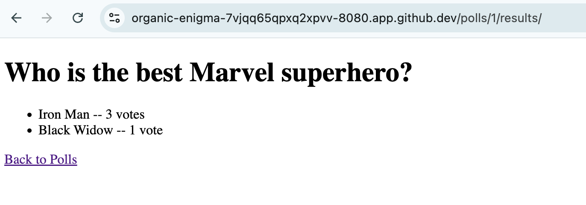

# Django Example - Part 4. Add Forms

In today's challenge, we will finish the 4-part challenge by adding forms for the users to cast their vote. 

Today's challenge is roughly mapped to [Django Tutorial Part 4](https://docs.djangoproject.com/en/5.1/intro/tutorial04/). Please consult the page for more details about the code. 

## Code Example

Let's update the views with the new vote and results function-based views. Each function will specify the new HTML template it will use to return the final page: 

```python
(djangoproject-py3.10) @ericchou1 ➜ ~/djangoproject/mysite $ cat polls/views.py 
from django.shortcuts import render
from django.http import HttpResponseRedirect
from django.urls import reverse

from .models import Question, Choice

def index(request):
    latest_question_list = Question.objects.order_by('-pub_date')[:5]
    context = {'latest_question_list': latest_question_list}
    return render(request, 'polls/index.html', context)

def detail(request, question_id):
    question = Question.objects.get(pk=question_id)
    return render(request, 'polls/detail.html', {'question': question})

def vote(request, question_id):
    question = Question.objects.get(pk=question_id)
    try:
        selected_choice = question.choice_set.get(pk=request.POST['choice'])
    except (KeyError, Choice.DoesNotExist):
        return render(request, 'polls/detail.html', {
            'question': question,
            'error_message': "You didn't select a choice.",
        })
    else:
        selected_choice.votes += 1
        selected_choice.save()
        return HttpResponseRedirect(reverse('results', args=(question.id,)))

def results(request, question_id):
    question = Question.objects.get(pk=question_id)
    return render(request, 'polls/results.html', {'question': question})
```

We will modify the `detail.html` page to include a voting mechanism with radio buttons: 

```html
(djangoproject-py3.10) @ericchou1 ➜ ~/djangoproject/mysite $ cat polls/templates/polls/detail.html 
<!DOCTYPE html>
<html>
<head>
    <title>{{ question.question_text }}</title>
</head>
<body>
    <h1>{{ question.question_text }}</h1>
    <form action="" method="post">
        
        
            <input type="radio" name="choice" id="choice{{ forloop.counter }}" value="{{ choice.id }}">
            <label for="choice{{ forloop.counter }}">{{ choice.choice_text }}</label><br>
        
        <input type="submit" value="Vote">
    </form>
    
        <p><strong>{{ error_message }}</strong></p>
    
</body>
</html>
```

We will add the new url paths: 

```python
(djangoproject-py3.10) @ericchou1 ➜ ~/djangoproject/mysite $ cat polls/urls.py 
from django.urls import path
from . import views

urlpatterns = [
    path('', views.index, name='index'),
    path('<int:question_id>/', views.detail, name='detail'),
    path('<int:question_id>/results/', views.results, name='results'),
    path('<int:question_id>/vote/', views.vote, name='vote'),
]
```

We need to create the new `results` template: 

```html
(djangoproject-py3.10) @ericchou1 ➜ ~/djangoproject/mysite $ cat polls/templates/polls/results.html 
<!DOCTYPE html>
<html>
<head>
    <title>{{ question.question_text }}</title>
</head>
<body>
    <h1>{{ question.question_text }}</h1>
    <ul>
        
            <li>{{ choice.choice_text }} -- {{ choice.votes }} vote{{ choice.votes|pluralize }}</li>
        
    </ul>
    <a href="">Back to Polls</a>
</body>
</html>
```

We can update `admin.py` to add new choice entries: 

```
(djangoproject-py3.10) @ericchou1 ➜ ~/djangoproject/mysite $ cat polls/admin.py 
from django.contrib import admin
from .models import Question, Choice

admin.site.register(Question)
admin.site.register(Choice)
```

Restart the dev server: 

```shell
(djangoproject-py3.10) @ericchou1 ➜ ~/djangoproject/mysite $ python manage.py runserver 0.0.0.0:8080
```

We can now create choices in admin, notice the relationship between Question and Choice, we need to pick the existing question from the drop down menu: 


The list of choices is listed on the main page: 


Let's go ahead and view the `polls` page and vote: 



Once the voting is done, we will be redirected to the result page: 



Final view on directory structure: 

```shell
(djangoproject-py3.10) @ericchou1 ➜ ~/djangoproject $ pwd
/home/vscode/djangoproject

(djangoproject-py3.10) @ericchou1 ➜ ~/djangoproject $ tree .
.
├── mysite
│   ├── db.sqlite3
│   ├── manage.py
│   ├── mysite
│   │   ├── asgi.py
│   │   ├── __init__.py
│   │   ├── __pycache__
│   │   │   ├── __init__.cpython-310.pyc
│   │   │   ├── settings.cpython-310.pyc
│   │   │   ├── urls.cpython-310.pyc
│   │   │   └── wsgi.cpython-310.pyc
│   │   ├── settings.py
│   │   ├── urls.py
│   │   └── wsgi.py
│   └── polls
│       ├── admin.py
│       ├── apps.py
│       ├── __init__.py
│       ├── migrations
│       │   ├── 0001_initial.py
│       │   ├── __init__.py
│       │   └── __pycache__
│       │       ├── 0001_initial.cpython-310.pyc
│       │       └── __init__.cpython-310.pyc
│       ├── models.py
│       ├── __pycache__
│       │   ├── admin.cpython-310.pyc
│       │   ├── apps.cpython-310.pyc
│       │   ├── __init__.cpython-310.pyc
│       │   ├── models.cpython-310.pyc
│       │   ├── urls.cpython-310.pyc
│       │   └── views.cpython-310.pyc
│       ├── templates
│       │   └── polls
│       │       ├── detail.html
│       │       ├── index.html
│       │       └── results.html
│       ├── tests.py
│       ├── urls.py
│       └── views.py
└── pyproject.toml

9 directories, 32 files
```

Congratulations on completing the 4-part challenge! 

## Final Thoughts

Here are some final thoughts comparing Django and Nautobot: 

    - In our Django app, we did not require Celery, Redis, or Beats because we do not need to execute asynchronous jobs. 

    - In our Django app, we use `makemigrations` and `migrate` to commit database changes. In our previous days, we use `invoke` that took care these steps, amongst others.  

    - In this simple Django app, we use SQLite as database that is only a single file. In our Nautobot setup, we use a Postgres container as our database.  

    - If you noticed, `manage.py` is similar in function to `nautobot-server`. 

    - `mysite` is similar to `Nautobot` and `polls` is simliar to different Nautobot apps. 

    - In our simple Django apps, we ignored tests, security, and many other important aspects. 

    - Just to be extra clear, the development server is not suitable for production. 

In the next few days, we will see how we can take these Django concepts we learned and apply them in the Nautobot app development context. 

## Day 49 To Do

Remember to stop the codespace instance on [https://github.com/codespaces/](https://github.com/codespaces/). 

Go ahead and post a screenshot of the final iteration of the Django app on a social media of your choice, make sure you use the tag `#100DaysOfNautobot` `#JobsToBeDone` and tag `@networktocode`, so we can share your progress! 

In tomorrow's challenge, we will be taking these Django concepts to the Nautobot app development environment. See you tomorrow! 

[X/Twitter](<https://twitter.com/intent/tweet?url=https://github.com/nautobot/100-days-of-nautobot&text=I+just+completed+Day+49+of+the+100+days+of+nautobot+challenge+!&hashtags=100DaysOfNautobot,JobsToBeDone>)

[LinkedIn](https://www.linkedin.com/) (Copy & Paste: I just completed Day 49 of 100 Days of Nautobot, https://github.com/nautobot/100-days-of-nautobot, challenge! @networktocode #JobsToBeDone #100DaysOfNautobot) 