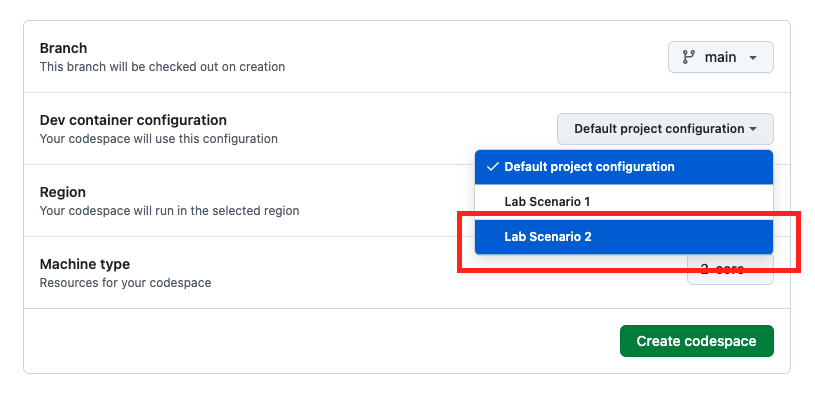
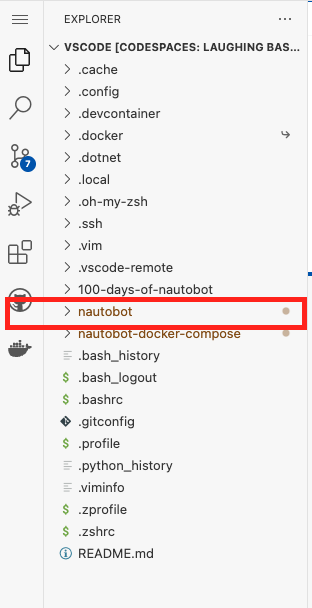
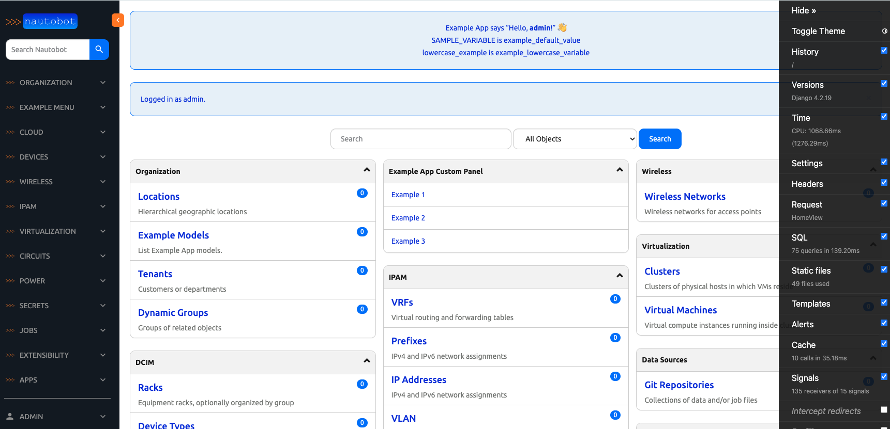
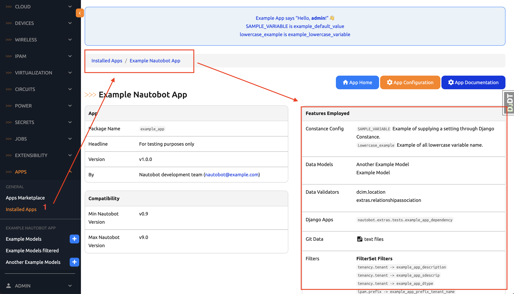
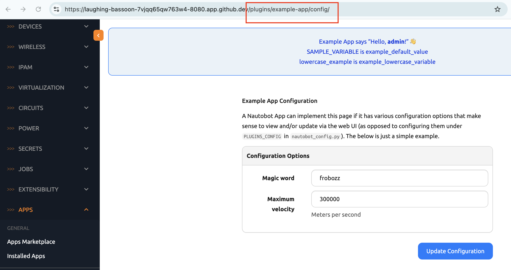
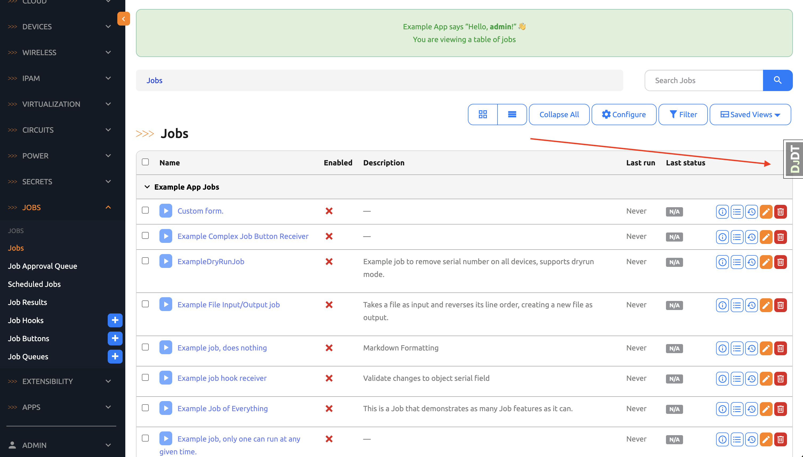
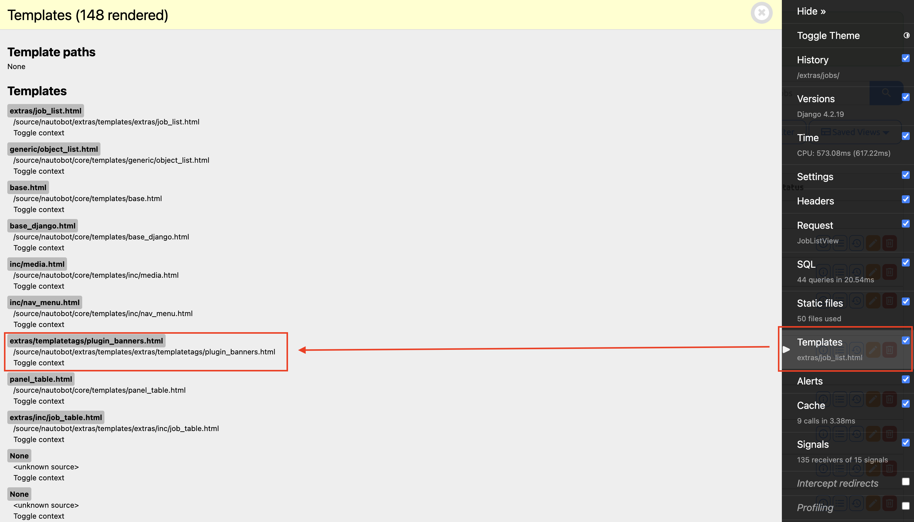
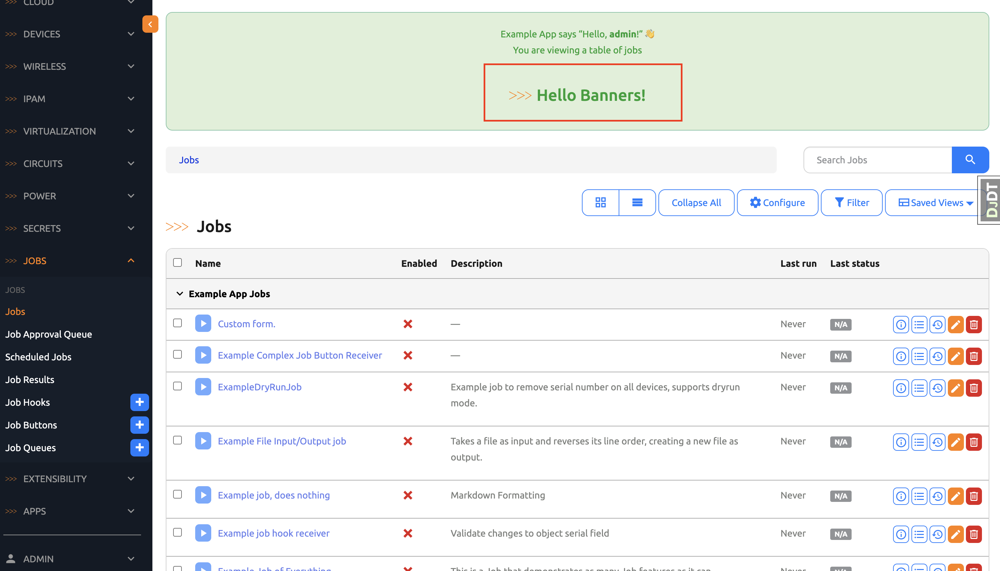

# Example App Overview

In the next few days, Days 50 to 59 to be exact, we will apply what we learned to the Nautobot environment using a pre-existing example app setting. 

In particular, we will clone the [Nautobot](https://github.com/nautobot/nautobot) repository and use the [example_app](https://github.com/nautobot/nautobot/tree/develop/examples/example_app) within Nautobot repository. 

Just like [Day 42](../Day042_Baking_an_App_Cookie/README.md), the Nautobot repository contains a development environment with various docker containers that we will use. 

In today's challenge, we will: 

- Set up the development environment and launch the App with different dev container images. 
- Do a quick overview of how the App integrates to Nautobot for an end-to-end workflow. 

Ready? Let's get started. 

## Environment Setup

We will use [Scenario 2](../Lab_Setup/scenario_2_setup/README.md) for Days 50 - 59. This scenario contains a pre-cloned Nautobot directory we will be working in: 



> [!INFORMATION]
> If you wonder why we need to use a pre-cloned directory, we listed out the changes we had for Codespace environment in [Scenario 2 Setup](../Lab_Setup/scenario_2_setup/README.md). 

Once Codespace is launched, we will see the `nautobot` directory: 



The steps to launch the development containers is almost identical to what we have been doing in `Scenario 1`. However, this process takes longer for "nautobot proper" because of the complexity and the additional packages. 

Here are the steps: 

```
$ cd nautobot
$ poetry shell
$ poetry install
...
(lots of packages)
...
$ invoke build
...
(be patient with this step, please grab a cup coffee/tea)
...
$ invoke debug
...
(be patient with this step as well, please grab another cup of coffee/tea)
...
```

Finally, once everything is completed, you will see many ports opened by various containers, please pick our favorite port 8080: 


We can log in with `admin/admin` and username and password. 

Once logged in, we can see [Django Debug Toolbar](https://django-debug-toolbar.readthedocs.io/en/latest/) is active, it is a fantastic debug tool, however, we will minimize it for more screen real estate with the `Hide>>` button on the top. 



In the next section, we will take a closer look at this environment. 

## Example Application Environment

Here are some of the points of interest that are new to us: 

- There is a new docker image with [Selenium](https://www.selenium.dev/), it is used for headless Web UI Testing.

- The Nautobot version is 2.4. For our purpose it does not make much difference, but there are obviously some differences between Nautobot 2.3 and 2.4. 

- If you are interested in which services maps to which port: 

```
@ericchou1 ➜ ~ $ cd nautobot
@ericchou1 ➜ ~/nautobot (develop) $ poetry shell
@ericchou1 ➜ ~ $ docker ps
CONTAINER ID   IMAGE                                 COMMAND                  CREATED         STATUS                   PORTS                                                                                                          NAMES
495fd7e794fa   local/nautobot-dev:local-2.4-py3.12   "watchmedo auto-rest…"   9 minutes ago   Up 7 minutes (healthy)   8080/tcp                                                                                                       nautobot-2-4-celery_beat-1
ed2026b1fa1d   local/nautobot-dev:local-2.4-py3.12   "watchmedo auto-rest…"   9 minutes ago   Up 7 minutes (healthy)   0.0.0.0:6898->6898/tcp, :::6898->6898/tcp, 0.0.0.0:8081->8080/tcp, :::8081->8080/tcp                           nautobot-2-4-celery_worker-1
b3f7ed22a9e5   local/nautobot-dev:local-2.4-py3.12   "/docker-entrypoint.…"   9 minutes ago   Up 9 minutes (healthy)   0.0.0.0:6899->6899/tcp, :::6899->6899/tcp, 0.0.0.0:8080->8080/tcp, :::8080->8080/tcp                           nautobot-2-4-nautobot-1
dd26d3cf119d   redis:6-alpine                        "docker-entrypoint.s…"   9 minutes ago   Up 9 minutes (healthy)   6379/tcp                                                                                                       nautobot-2-4-redis-1
70e700f76299   postgres:13                           "docker-entrypoint.s…"   9 minutes ago   Up 9 minutes (healthy)   5432/tcp                                                                                                       nautobot-2-4-db-1
f6b2d7fe2883   selenium/standalone-firefox:4.27      "/opt/bin/entry_poin…"   9 minutes ago   Up 9 minutes             5900/tcp, 0.0.0.0:4444->4444/tcp, :::4444->4444/tcp, 0.0.0.0:15900->15900/tcp, :::15900->15900/tcp, 9000/tcp   nautobot-2-4-selenium-1
```

### Example App

In the `APPS -> Installed Apps` section, we see the `Example Nautobot App` is already installed: 



We will attach to the `nautobot` container and take a look at the following: 
 
- The code is mapped under `/source` in the container. 
- Nautobot is installed under `/opt/nautobot`. 

```
@ericchou1 ➜ ~ $ docker exec -it -u root nautobot-2-4-nautobot-1 bash

root@b3f7ed22a9e5:/source# pwd
/source

root@b3f7ed22a9e5:/source# ls
CHANGELOG.md        LICENSE.txt  SECURITY.md  docker    git                 jobs        nautobot                 pyproject.toml  tasks.py
CODE_OF_CONDUCT.md  NOTICE       changes      docs      install.sh          media       nautobot.code-workspace  renovate.json   venv
CONTRIBUTING.md     README.md    development  examples  invoke.yml.example  mkdocs.yml  poetry.lock              scripts
root@b3f7ed22a9e5:/source#

root@b3f7ed22a9e5:/source# ls /opt/nautobot/
__pycache__  git  jobs  media  nautobot_config.py  static

```

### URL Dispatch

We can walk from the Python packages to the core `urls.py` and see it offloads the URL patterns to `example_app/urls.py`:

```
root@b3f7ed22a9e5:/source# cat /usr/local/lib/python3.12/site-packages/nautobot.pth 
/source

root@b3f7ed22a9e5:/source# cat nautobot/core/urls.py 
nautobot/core/urls.py
...
from nautobot.extras.plugins.urls import (
    apps_patterns,
    plugin_admin_patterns,
    plugin_patterns,
)
...
urlpatterns = [
    ...
    path("plugins/", include((plugin_patterns, "plugins"))),
    ...
]


root@b3f7ed22a9e5:/source# cat examples/example_app/example_app/urls.py 
from django.templatetags.static import static
from django.urls import path
from django.views.generic import RedirectView

from nautobot.apps.urls import NautobotUIViewSetRouter

from example_app import views

app_name = "example_app"
router = NautobotUIViewSetRouter()
# ExampleModel is registered using the ViewSet
router.register("models", views.ExampleModelUIViewSet)
router.register("other-models", views.AnotherExampleModelUIViewSet)

urlpatterns = [
    path("", views.ExampleAppHomeView.as_view(), name="home"),
    path("useful-links/", views.UsefulLinkListView.as_view(), name="usefullinks_list"),
    path("config/", views.ExampleAppConfigView.as_view(), name="config"),
    path(
        "docs/",
        RedirectView.as_view(url=static("example_app/docs/index.html")),
        name="docs",
    ),
    # Still have the ability to add routes to a model that is using the NautobotUIViewSet.
    path("circuits/<uuid:pk>/example-app-tab/", views.CircuitDetailAppTabView.as_view(), name="circuit_detail_tab"),
    path(
        "devices/<uuid:pk>/example-app-tab-1/",
        views.DeviceDetailAppTabOneView.as_view(),
        name="device_detail_tab_1",
    ),
    path(
        "devices/<uuid:pk>/example-app-tab-2/",
        views.DeviceDetailAppTabTwoView.as_view(),
        name="device_detail_tab_2",
    ),
    # This URL definition is here in order to test the override_views functionality which is defined
    # in examples.example_app_with_view_override.example_app_with_view_override.views
    path("override-target/", views.ViewToBeOverridden.as_view(), name="view_to_be_overridden"),
    # This URL definition is here in order to test the permission_classes functionality which is defined
    # in NautobotUIViewSetMixin
    path(
        "view-with-custom-permissions/",
        views.ViewWithCustomPermissions.as_view({"get": "list"}),
        name="view_with_custom_permissions",
    ),
]
urlpatterns += router.urls

```

From the URL patterns, we can see there is a pattern for `config/` for the `views.ExampleAppConfigView` view. From the root level, it should be `plugins/example-app/config/`: 



Let's see the code for that view: 

```
root@b3f7ed22a9e5:/source# cat examples/example_app/example_app/views.py
...
class ExampleAppConfigView(views.GenericView):
    def get(self, request):
        """Render the configuration page for this App.

        Just an example - in reality you'd want to use real config data here as appropriate to your App, if any.
        """
        form = forms.ExampleAppConfigForm({"magic_word": "frobozz", "maximum_velocity": 300000})
        return render(request, "example_app/config.html", {"form": form})

    def post(self, request):
        """Handle configuration changes for this App.

        Not actually implemented here.
        """
        form = forms.ExampleAppConfigForm({"magic_word": "frobozz", "maximum_velocity": 300000})
        return render(request, "example_app/config.html", {"form": form})
...
```

The code for the view is a bit different from what we have learned before. The type of view code we used were Python functions with `def`, but this view is using `class`. What gives? In short, [function-based views](https://docs.djangoproject.com/en/5.1/topics/http/views/) and [class-based views](https://docs.djangoproject.com/en/5.1/topics/class-based-views/) are both valid ways of generating a view but `class-based views` is newer and does more with less code at the expense of giving more `Django magic`. 

Even if we do not fully understand the code, we can see the template being returned is `example_app/config.html` in the view code, let's take a look at the template code: 

```
root@c8032ee34216:/source# cat examples/example_app/example_app/templates/example_app/config.html 




    <form action="" method="post" enctype="multipart/form-data" class="form form-horizontal">
        
        <div class="row">
            <div class="col-md-6 col-md-offset-3">
                <h3>Example App Configuration</h3>
                <p>
                    A Nautobot App can implement this page if it has various configuration options that make sense to
                    view and/or update via the web UI (as opposed to configuring them under <code>PLUGINS_CONFIG</code>
                    in <code>nautobot_config.py</code>). The below is just a simple example.
                </p>
                
                    <div class="panel panel-default">
                        <div class="panel-heading"><strong>Configuration Options</strong></div>
                        <div class="panel-body">
                            
                                
                            
                        </div>
                    </div>
                
            </div>
        </div>
        <div class="row">
            <div class="col-md-6 col-md-offset-3 text-right">
                <button type="submit" class="btn btn-primary">Update Configuration</button>
            </div>
        </div>
    </form>

```

Cool, we just traced from the initial URL all the way to the final HTML template with `URL Dispatch -> View -> HTML Template`. But wait, what about database models? I am glad you asked, looking back in the view code, there is a `form = forms.ExampleAppConfigForm`. Let's take a look at that: 

```
root@c8032ee34216:/source# cat examples/example_app/example_app/forms.py 
...
class ExampleAppConfigForm(BootstrapMixin, forms.Form):
    """Example of what an App-specific configuration form might look like."""

    magic_word = forms.CharField()
    maximum_velocity = forms.IntegerField(help_text="Meters per second")
...
```

Ok, so we can see this particular code does not have anything to do with database models. However, as we can see from other code snippets in the form, this is where the code would be if we need to modify the database models with a form submission. 

In today's challenge, even without understanding every line of code, we can still get a good sense of where things are with just basic Django design patterns. 

The last step is to make a simple HTML change and see it on the screen. 

## Change Banners

Let's expand the Django debug toolbar on the home page:  



We can see the toolbar gives us information such as the CPU time, current request, number of SQL queries. Under `Templates` we can see the template paths. Let's find the template that generates the banner:



Once we find it, we can add a `<h1>` tag to say `Hello Banners!`: 


There it is, our awesome message to whoever sees the banner when they log in: 



I don't know about you, but today's challenge is a giant step toward understanding Nautobot structure and how we can use the existing framework to develop our new app! 

## Day 50 To Do

Remember to stop the codespace instance on [https://github.com/codespaces/](https://github.com/codespaces/). As mentioned, we will use the same instance for the next few days. 

Go ahead and post a screenshot of the new banner or any of the steps in today's challenge on a social media of your choice, make sure you use the tag `#100DaysOfNautobot` `#JobsToBeDone` and tag `@networktocode`, so we can share your progress! 

In tomorrow's challenge, we will be working with database models in the example app. See you tomorrow! 

[X/Twitter](<https://twitter.com/intent/tweet?url=https://github.com/nautobot/100-days-of-nautobot&text=I+just+completed+Day+50+of+the+100+days+of+nautobot+challenge+!&hashtags=100DaysOfNautobot,JobsToBeDone>)

[LinkedIn](https://www.linkedin.com/) (Copy & Paste: I just completed Day 50 of 100 Days of Nautobot, https://github.com/nautobot/100-days-of-nautobot, challenge! @networktocode #JobsToBeDone #100DaysOfNautobot) 