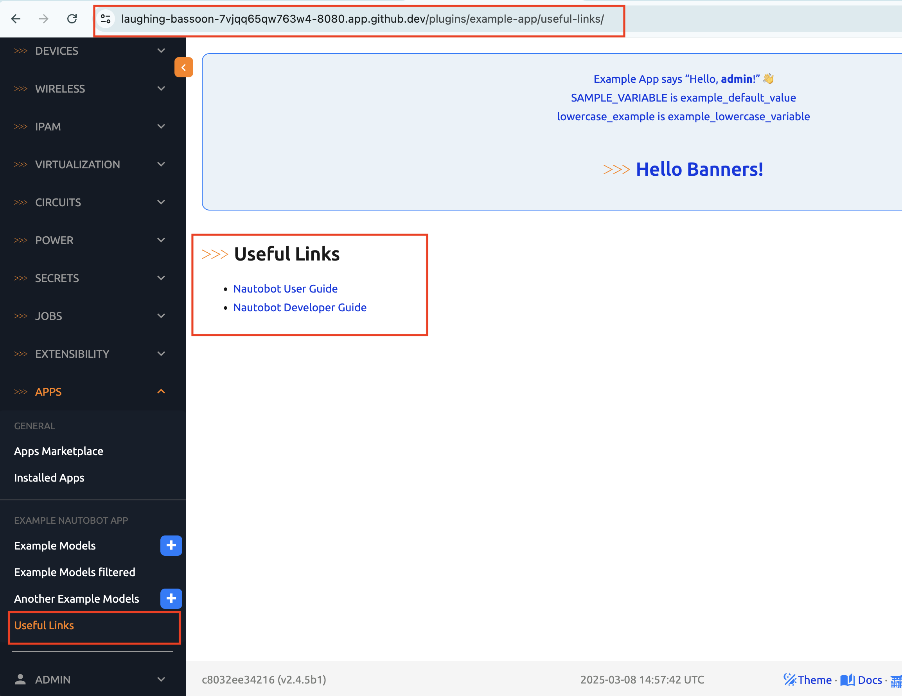
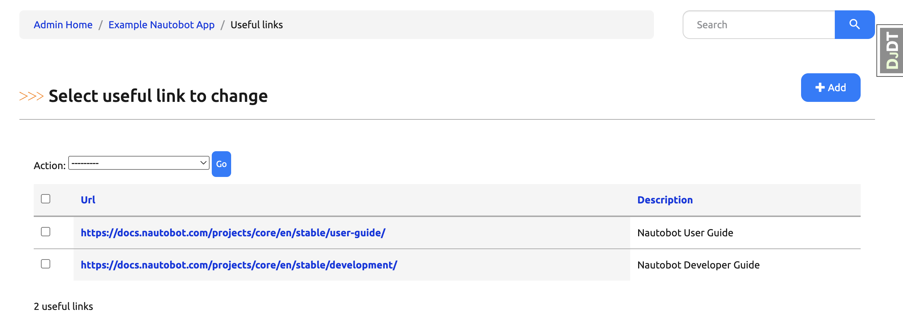
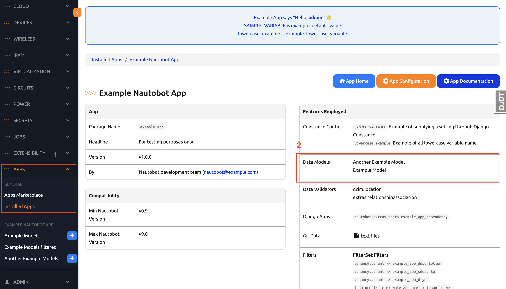
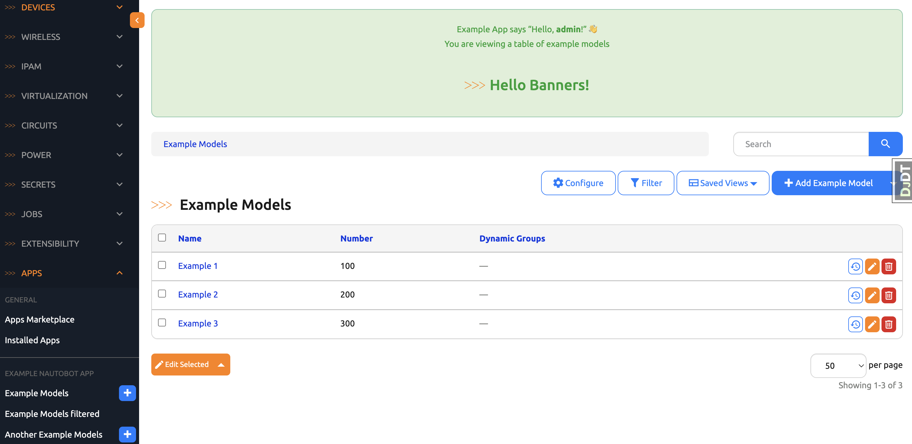
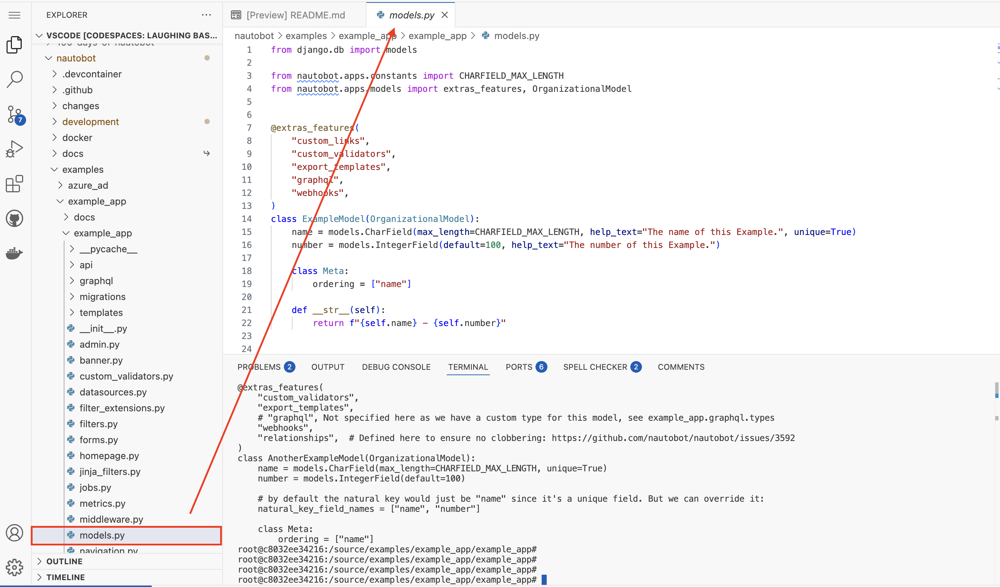

# Example App Creating Data Models - Part 1

For our example app, we will add a new page with a list of useful links as a quick reference. This is what we will end up with at the end of Day 59: 

- A new database model of useful links. 
- Use the admin panel to add data to the database model. 
- A new view that integrates the new database model. 
- A new HTML template to present these links. 
- A new URL for the new template. 
- A new navigation link within example_app points to the new URL. 



We will use the admin panel to add our links: 



As with most new app development, we will start with the database model. 

## Models.py

We know the file to be modified for the example_app is probably named `models.py`, if we look around the nautobot repository, we see this file [models.py](https://github.com/nautobot/nautobot/blob/develop/examples/example_app/example_app/models.py) file. Let's find it in our environment. 

Use the `docker ps` to see the running containers: 

```
@ericchou1 ➜ ~ $ docker ps
CONTAINER ID   IMAGE                                 COMMAND                  CREATED      STATUS                       PORTS                                                                                                          NAMES
6d89d5e18d29   local/nautobot-dev:local-2.4-py3.12   "watchmedo auto-rest…"   3 days ago   Up About an hour (healthy)   8080/tcp                                                                                                       nautobot-2-4-celery_beat-1
ed1202e56658   local/nautobot-dev:local-2.4-py3.12   "watchmedo auto-rest…"   3 days ago   Up About an hour (healthy)   0.0.0.0:6898->6898/tcp, :::6898->6898/tcp, 0.0.0.0:8081->8080/tcp, :::8081->8080/tcp                           nautobot-2-4-celery_worker-1
c8032ee34216   local/nautobot-dev:local-2.4-py3.12   "/docker-entrypoint.…"   3 days ago   Up About an hour (healthy)   0.0.0.0:6899->6899/tcp, :::6899->6899/tcp, 0.0.0.0:8080->8080/tcp, :::8080->8080/tcp                           nautobot-2-4-nautobot-1
8dfdf6d852e1   selenium/standalone-firefox:4.27      "/opt/bin/entry_poin…"   3 days ago   Up About an hour             5900/tcp, 0.0.0.0:4444->4444/tcp, :::4444->4444/tcp, 0.0.0.0:15900->15900/tcp, :::15900->15900/tcp, 9000/tcp   nautobot-2-4-selenium-1
a4251f9acfae   redis:6-alpine                        "docker-entrypoint.s…"   3 days ago   Up About an hour (healthy)   6379/tcp                                                                                                       nautobot-2-4-redis-1
d5e11fb88308   postgres:13                           "docker-entrypoint.s…"   3 days ago   Up About an hour (healthy)   5432/tcp                                                                                                       nautobot-2-4-db-1
```

Attach to the nautobot instance and take a look at the models: 

```
@ericchou1 ➜ ~ $ docker exec -it nautobot-2-4-nautobot-1 bash

root@c8032ee34216:/source# cat examples/example_app/example_app/models.py 
from django.db import models
from nautobot.core.models import BaseModel 
from nautobot.apps.constants import CHARFIELD_MAX_LENGTH
from nautobot.apps.models import extras_features, OrganizationalModel


@extras_features(
    "custom_links",
    "custom_validators",
    "export_templates",
    "graphql",
    "webhooks",
)
class ExampleModel(OrganizationalModel):
    name = models.CharField(max_length=CHARFIELD_MAX_LENGTH, help_text="The name of this Example.", unique=True)
    number = models.IntegerField(default=100, help_text="The number of this Example.")

    class Meta:
        ordering = ["name"]

    def __str__(self):
        return f"{self.name} - {self.number}"


@extras_features(
    "custom_validators",
    "export_templates",
    # "graphql", Not specified here as we have a custom type for this model, see example_app.graphql.types
    "webhooks",
    "relationships",  # Defined here to ensure no clobbering: https://github.com/nautobot/nautobot/issues/3592
)
class AnotherExampleModel(OrganizationalModel):
    name = models.CharField(max_length=CHARFIELD_MAX_LENGTH, unique=True)
    number = models.IntegerField(default=100)

    # by default the natural key would just be "name" since it's a unique field. But we can override it:
    natural_key_field_names = ["name", "number"]

    class Meta:
        ordering = ["name"]

```

We see there are two models, `ExampleModel` and `AnotherExampleModel`. We can verify that in two places in the Web UI. 

The first place is under `Installed Apps -> Example Nautoobt App` there is a `Data Models` section that lists out the data models: 



Another place is from the navigation menu, there is a link for `Example Models` that we can click to see a list view of examples: 



Keep these locations in mind as we start to add our own data model. 

The last step is to find this file in our VSCode explorer: 



Congratulations on completing today's task! Finding the right file and knowing where to look might seem trivial, but trust me, it is not, especially for a software project that has been in development for many years!

## Day 51 To Do

Remember to stop the codespace instance on [https://github.com/codespaces/](https://github.com/codespaces/). 

Go ahead and post a screenshot from any of the steps in today's challenge on a social media of your choice, make sure you use the tag `#100DaysOfNautobot` `#JobsToBeDone` and tag `@networktocode`, so we can share your progress! 

In tomorrow's challenge, we will be creating a new database model. See you tomorrow! 

[X/Twitter](<https://twitter.com/intent/tweet?url=https://github.com/nautobot/100-days-of-nautobot&text=I+just+completed+Day+51+of+the+100+days+of+nautobot+challenge+!&hashtags=100DaysOfNautobot,JobsToBeDone>)

[LinkedIn](https://www.linkedin.com/) (Copy & Paste: I just completed Day 51 of 100 Days of Nautobot, https://github.com/nautobot/100-days-of-nautobot, challenge! @networktocode #JobsToBeDone #100DaysOfNautobot) 