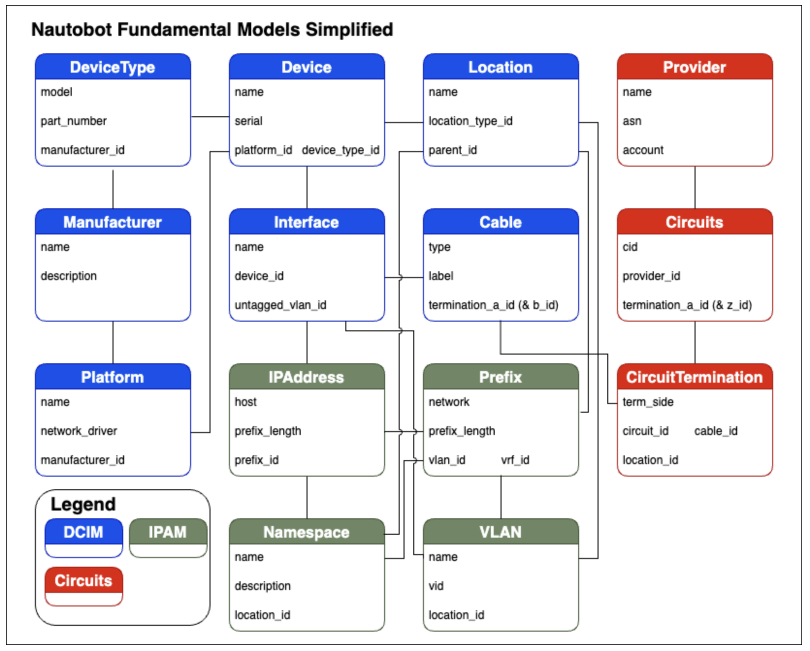
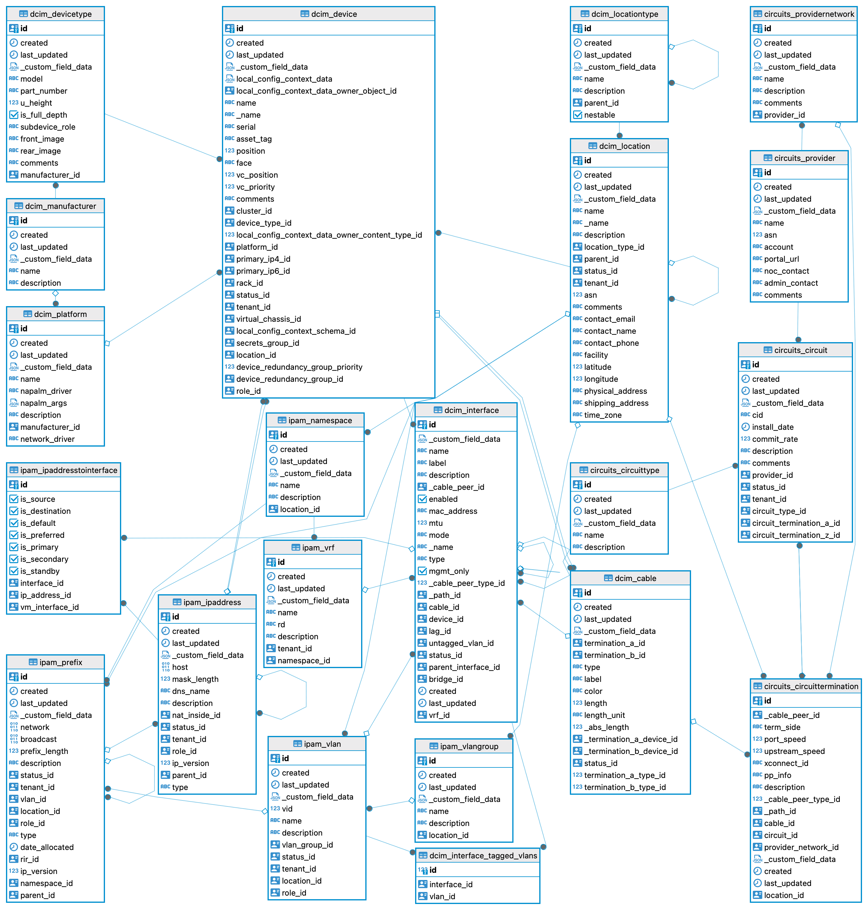
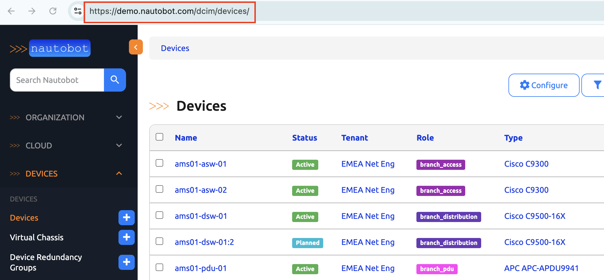
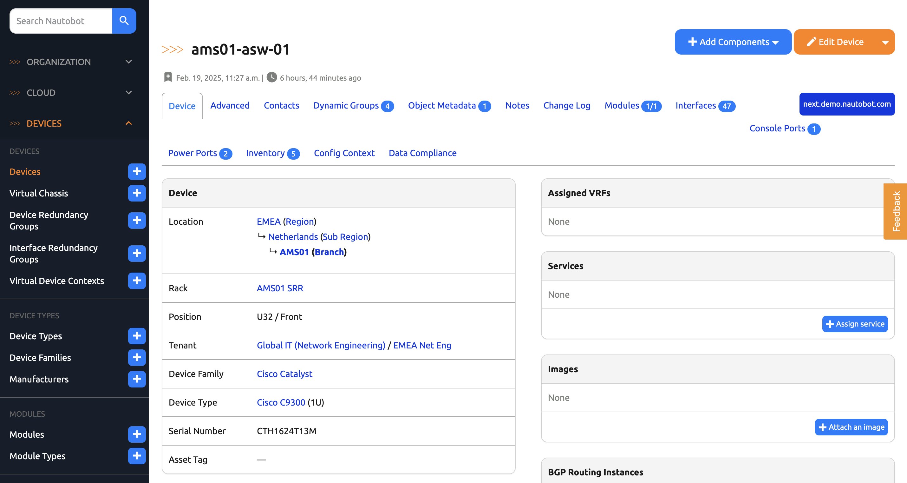
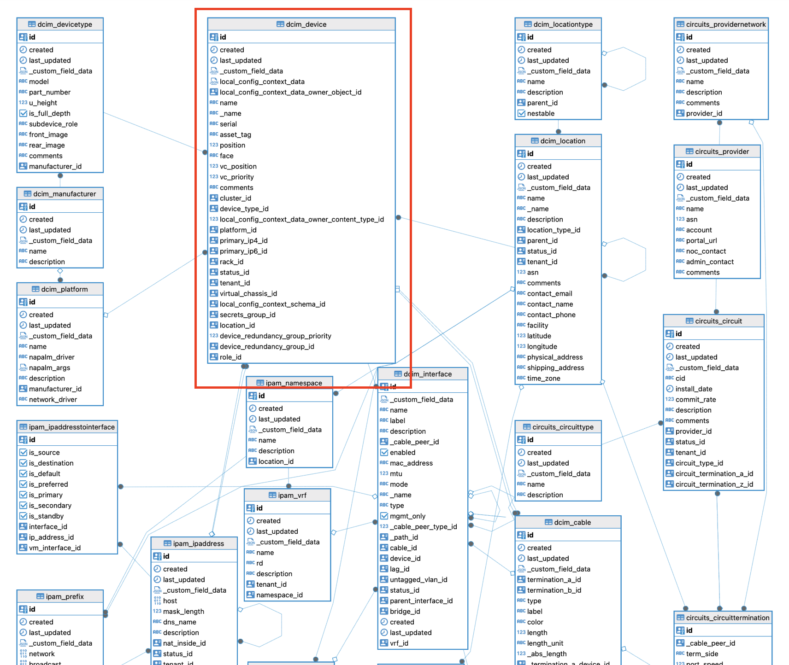
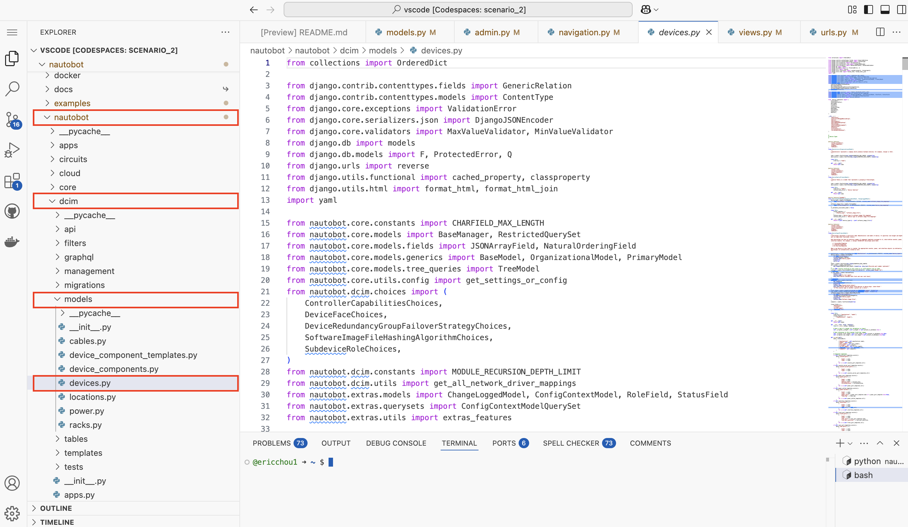

# Nautobot Database Model Part 1: Understanding Nautobot's Core Data Models

In the next few days, we will familiarize ourselves with some of Nautobot's Data models. As stated in the [Core Data Model Overview](https://docs.nautobot.com/projects/core/en/latest/user-guide/core-data-model/overview/introduction/), there are nearly 200 models in Nautobot core, which do not include any of the models that come from Nautobot Apps. We cannot possibly go over all the models in a single day's challenge. But instead, we can highlight the most common models, learn about their usage pattern, learn where to find documentation, and use them as a quick reference for other models.  

As illustrated by [Nautobot Fundamental Models Simplified](https://docs.nautobot.com/projects/core/en/latest/media/models/model_simple.png), amongst the core data models are: 

- DCIM: Location, Device, DeviceType, Manufacturer, Platform, Interface, and Cable, etc. 
- Circuits: Circuits, Provider, CircuitTermination, etc. 
- IPAM: IPAddress, Prefix, Namespace, VLAN, etc. 



For the unintimated, more details can be gleaned from the [UML version](https://docs.nautobot.com/projects/core/en/latest/user-guide/core-data-model/overview/introduction/#fundamental-model-uml): 



In today's challenge, our objective is to use various tools to find relevant information about a particular core data model in Nautobot and its relationship with other data models. 

## Environment Setup

We will use a combination of [Scenario 2](../Lab_Setup/scenario_2_setup/README.md) lab, [https://demo.nautobot.com/](https://demo.nautobot.com/), and [Nautobot Documentation](https://docs.nautobot.com/projects/core/en/latest/user-guide/core-data-model/overview/introduction/) for today's challenge. 

```
$ cd nautobot
$ poetry shell
$ poetry install
$ invoke build
(be patient with this step)
$ invoke debug
(be patient with this step as well)
```


## Device Model Example

As a network engineer, managing network devices is one of the main areas of our job. Let's say we are curious about how the devices are represented in Nautobot and its association with other data models. How do we go about doing it? 

There are different approaches, and the way to learn highly dependent on your background and experience level. Below I offer some ideas for learning and exploration. 

### Demo Site

The [Nautobot Demo Site](https://demo.nautobot.com/) offers pre-populated data that aims to replicate real world scenarios. 

We can see in the [Devices](https://demo.nautobot.com/dcim/devices/) are represented under `/dcim/devices/`, which offers the first hint of the device model is part of the group of DCIM data models. 



If we click on any of the details, it will lead us to a detail view of the device: 



From the view, we can form an educated guess that the device has fields such as name, serial number, asset tag, and other fields. 

Since we can click on fields such as Location, Device Types, and Device Family, we can be also reasonably guess that these are other data models that has relationship with the device data model. 

### Documentation 

In fact, we can take some guess work out from reading the [fundamental model UML](https://docs.nautobot.com/projects/core/en/latest/user-guide/core-data-model/overview/introduction/#fundamental-model-uml): 



The [device](https://docs.nautobot.com/projects/core/en/latest/user-guide/core-data-model/dcim/device/) documentation indeed offers more information about the model, such as the required assignments: 

```
Each device must be assigned a location, device role, and operational status, and may optionally be assigned to a rack within a location. A platform, serial number, and asset tag may optionally be assigned to each device.

Device names must be unique within a location, unless the device has been assigned to a tenant. Devices may also be unnamed.
```

In the next step, we will try to take a look at Nautobot's source code related to the `dcim.devices` data model. 

### Source Code 

We can launch our Codespace and take a look at the source code. We see the model is defined under `nautobot -> dcim -> models -> devices.py`: 



We can see many of the models defined in this file, such as `Manufacturer`, `DeviceFamily`, `DeviceType`, `Platform`, and, of course, `Device`: 

```python 
@extras_features(
    "custom_links",
    "custom_validators",
    "export_templates",
    "graphql",
    "locations",
    "statuses",
    "webhooks",
)
class Device(PrimaryModel, ConfigContextModel):
    """
    A Device represents a piece of physical hardware. Each Device is assigned a DeviceType,
    Role, and (optionally) a Platform. Device names are not required, however if one is set it must be unique.

    Each Device must be assigned to a Location, and optionally to a Rack within that.
    Associating a device with a particular rack face or unit is optional (for example, vertically mounted PDUs
    do not consume rack units).

    When a new Device is created, console/power/interface/device bay components are created along with it as dictated
    by the component templates assigned to its DeviceType. Components can also be added, modified, or deleted after the
    creation of a Device.
    """

    device_type = models.ForeignKey(to="dcim.DeviceType", on_delete=models.PROTECT, related_name="devices")
    status = StatusField(blank=False, null=False)
    role = RoleField(blank=False, null=False)
    tenant = models.ForeignKey(
        to="tenancy.Tenant",
        on_delete=models.PROTECT,
        related_name="devices",
        blank=True,
        null=True,
    )
    platform = models.ForeignKey(
        to="dcim.Platform",
        on_delete=models.SET_NULL,
        related_name="devices",
        blank=True,
        null=True,
    )
    name = models.CharField(  # noqa: DJ001  # django-nullable-model-string-field -- intentional, see below
        max_length=CHARFIELD_MAX_LENGTH,
        blank=True,
        null=True,  # because name is part of uniqueness constraint but is optional
        db_index=True,
    )
    _name = NaturalOrderingField(
        target_field="name", max_length=CHARFIELD_MAX_LENGTH, blank=True, null=True, db_index=True
    )
    serial = models.CharField(max_length=CHARFIELD_MAX_LENGTH, blank=True, verbose_name="Serial number", db_index=True)
    asset_tag = models.CharField(
        max_length=CHARFIELD_MAX_LENGTH,
        blank=True,
        null=True,
        unique=True,
        verbose_name="Asset tag",
        help_text="A unique tag used to identify this device",
    )
    location = models.ForeignKey(
        to="dcim.Location",
        on_delete=models.PROTECT,
        related_name="devices",
    )
    rack = models.ForeignKey(
        to="dcim.Rack",
        on_delete=models.PROTECT,
        related_name="devices",
        blank=True,
        null=True,
    )
    # 2.0 TODO: Profile filtering on this field if it could benefit from an index
    position = models.PositiveSmallIntegerField(
        blank=True,
        null=True,
        validators=[MinValueValidator(1)],
        verbose_name="Position (U)",
        help_text="The lowest-numbered unit occupied by the device",
    )
    # todoindex:
    face = models.CharField(max_length=50, blank=True, choices=DeviceFaceChoices, verbose_name="Rack face")
    primary_ip4 = models.ForeignKey(
        to="ipam.IPAddress",
        on_delete=models.SET_NULL,
        related_name="primary_ip4_for",
        blank=True,
        null=True,
        verbose_name="Primary IPv4",
    )
    primary_ip6 = models.ForeignKey(
        to="ipam.IPAddress",
        on_delete=models.SET_NULL,
        related_name="primary_ip6_for",
        blank=True,
        null=True,
        verbose_name="Primary IPv6",
    )
    cluster = models.ForeignKey(
        to="virtualization.Cluster",
        on_delete=models.SET_NULL,
        related_name="devices",
        blank=True,
        null=True,
    )
    virtual_chassis = models.ForeignKey(
        to="VirtualChassis",
        on_delete=models.SET_NULL,
        related_name="members",
        blank=True,
        null=True,
    )
    device_redundancy_group = models.ForeignKey(
        to="dcim.DeviceRedundancyGroup",
        on_delete=models.SET_NULL,
        related_name="devices",
        blank=True,
        null=True,
        verbose_name="Device Redundancy Group",
    )
    device_redundancy_group_priority = models.PositiveSmallIntegerField(
        blank=True,
        null=True,
        validators=[MinValueValidator(1)],
        verbose_name="Device Redundancy Group Priority",
        help_text="The priority the device has in the device redundancy group.",
    )
    software_version = models.ForeignKey(
        to="dcim.SoftwareVersion",
        on_delete=models.PROTECT,
        related_name="devices",
        blank=True,
        null=True,
        help_text="The software version installed on this device",
    )
    # 2.0 TODO: Profile filtering on this field if it could benefit from an index
    vc_position = models.PositiveSmallIntegerField(blank=True, null=True, validators=[MaxValueValidator(255)])
    vc_priority = models.PositiveSmallIntegerField(blank=True, null=True, validators=[MaxValueValidator(255)])
    comments = models.TextField(blank=True)
    images = GenericRelation(to="extras.ImageAttachment")

    secrets_group = models.ForeignKey(
        to="extras.SecretsGroup",
        on_delete=models.SET_NULL,
        related_name="devices",
        default=None,
        blank=True,
        null=True,
    )

    software_image_files = models.ManyToManyField(
        to="dcim.SoftwareImageFile",
        related_name="devices",
        blank=True,
        verbose_name="Software Image Files",
        help_text="Override the software image files associated with the software version for this device",
    )
    controller_managed_device_group = models.ForeignKey(
        to="dcim.ControllerManagedDeviceGroup",
        on_delete=models.SET_NULL,
        related_name="devices",
        blank=True,
        null=True,
    )

    objects = BaseManager.from_queryset(ConfigContextModelQuerySet)()

    clone_fields = [
        "device_type",
        "role",
        "tenant",
        "platform",
        "location",
        "rack",
        "status",
        "cluster",
        "secrets_group",
    ]

    @classproperty  # https://github.com/PyCQA/pylint-django/issues/240
    def natural_key_field_names(cls):  # pylint: disable=no-self-argument
        """
        When DEVICE_NAME_AS_NATURAL_KEY is set in settings or Constance, we use just the `name` for simplicity.
        """
        if get_settings_or_config("DEVICE_NAME_AS_NATURAL_KEY"):
            # opt-in simplified "pseudo-natural-key"
            return ["name"]
        else:
            # true natural-key given current uniqueness constraints
            return ["name", "tenant", "location"]  # location should be last since it's potentially variadic

    class Meta:
        ordering = ("_name",)  # Name may be null
        unique_together = (
            ("location", "tenant", "name"),  # See validate_unique below
            ("rack", "position", "face"),
            ("virtual_chassis", "vc_position"),
        )

    def __str__(self):
        return self.display or super().__str__()

    def validate_unique(self, exclude=None):
        # Check for a duplicate name on a device assigned to the same Location and no Tenant. This is necessary
        # because Django does not consider two NULL fields to be equal, and thus will not trigger a violation
        # of the uniqueness constraint without manual intervention.
        if self.name and hasattr(self, "location") and self.tenant is None:
            if Device.objects.exclude(pk=self.pk).filter(name=self.name, location=self.location, tenant__isnull=True):
                raise ValidationError({"name": "A device with this name already exists."})

        super().validate_unique(exclude)

    def clean(self):
        from nautobot.ipam import models as ipam_models  # circular import workaround

        super().clean()

        # Validate location
        if self.location is not None:
            if self.rack is not None:
                device_location = self.location
                # Rack's location must be a child location or the same location as that of the parent device.
                # Location is a required field on rack.
                rack_location = self.rack.location
                if device_location not in rack_location.ancestors(include_self=True):
                    raise ValidationError(
                        {
                            "rack": f'Rack "{self.rack}" does not belong to location "{self.location}" and its descendants.'
                        }
                    )

            # self.cluster is validated somewhat later, see below

            if ContentType.objects.get_for_model(self) not in self.location.location_type.content_types.all():
                raise ValidationError(
                    {"location": f'Devices may not associate to locations of type "{self.location.location_type}".'}
                )

        if self.rack is None:
            if self.face:
                raise ValidationError(
                    {
                        "face": "Cannot select a rack face without assigning a rack.",
                    }
                )
            if self.position:
                raise ValidationError(
                    {
                        "position": "Cannot select a rack position without assigning a rack.",
                    }
                )

        # Validate position/face combination
        if self.position and not self.face:
            raise ValidationError(
                {
                    "face": "Must specify rack face when defining rack position.",
                }
            )

        # Prevent 0U devices from being assigned to a specific position
        if self.position and self.device_type.u_height == 0:
            raise ValidationError(
                {"position": f"A U0 device type ({self.device_type}) cannot be assigned to a rack position."}
            )

        if self.rack:
            try:
                # Child devices cannot be assigned to a rack face/unit
                if self.device_type.is_child_device and self.face:
                    raise ValidationError(
                        {
                            "face": "Child device types cannot be assigned to a rack face. This is an attribute of the "
                            "parent device."
                        }
                    )
                if self.device_type.is_child_device and self.position:
                    raise ValidationError(
                        {
                            "position": "Child device types cannot be assigned to a rack position. This is an attribute of "
                            "the parent device."
                        }
                    )

                # Validate rack space
                rack_face = self.face if not self.device_type.is_full_depth else None
                exclude_list = [self.pk] if self.present_in_database else []
                available_units = self.rack.get_available_units(
                    u_height=self.device_type.u_height,
                    rack_face=rack_face,
                    exclude=exclude_list,
                )
                if self.position and self.position not in available_units:
                    raise ValidationError(
                        {
                            "position": f"U{self.position} is already occupied or does not have sufficient space to "
                            f"accommodate this device type: {self.device_type} ({self.device_type.u_height}U)"
                        }
                    )

            except DeviceType.DoesNotExist:
                pass

        # Validate primary IP addresses
        all_interfaces = self.all_interfaces.all()
        for field in ["primary_ip4", "primary_ip6"]:
            ip = getattr(self, field)
            if ip is not None:
                if field == "primary_ip4":
                    if ip.ip_version != 4:
                        raise ValidationError({f"{field}": f"{ip} is not an IPv4 address."})
                else:
                    if ip.ip_version != 6:
                        raise ValidationError({f"{field}": f"{ip} is not an IPv6 address."})
                if ipam_models.IPAddressToInterface.objects.filter(
                    ip_address=ip, interface__in=all_interfaces
                ).exists():
                    pass
                elif (
                    ip.nat_inside is not None
                    and ipam_models.IPAddressToInterface.objects.filter(
                        ip_address=ip.nat_inside, interface__in=all_interfaces
                    ).exists()
                ):
                    pass
                else:
                    raise ValidationError(
                        {f"{field}": f"The specified IP address ({ip}) is not assigned to this device."}
                    )

        # Validate manufacturer/platform
        if hasattr(self, "device_type") and self.platform:
            if self.platform.manufacturer and self.platform.manufacturer != self.device_type.manufacturer:
                raise ValidationError(
                    {
                        "platform": (
                            f"The assigned platform is limited to {self.platform.manufacturer} device types, "
                            f"but this device's type belongs to {self.device_type.manufacturer}."
                        )
                    }
                )

        # A Device can only be assigned to a Cluster in the same location or parent location, if any
        if (
            self.cluster is not None
            and self.location is not None
            and self.cluster.location is not None
            and self.cluster.location not in self.location.ancestors(include_self=True)
        ):
            raise ValidationError(
                {"cluster": f"The assigned cluster belongs to a location that does not include {self.location}."}
            )

        # Validate virtual chassis assignment
        if self.virtual_chassis and self.vc_position is None:
            raise ValidationError(
                {"vc_position": "A device assigned to a virtual chassis must have its position defined."}
            )

        # Validate device isn't being removed from a virtual chassis when it is the master
        if not self.virtual_chassis and self.present_in_database:
            existing_virtual_chassis = Device.objects.get(id=self.id).virtual_chassis
            if existing_virtual_chassis and existing_virtual_chassis.master == self:
                raise ValidationError(
                    {
                        "virtual_chassis": f"The master device for the virtual chassis ({ existing_virtual_chassis}) may not be removed"
                    }
                )

        # Validate device is a member of a device redundancy group if it has a device redundancy group priority set
        if self.device_redundancy_group_priority is not None and self.device_redundancy_group is None:
            raise ValidationError(
                {
                    "device_redundancy_group_priority": "Must assign a redundancy group when defining a redundancy group priority."
                }
            )

        # If any software image file is specified, validate that
        # each of the software image files belongs to the device's device type or is a default image
        # TODO: this is incorrect as we cannot validate a ManyToMany during clean() - nautobot/nautobot#6344
        for image_file in self.software_image_files.all():
            if not image_file.default_image and self.device_type not in image_file.device_types.all():
                raise ValidationError(
                    {
                        "software_image_files": (
                            f"Software image file {image_file} for version '{image_file.software_version}' is not "
                            f"valid for device type {self.device_type}."
                        )
                    }
                )

    def save(self, *args, **kwargs):
        is_new = not self.present_in_database

        super().save(*args, **kwargs)

        # If this is a new Device, instantiate all related components per the DeviceType definition
        if is_new:
            self.create_components()

        # Update Location and Rack assignment for any child Devices
        devices = Device.objects.filter(parent_bay__device=self)
        for device in devices:
            save_child_device = False
            if device.location != self.location:
                device.location = self.location
                save_child_device = True
            if device.rack != self.rack:
                device.rack = self.rack
                save_child_device = True

            if save_child_device:
                device.save()

    def create_components(self):
        """Create device components from the device type definition."""
        # The order of these is significant as
        # - PowerOutlet depends on PowerPort
        # - FrontPort depends on RearPort
        component_models = [
            (ConsolePort, self.device_type.console_port_templates.all()),
            (ConsoleServerPort, self.device_type.console_server_port_templates.all()),
            (PowerPort, self.device_type.power_port_templates.all()),
            (PowerOutlet, self.device_type.power_outlet_templates.all()),
            (Interface, self.device_type.interface_templates.all()),
            (RearPort, self.device_type.rear_port_templates.all()),
            (FrontPort, self.device_type.front_port_templates.all()),
            (DeviceBay, self.device_type.device_bay_templates.all()),
            (ModuleBay, self.device_type.module_bay_templates.all()),
        ]
        instantiated_components = []
        for model, templates in component_models:
            model.objects.bulk_create([x.instantiate(device=self) for x in templates])
        return instantiated_components

    @property
    def display(self):
        if self.name:
            return self.name
        elif self.virtual_chassis:
            return f"{self.virtual_chassis.name}:{self.vc_position} ({self.pk})"
        elif self.device_type:
            return f"{self.device_type.manufacturer} {self.device_type.model} ({self.pk})"
        else:
            return ""  # Device has not yet been created

    @property
    def identifier(self):
        """
        Return the device name if set; otherwise return the Device's primary key as {pk}
        """
        if self.name is not None:
            return self.name
        return f"{{{self.pk}}}"

    @property
    def primary_ip(self):
        if get_settings_or_config("PREFER_IPV4") and self.primary_ip4:
            return self.primary_ip4
        elif self.primary_ip6:
            return self.primary_ip6
        elif self.primary_ip4:
            return self.primary_ip4
        else:
            return None

    def get_vc_master(self):
        """
        If this Device is a VirtualChassis member, return the VC master. Otherwise, return None.
        """
        return self.virtual_chassis.master if self.virtual_chassis else None

    @property
    def vc_interfaces(self):
        """
        Return a QuerySet matching all Interfaces assigned to this Device or, if this Device is a VC master, to another
        Device belonging to the same VirtualChassis.
        """
        qs = self.all_interfaces
        if self.virtual_chassis and self.virtual_chassis.master == self:
            for member in self.virtual_chassis.members.exclude(id=self.id):
                qs |= member.all_interfaces.filter(mgmt_only=False)
        return qs

    @property
    def common_vc_interfaces(self):
        """
        Return a QuerySet matching all Interfaces assigned to this Device or,
        if this Device belongs to a VirtualChassis, it returns all interfaces belonging Devices with same VirtualChassis
        """
        if self.virtual_chassis:
            return self.virtual_chassis.member_interfaces
        return self.all_interfaces

    def get_cables(self, pk_list=False):
        """
        Return a QuerySet or PK list matching all Cables connected to a component of this Device.
        """
        from .cables import Cable

        cable_pks = []
        for component_model in [
            ConsolePort,
            ConsoleServerPort,
            PowerPort,
            PowerOutlet,
            Interface,
            FrontPort,
            RearPort,
        ]:
            cable_pks += component_model.objects.filter(device=self, cable__isnull=False).values_list(
                "cable", flat=True
            )
        if pk_list:
            return cable_pks
        return Cable.objects.filter(pk__in=cable_pks)

    def get_children(self):
        """
        Return the set of child Devices installed in DeviceBays within this Device.
        """
        return Device.objects.filter(parent_bay__device=self.pk)

    @property
    def all_modules(self):
        """
        Return all child Modules installed in ModuleBays within this Device.
        """
        # Supports Device->ModuleBay->Module->ModuleBay->Module->ModuleBay->Module->ModuleBay->Module
        # This query looks for modules that are installed in a module_bay and attached to this device
        # We artificially limit the recursion to 4 levels or we would be stuck in an infinite loop.
        recursion_depth = MODULE_RECURSION_DEPTH_LIMIT
        qs = Module.objects.all()
        query = Q()
        for level in range(recursion_depth):
            recursive_query = "parent_module_bay__parent_module__" * level
            query = query | Q(**{f"{recursive_query}parent_module_bay__parent_device": self})
        return qs.filter(query)

    @property
    def all_console_ports(self):
        """
        Return all Console Ports that are installed in the device or in modules that are installed in the device.
        """
        # TODO: These could probably be optimized to reduce the number of joins
        return ConsolePort.objects.filter(Q(device=self) | Q(module__in=self.all_modules))

    @property
    def all_console_server_ports(self):
        """
        Return all Console Server Ports that are installed in the device or in modules that are installed in the device.
        """
        return ConsoleServerPort.objects.filter(Q(device=self) | Q(module__in=self.all_modules))

    @property
    def all_front_ports(self):
        """
        Return all Front Ports that are installed in the device or in modules that are installed in the device.
        """
        return FrontPort.objects.filter(Q(device=self) | Q(module__in=self.all_modules))

    @property
    def all_interfaces(self):
        """
        Return all Interfaces that are installed in the device or in modules that are installed in the device.
        """
        return Interface.objects.filter(Q(device=self) | Q(module__in=self.all_modules))

    @property
    def all_module_bays(self):
        """
        Return all Module Bays that are installed in the device or in modules that are installed in the device.
        """
        return ModuleBay.objects.filter(Q(parent_device=self) | Q(parent_module__in=self.all_modules))

    @property
    def all_power_ports(self):
        """
        Return all Power Ports that are installed in the device or in modules that are installed in the device.
        """
        return PowerPort.objects.filter(Q(device=self) | Q(module__in=self.all_modules))

    @property
    def all_power_outlets(self):
        """
        Return all Power Outlets that are installed in the device or in modules that are installed in the device.
        """
        return PowerOutlet.objects.filter(Q(device=self) | Q(module__in=self.all_modules))

    @property
    def all_rear_ports(self):
        """
        Return all Rear Ports that are installed in the device or in modules that are installed in the device.
        """
        return RearPort.objects.filter(Q(device=self) | Q(module__in=self.all_modules))
```

A detailed explanation of the fields is out of scope for today's challenge, the [Django Models](https://docs.djangoproject.com/en/5.1/topics/db/models/) documentation does a good job of give detail descriptions to the fields, filed types, relationships, etc. 

### Use nbshell

Go ahead and create a device with the necessary assignments such as location, device role, and status. Then try to query the devices and explore its relationship with other data models using `nbshell`:  

```shell
$ docker exec -it nautobot-2-4-nautobot-1 bash

root@c8032ee34216:/source# nautobot-server nbshell
...

# Retrieve all devices
>>> devices = Device.objects.all()

# Loop through devices
>>> for device in devices:
...     print(device.name, device.device_type, device.device_role, device.site)
... 

# Retrieve a specific device by name
device = Device.objects.get(name="DeviceName")
print(device.name, device.device_type, device.device_role, device.site)

# Filter devices by site
site_devices = Device.objects.filter(site__name="SiteName")
for device in site_devices:
    print(device.name, device.device_type, device.device_role, device.site)

```

Congratulations on completing Day 61, this is the first of 5 days of Nautobot models, stay tuned for more! 

## Day 61 To Do

Remember to stop the codespace instance on [https://github.com/codespaces/](https://github.com/codespaces/). 

Go ahead and post something you learned from today's challenge on a social media of your choice, make sure you use the tag `#100DaysOfNautobot` `#JobsToBeDone` and tag `@networktocode`, so we can share your progress! 

In tomorrow's challenge, we will learn more about creating custom Nautobot data models. See you tomorrow! 

[X/Twitter](<https://twitter.com/intent/tweet?url=https://github.com/nautobot/100-days-of-nautobot&text=I+just+completed+Day+61+of+the+100+days+of+nautobot+challenge+!&hashtags=100DaysOfNautobot,JobsToBeDone>)

[LinkedIn](https://www.linkedin.com/) (Copy & Paste: I just completed Day 61 of 100 Days of Nautobot, https://github.com/nautobot/100-days-of-nautobot, challenge! @networktocode #JobsToBeDone #100DaysOfNautobot) 
