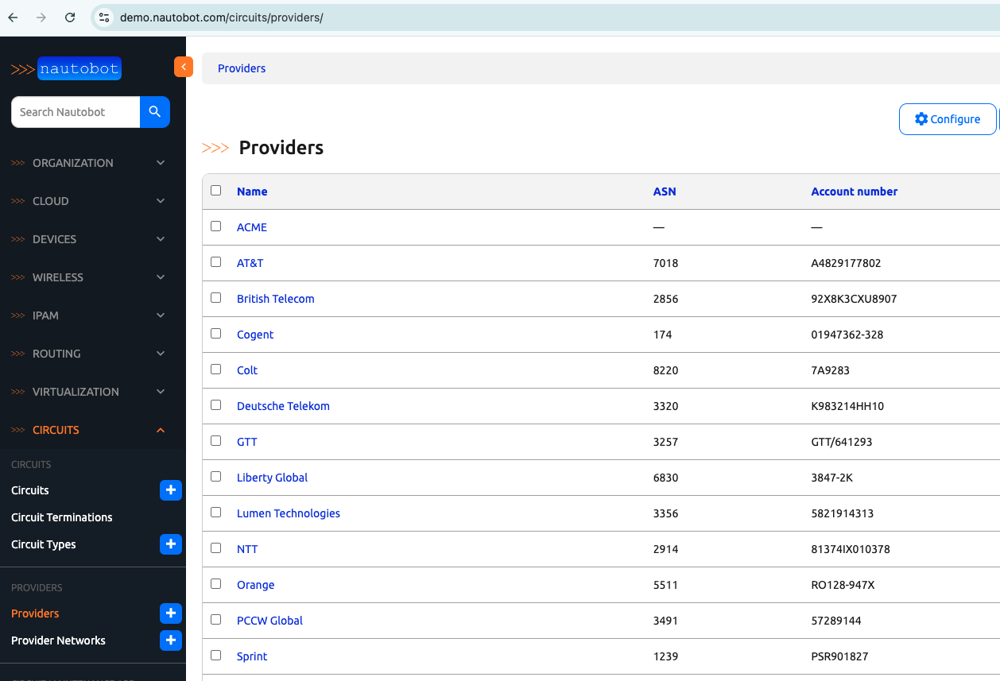

# Nautobot Class-Based Views

Nautobot leverages class-based views to provide a more organized and maintainable way of handling HTTP requests. In Nautobot, class-based views are used extensively to handle various operations such as displaying lists, handling forms, and performing database operations.

In today's challenge, we will introduce Nautobot's use of class-based views for Nautobot Apps. In particular, we will discuss `NautobotUIViewSetRouter` and `NautobotUIViewSet`, the relevant documentation are helpful to keep open as we cover the topics in today's challenge: 

- [NautobotUIVewSetRouter](https://docs.nautobot.com/projects/core/en/stable/development/apps/api/views/nautobotuiviewsetrouter/)
- [NautobotUIViewSet](https://docs.nautobot.com/projects/core/en/stable/development/apps/api/views/nautobotuiviewset/)

## Environment Setup

There is no hands-on work for today's challenge. Please feel free to use a combination of [Scenario 2](../Lab_Setup/scenario_2_setup/README.md) lab and [Nautbot Documentation](https://docs.nautobot.com/projects/core/en/stable/development/apps/) to experiment with code for today's challenge.

```
$ cd nautobot
$ poetry shell
$ poetry install
$ invoke build
(be patient with this step)
$ invoke debug
(be patient with this step as well)
```

### NautobotUIViewSetRouter

Nautobot uses class-based views extensively through the `NautobotUIViewSet` and its component `Mixins`. 

> [!TIP]
> [Mixins in Django](https://docs.djangoproject.com/en/5.1/topics/class-based-views/mixins/) are a form of multiple inheritance that allows for the reuse of code across multiple classes. 

The `NautobotUIViewSetRouter` is a key component for creating and registering URL patterns in [Nautobot Apps urls.py](https://github.com/nautobot/nautobot/blob/develop/nautobot/apps/urls.py): 

```
"""Utilities for apps to implement URL routing."""

from nautobot.core.views.routers import NautobotUIViewSetRouter

__all__ = ("NautobotUIViewSetRouter",)
```

The patterns are then matched in [https://github.com/nautobot/nautobot/blob/develop/nautobot/core/views/routers.py](https://github.com/nautobot/nautobot/blob/develop/nautobot/core/views/routers.py). The matched URL pattern will be directed to the app's view for standard views or `NautobotUIViewSet`. 

As explained in the [App Developer Guide -> Views -> NautobotUIViewSetRouter](https://docs.nautobot.com/projects/core/en/stable/development/apps/api/views/nautobotuiviewsetrouter/), we need to register the app's model and views with `NautobotUIViewSetRouter`. 

Here is a theoretical `urls.py` file for a Nautobot app: 

```python
from django.urls import path

from nautobot.apps.urls import NautobotUIViewSetRouter
from your_app import views


router = NautobotUIViewSetRouter()
router.register("yourappmodel", views.YourAppModelUIViewSet)

urlpatterns = [
    # Extra urls that do not follow the patterns of `NautobotUIViewSetRouter` go here.
    # changelog, notes and etc.
    ...
    path(
        "yourappmodels/<uuid:pk>/changelog/",
        ObjectChangeLogView.as_view(),
        name="yourappmodel_changelog",
        kwargs={"model": yourappmodel},
    ),
    path(
        "yourappmodels/<uuid:pk>/notes/",
        ObjectNotesView.as_view(),
        name="yourappmodel_notes",
        kwargs={"model": yourappmodel},
    ),
    ...
]
urlpatterns += router.urls
```

For an example of app `urls.py` we can look at [nautobot -> circuits -> urls.py](https://github.com/nautobot/nautobot/blob/develop/nautobot/circuits/urls.py): 

```python 
from django.urls import path

from nautobot.core.views.routers import NautobotUIViewSetRouter
from nautobot.dcim.views import CableCreateView, PathTraceView

from . import views
from .models import CircuitTermination

app_name = "circuits"
router = NautobotUIViewSetRouter()
router.register("providers", views.ProviderUIViewSet)
router.register("provider-networks", views.ProviderNetworkUIViewSet)
router.register("circuit-types", views.CircuitTypeUIViewSet)
router.register("circuits", views.CircuitUIViewSet)
router.register("circuit-terminations", views.CircuitTerminationUIViewSet)

urlpatterns = [
    path(
        "circuits/<uuid:pk>/terminations/swap/",
        views.CircuitSwapTerminations.as_view(),
        name="circuit_terminations_swap",
    ),
    path(
        "circuits/<uuid:circuit>/terminations/add/",
        views.CircuitTerminationUIViewSet.as_view({"get": "create", "post": "create"}),
        name="circuittermination_add",
    ),
    path(
        "circuit-terminations/<uuid:termination_a_id>/connect/<str:termination_b_type>/",
        CableCreateView.as_view(),
        name="circuittermination_connect",
        kwargs={"termination_a_type": CircuitTermination},
    ),
    path(
        "circuit-terminations/<uuid:pk>/trace/",
        PathTraceView.as_view(),
        name="circuittermination_trace",
        kwargs={"model": CircuitTermination},
    ),
]
urlpatterns += router.urls
```

We can experiment with URL mapping on [demo.nautobot.com](https://demo.nautobot.com/): 



In the next section, we will take a look at some views offered by `NautobotUIViewSet` and its associated `Mixins`. 

### NautobotUIViewSet Mixins

[NautobotUIViewSet](https://docs.nautobot.com/projects/core/en/stable/development/apps/api/views/nautobotuiviewset/) was introduced in Nautobot 1.4 intended to save app developer time and effort. 

The `NautobotUIViewSet` views can be gleaned from [Nautobot -> Apps -> Views.py](https://github.com/nautobot/nautobot/blob/develop/nautobot/apps/views.py). 

Some Common `NautobotUIViewSet` `Mixins`: 

1. **ObjectListViewMixin**: Displays a list view of the model.
2. **ObjectDetailViewMixin**: Displays detailed view of a single object.
3. **ObjectEditViewMixin**: The edit view of the model.
4. **ObjectDestroyViewMixin**: Delete view of the model.
5. **ObjectBuildUpdateViewMixin**: The bulk edit view of the model.
6. **ObjectBulkDestroyViewMixin**: The bulk delete view of the model.

Related back to the URL mapping, we can take a look at `views.ProviderUIViewSet`: 

```python
class ProviderUIViewSet(NautobotUIViewSet):
    bulk_update_form_class = forms.ProviderBulkEditForm
    filterset_class = filters.ProviderFilterSet
    filterset_form_class = forms.ProviderFilterForm
    form_class = forms.ProviderForm
    queryset = Provider.objects.all()
    serializer_class = serializers.ProviderSerializer
    table_class = tables.ProviderTable
    object_detail_content = ObjectDetailContent(
        panels=(
            ObjectFieldsPanel(
                section=SectionChoices.LEFT_HALF,
                weight=100,
                fields="__all__",
            ),
            ObjectsTablePanel(
                weight=200,
                table_class=tables.CircuitTable,
                table_filter="provider",
                section=SectionChoices.FULL_WIDTH,
                exclude_columns=["provider"],
            ),
        ),
    )
```

In this example, with a few lines of code, the majority of the database operations are offloaded to `NautobotUIViewSet`. 

## Resources
- [NautobotUIVewSetRouter](https://docs.nautobot.com/projects/core/en/stable/development/apps/api/views/nautobotuiviewsetrouter/)
- [NautobotUIViewSet](https://docs.nautobot.com/projects/core/en/stable/development/apps/api/views/nautobotuiviewset/)

Congratulations on completing Day 67! 

## Day 67 To Do

Remember to stop the codespace instance on [https://github.com/codespaces/](https://github.com/codespaces/). 

Go ahead and post about `NautobotUIViewSet` and the things you learned from today's challenge on a social media of your choice, make sure you use the tag `#100DaysOfNautobot` `#JobsToBeDone` and tag `@networktocode`, so we can share your progress! 

In tomorrow's challenge, we will be looking at other views provided in Nautobot. See you tomorrow! 

[X/Twitter](<https://twitter.com/intent/tweet?url=https://github.com/nautobot/100-days-of-nautobot&text=I+just+completed+Day+67+of+the+100+days+of+nautobot+challenge+!&hashtags=100DaysOfNautobot,JobsToBeDone>)

[LinkedIn](https://www.linkedin.com/) (Copy & Paste: I just completed Day 67 of 100 Days of Nautobot, https://github.com/nautobot/100-days-of-nautobot, challenge! @networktocode #JobsToBeDone #100DaysOfNautobot) 
