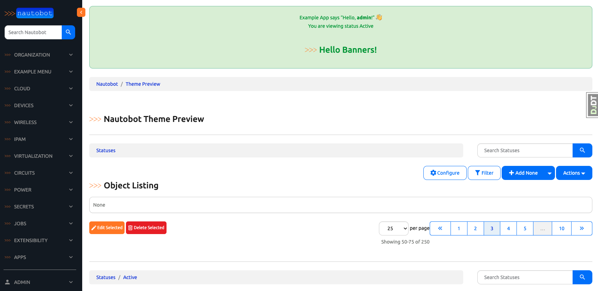
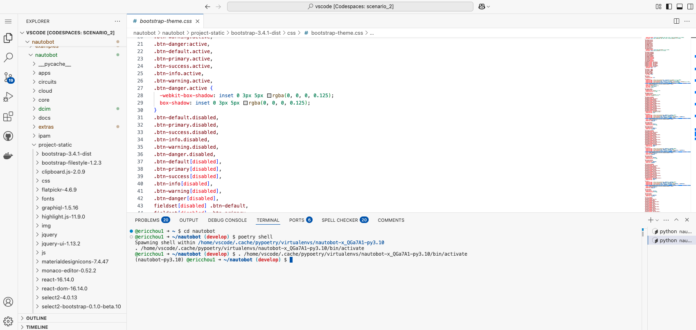
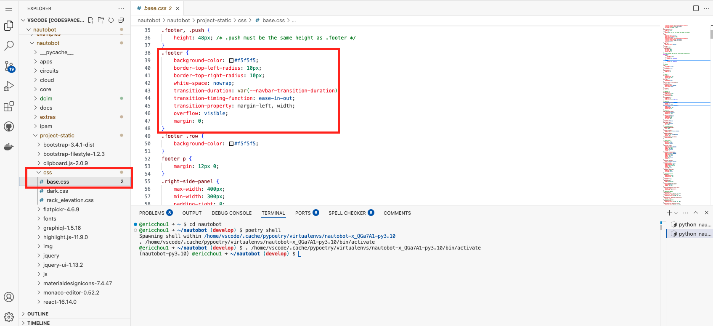
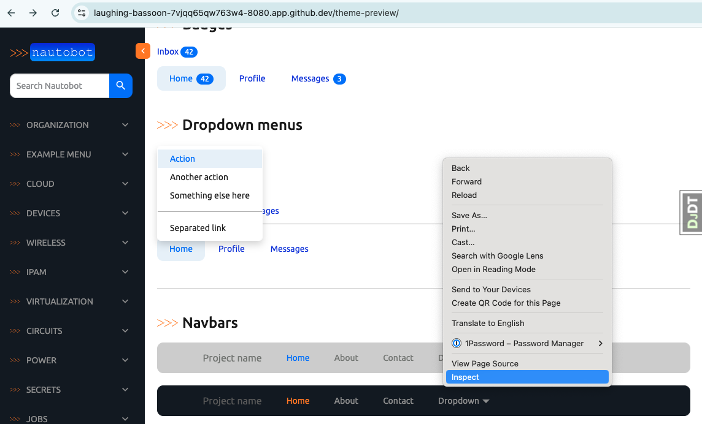
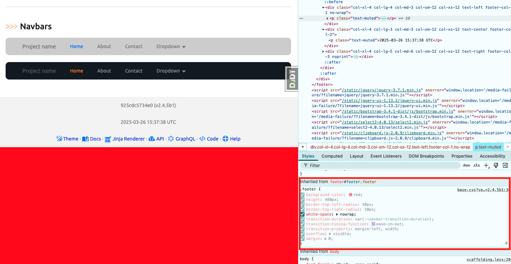

# Nautobot UI Styling

Nautobot's primary UI styling is based on [Bootstrap 3](https://getbootstrap.com/docs/3.4/), one of the most popular HTML, CSS, and JavaScript framework for developing responsive user interfaces. 

However, starting from version 2.1.0, the UI has used a Nautobot-specific custom Bootstrap theme in [nautobot-bootstrap GitHub repository](https://github.com/nautobot/nautobot-bootstrap/), then customized further in the main `nautobot` repository. 

> [!TIP] 
> We will cover just the basics of Bootstrap 3 as it relates to Nautobot implementation. To see the extent Bootstrap can be used to style a website, take a look at [Bootstrap Expo](https://expo.getbootstrap.com/)

The theme files are what is installed and referenced in the HTML templates. 

## Theme Files 

- `nautobot/project-static/bootstrap-3.4.1-dist/css/`: the base Nautobot-themed Bootstrap CSS definitions, directly as compiled from `nautobot-bootstrap`. These should never be edited manually, only recompiled from `nautobot-bootstrap` and copied as-is into nautobot.
- `nautobot/project-static/css/base.css`: Overrides and extensions of the base CSS theme for Nautobot. It can be edited as needed.
- `nautobot/project-static/css/dark.css`: Additional overrides and extensions specifically for the "dark mode" theme. Can be edited as needed.

Let's take a look at the files and play around with the different styles a bit. 

## Environment Setup

We will use a combination of [Scenario 2](../Lab_Setup/scenario_2_setup/README.md) lab, [https://demo.nautobot.com/](https://demo.nautobot.com/), and [Nautobot Documentation](https://docs.nautobot.com/projects/core/en/latest/user-guide/core-data-model/overview/introduction/) for today's challenge. 

```
$ cd nautobot
$ poetry shell
$ poetry install
$ invoke build
(be patient with this step)
$ invoke debug
(be patient with this step as well)
```

nautobot_fundamental_models_uml
In today's challenge, our objective is to use various tools to find relevant information about a particular core data model in Nautobot and its relationship with other data models.

Environment Setup
We will use a combination of Scenario 2 lab, https://demo.nautobot.com/, and Nautobot Documentation for today's challenge.

 nautobot_fundamental_models_uml
In today's challenge, our objective is to use various tools to find relevant information about a particular core data model in Nautobot and its relationship with other data models.

Environment Setup
We will use a combination of Scenario 2 lab, https://demo.nautobot.com/, and Nautobot Documentation for today's challenge.


## Theme Preview

In our development environment we have `settings.DEBUG` set to `True`. As a result, we can navigate to `/theme-preview` to retrieve a template view that showcases many of the Nautobot UI elements. 



The static files are located under `nautobot -> project-static` folder: 



Let's make some harmless but visible changes. 

## Example

Just for illustration, let's make some harmless changes that does not alter permanent settings. 

We can see the `footer` settings under `nautobot -> project-static -> css -> base.css`: 



We can right-click on any of the Nautobot page, in this case `/theme-preview/` and choose `inspect`: 



Locate the `.footer` section where we can see the `base.css?ve*` that matches the code snippet. We can make changes that can be viewed instantly on the page. In the example below, the background color was changed to `red` and the height of `480px` was added: 



The change instantly shows up on the page.

Once we are done experimenting, just close the inspection box and refresh the page. No permanent change took place, but we now know which lines to change if we decide to make styling changes. 

## Resources

The `C` in `css` stands for `cascading` which includes different specificity, inheritance, and [the cascade](https://developer.mozilla.org/en-US/docs/Web/CSS/CSS_cascade/Cascade) that specifies the order of origin and importance. Many full-length books have been written about CSS. 

There are additional complication regarding Django's way of handling static files, such as it `collectstatic` command to gather different static files into a single location for efficiency. 

In today's challenge, we focused on the location of the files, so we know where to look if we want to make styling changes. 

For further studies, take a look at the additional resources below. Each of the link below will lead to more additional resources, if interested. 

- [Bootstrap UI Documentation](https://docs.nautobot.com/projects/core/en/stable/development/core/bootstrap-ui/)
- [Nautobot Bootstrap repository](https://github.com/nautobot/nautobot-bootstrap/)
- [Django Static Files](https://www.w3schools.com/django/django_collect_static_files.php)

Congratulations on completing Day 70! 

## Day 70 To Do

Remember to stop the codespace instance on [https://github.com/codespaces/](https://github.com/codespaces/). 

Go ahead and post a screenshot of the changes you made based on today's challenge on a social media of your choice, make sure you use the tag `#100DaysOfNautobot` `#JobsToBeDone` and tag `@networktocode`, so we can share your progress! 

In tomorrow's challenge, we will dig further into Nautobot Templates. See you tomorrow! 

[X/Twitter](<https://twitter.com/intent/tweet?url=https://github.com/nautobot/100-days-of-nautobot&text=I+just+completed+Day+70+of+the+100+days+of+nautobot+challenge+!&hashtags=100DaysOfNautobot,JobsToBeDone>)

[LinkedIn](https://www.linkedin.com/) (Copy & Paste: I just completed Day 70 of 100 Days of Nautobot, https://github.com/nautobot/100-days-of-nautobot, challenge! @networktocode #JobsToBeDone #100DaysOfNautobot) 
