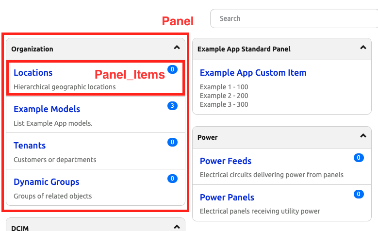
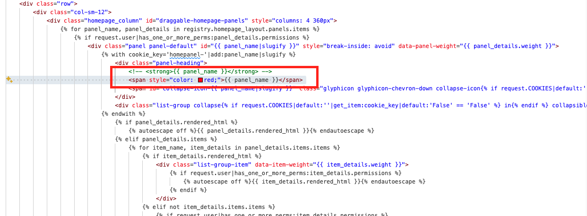
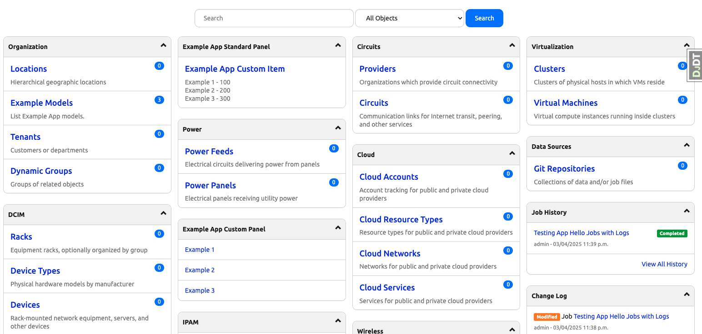
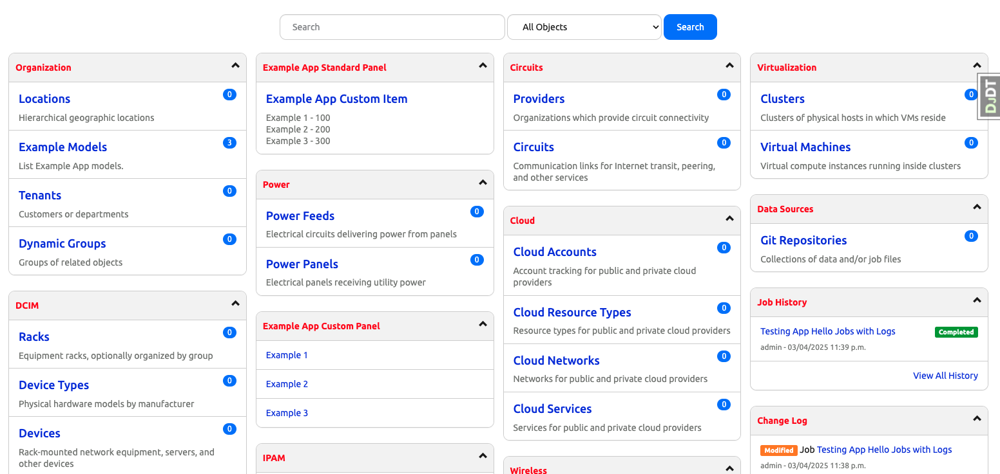
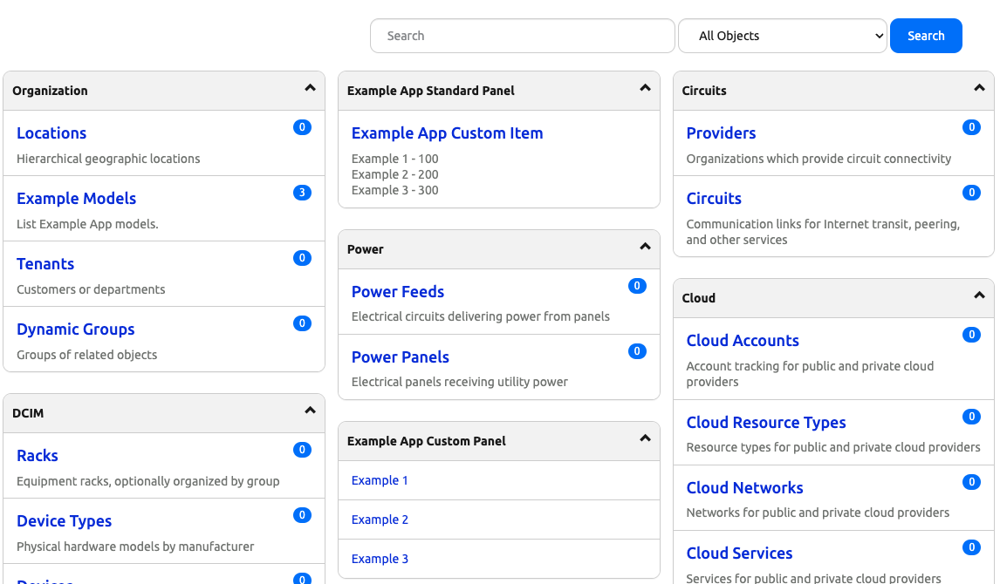
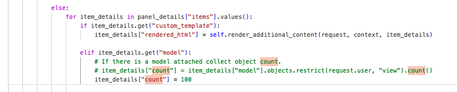
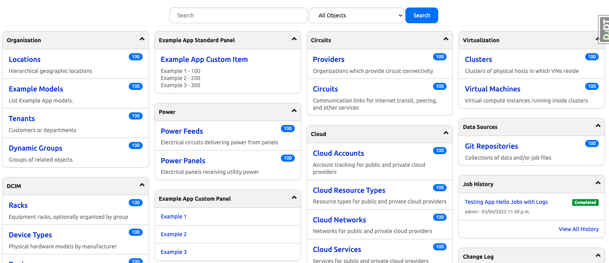

# Page Panels and Panel Items

Starting from today's challenge, in the next few days we will start to discuss the user interface in Nautobot. 

From previous exercises, we have already seen the relationship between models, views, templates, and URLs. 

Here is a simplified workflow: 

1. Define a model with fields and relationships. 
2. Create a view to reference the model and the associated template. 
3. Create the template. 
4. Create the URL to direct to the view. 

The current trend in Django and Nautobot is to decrease the amount of raw HTML involved in the process. This follows the `DRY (Do not repeat yourself)` mantra and make the presentation more consistent. 

We will start our discussion with Panels and Panel Items. 

The main objective for today is to use the widely used object (panels and panel items) to illustrate how we can use what we have learned so far and traverse through code in our sandbox. We will also make trivial changes to reinforce the learning. 

## Environment Setup

We will use a combination of [Scenario 2](../Lab_Setup/scenario_2_setup/README.md) lab, [https://demo.nautobot.com/](https://demo.nautobot.com/), and [Nautobot Documentation](https://docs.nautobot.com/projects/core/en/latest/user-guide/core-data-model/overview/introduction/) for today's challenge. 

```
$ cd nautobot
$ poetry shell
$ poetry install
$ invoke build
(be patient with this step)
$ invoke debug
(be patient with this step as well)
```

## Panels and Panel Items

The first thing we saw on the home page of Nautobot are groups of `panels` with a list of `panel items`: 



If we want to make some changes on how the panels look, where should we start? Below are a few places we can start. 

## Looking at the Code

The first thing is to look at the endpoints and the related `view` code. We can start with `nautobot -> core -> urls.py`. We can see the *urlpattern* of root is the `HomeView`, which was imported from `nautobot.core.views`: 

```python nautobot.core.urls.py
from nautobot.core.views import (
    AboutView,
    CustomGraphQLView,
    get_file_with_authorization,
    HomeView,
    NautobotMetricsView,
    NautobotMetricsViewAuth,
    RenderJinjaView,
    SearchView,
    StaticMediaFailureView,
    ThemePreviewView,
    WorkerStatusView,
)
...
urlpatterns = [
    # Base views
    path("", HomeView.as_view(), name="home"),
    ...
]
```

When we look under the `views` folder under `nautobot.core` we do not see an individual file corresponding to `HomeView`. But looking into `__init__.py` we found the class-based view for `HomeView`: 

```python nautobot.core.views.__init__.py
class HomeView(AccessMixin, TemplateView):
    template_name = "home.html"

    def render_additional_content(self, request, context, details):
        # Collect all custom data using callback functions.
        for key, data in details.get("custom_data", {}).items():
            if callable(data):
                context[key] = data(request)
            else:
                context[key] = data

        # Create standalone template
        path = f'{details["template_path"]}{details["custom_template"]}'
        if os.path.isfile(path):
            with open(path, "r") as f:
                html = f.read()
        else:
            raise TemplateDoesNotExist(path)

        template = Template(html)

        additional_context = RequestContext(request, context)
        return template.render(additional_context)

    def get(self, request, *args, **kwargs):
        # Redirect user to login page if not authenticated
        if not request.user.is_authenticated:
            return self.handle_no_permission()
        # Check whether a new release is available. (Only for staff/superusers.)
        new_release = None
        if request.user.is_staff or request.user.is_superuser:
            latest_release, release_url = get_latest_release()
            if isinstance(latest_release, version.Version):
                current_version = version.parse(settings.VERSION)
                if latest_release > current_version:
                    new_release = {
                        "version": str(latest_release),
                        "url": release_url,
                    }

        context = self.get_context_data()
        context.update(
            {
                "search_form": SearchForm(),
                "new_release": new_release,
            }
        )

        # Loop over homepage layout to collect all additional data and create custom panels.
        for panel_details in registry["homepage_layout"]["panels"].values():
            if panel_details.get("custom_template"):
                panel_details["rendered_html"] = self.render_additional_content(request, context, panel_details)

            else:
                for item_details in panel_details["items"].values():
                    if item_details.get("custom_template"):
                        item_details["rendered_html"] = self.render_additional_content(request, context, item_details)

                    elif item_details.get("model"):
                        # If there is a model attached collect object count.
                        item_details["count"] = item_details["model"].objects.restrict(request.user, "view").count()

                    elif item_details.get("items"):
                        # Collect count for grouped objects.
                        for group_item_details in item_details["items"].values():
                            if group_item_details.get("custom_template"):
                                group_item_details["rendered_html"] = self.render_additional_content(
                                    request, context, group_item_details
                                )
                            elif group_item_details.get("model"):
                                group_item_details["count"] = (
                                    group_item_details["model"].objects.restrict(request.user, "view").count()
                                )

        return self.render_to_response(context)
```

We know the template being rendered from the line `template_name = "home.html"`. 

## Example - HTML 

Let's make a simple change in the `core -> templates -> home.html` file. We can locate the `panel_name` `div` class and comment out the `<string>` tag, replace it with the `span style` of `red`: 



```HTML
 <div class="panel-heading">
        <!-- <strong>{{ panel_name }}</strong> -->
        <span style="color: red;">{{ panel_name }}</span>
</div>
```

If we refresh the home page, we will see the panel name have turned from the original black: 



... into red: 



This is a simple example of how we can make changes in the template to impact the user interface. 

# Example - View

We can also try to make changes from the code in `view`. From the code, we can see in the `panel item` the model count is dynamically queried and returned. 



When we go back to `views` folder under `nautobot.core` in the `__init__.py`. We can make a simple change to a static value, in this example, we hard code it to `100`: 



The end result can be viewed on the page: 



As the great `Lao Tzu` saying goes: 

**Give a man a fish you feed him for a day. Teach him how to fish, and you feed him for a lifetime.** 

Hopefully from the steps in today's challenge, it opens the door of the steps we can take if we want to  make changes in templates and user interface. 

Congratulations on completing Day 71! 

## Day 71 To Do

Remember to stop the codespace instance on [https://github.com/codespaces/](https://github.com/codespaces/). 

Go ahead and post a screenshot of the change you made for today's challenge on a social media of your choice, make sure you use the tag `#100DaysOfNautobot` `#JobsToBeDone` and tag `@networktocode`, so we can share your progress! 

In tomorrow's challenge, we will look at searchable model. See you tomorrow! 

[X/Twitter](<https://twitter.com/intent/tweet?url=https://github.com/nautobot/100-days-of-nautobot&text=I+just+completed+Day+60+of+the+100+days+of+nautobot+challenge+!&hashtags=100DaysOfNautobot,JobsToBeDone>)

[LinkedIn](https://www.linkedin.com/) (Copy & Paste: I just completed Day 60 of 100 Days of Nautobot, https://github.com/nautobot/100-days-of-nautobot, challenge! @networktocode #JobsToBeDone #100DaysOfNautobot) 
