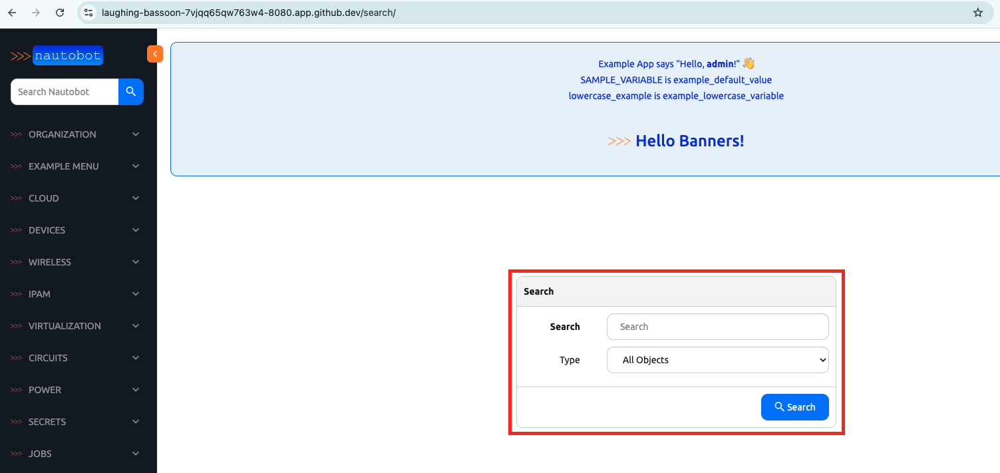

# Searchable Models

In today's challenge, we will look into searchable models and the related concepts in Nautobot. 

What do we mean by "searchable model"? On the home page, we saw there were two locations for search through the data models: 


For today's challenge, it is not template-related, however, it fits into the overall theme of presentation and how we present data to the user. 

If we use the same method by looking at `urls.py` and `views.py` from [Day 71](../Day071_Nautobot_Templates_1_Panel_and_Panel_Items/README.md), we can see there is also a `SearchView` that we can access: 



Let's use our knowledge and dig a bit deeper into the search. 

## Environment Setup

We will use a combination of [Scenario 2](../Lab_Setup/scenario_2_setup/README.md) lab, [https://demo.nautobot.com/](https://demo.nautobot.com/), and [Nautobot Documentation](https://docs.nautobot.com/projects/core/en/latest/user-guide/core-data-model/overview/introduction/) for today's challenge. 

```$ cd nautobot
$ poetry shell
$ poetry install
$ invoke build
(be patient with this step)
$ invoke debug
(be patient with this step as well)
```

## Create Location Types and Locations

Under `Organization -> Location Types`, let's create two location types of "Data Centers" and "Offices": 


Under `Organization -> Locations`, we can create two locations `BOS1` and `NYC1`, use `Data Centers` for location type for both and a status of `Active`: 


If we use the search function to search for `BOS1` we will see the result for location: 


However, if we search for `Data Centers` or `Offices` there will be no result: 


Why is that? 

If we use the dropdown menu for `All Objects`, we can see under `DCIM` group, `locations` was in the search list but not `location types`: 


How do we go about including `location types` in the searchable model list? We can leverage what we know so far and trace it in the code. 

## Views

The first thing would be to look through the relevant views. In the comment section for in the `SearchView` we saw the comment: 

```python
if form.is_valid():
    # Build the list of (app_label, modelname) tuples, representing all models included in the global search,
    # based on the `app_config.searchable_models` list (if any) defined by each app
    searchable_models = []
    for app_config in apps.get_app_configs():
        if hasattr(app_config, "searchable_models"):
            searchable_models += [(app_config.label, modelname) for modelname in app_config.searchable_models]
```


We know the list is built from `app_config.searchable_models` as defined in each app. 

## Adding to List

Where can we find the `app_config.searchable_models`? Can we add it directly in `core -> apps -> __init__.py`? Let's try that: 


Oops, it threw and error: 


Let's remove it from the list. 

Looking at the comments more closely, we remember the comment stated `based on the app_config.searchable_models list (if any) defined by each app`. 

We know the model is defined in the `DCIM` app, after a bit of poking around, we can see in `apps.py` the class `DCIMConfig` is inherited from `NautobotConfig`, and it has a list of `searchable_models` that we can add to: 


After adding `locationtype` to the list, the development server will reload, and we can see `location types` is now a searchable model: 


Now if we search either `Data Centers` or `Offices` the result will be returned: 


As we progress further into the nautobot app development journey, the documentation will not always be sufficient. We might need to start getting into a habit of using existing knowledge, reading the code, experiment, and asking questions on the public Slack channel. Hopefully this challenge gave you some taste in that process. 

Congratulations on completing Day 72! 

## Day 72 To Do

Remember to stop the codespace instance on [https://github.com/codespaces/](https://github.com/codespaces/). 

Go ahead and post a screenshot of the new searchable model list from today's challenge on a social media of your choice, make sure you use the tag `#100DaysOfNautobot` `#JobsToBeDone` and tag `@networktocode`, so we can share your progress! 

In tomorrow's challenge, we will look at a new UI component framework. See you tomorrow! 

[X/Twitter](<https://twitter.com/intent/tweet?url=https://github.com/nautobot/100-days-of-nautobot&text=I+just+completed+Day+60+of+the+100+days+of+nautobot+challenge+!&hashtags=100DaysOfNautobot,JobsToBeDone>)

[LinkedIn](https://www.linkedin.com/) (Copy & Paste: I just completed Day 60 of 100 Days of Nautobot, https://github.com/nautobot/100-days-of-nautobot, challenge! @networktocode #JobsToBeDone #100DaysOfNautobot) 
