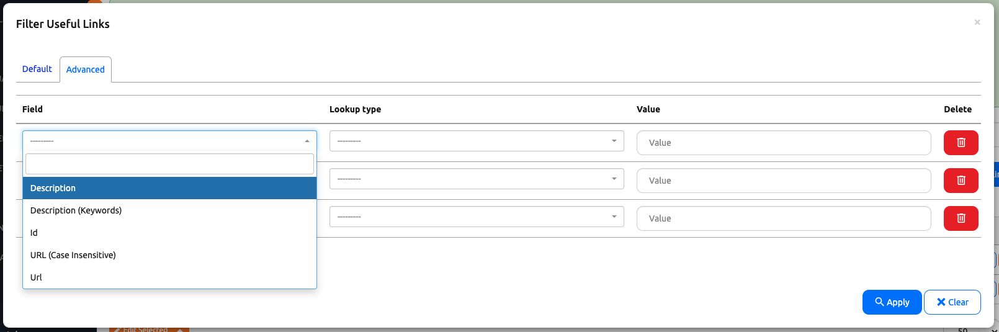

# Nautobot Filter

Filters are a vital component in Nautobot, allowing us to narrow down datasets according to specific criteria. They are extensively used across various areas such as APIs, forms, and the UI. 

Today, we will explore how filters are utilized within Nautobot and best practices for implementing them effectively.

## Environment Setup

We will use a combination of [Scenario 2](../Lab_Setup/scenario_2_setup/README.md) lab, [https://demo.nautobot.com/](https://demo.nautobot.com/), and [Nautobot Documentation](https://docs.nautobot.com/projects/core/en/latest/user-guide/core-data-model/overview/introduction/) for today's challenge. 

```
$ cd nautobot
$ poetry shell
$ poetry install
$ invoke build
(be patient with this step)
$ invoke debug
(be patient with this step as well)
```

### Understanding FilterSet Classes

The following examples are taken from the existing code snippets in `example_app -> filters.py`. 

- **nautobot.apps.filters Classes**:
  - These classes define how filtering can be applied to a query or `queryset`. 
  - Typically found in a `filters.py` file. 

```python
from nautobot.apps.filters import BaseFilterSet, SearchFilter

class UsefulLinkModelFilterSet(BaseFilterSet):
    """API filter for filtering useful link model objects."""

    q = SearchFilter(
        filter_predicates={
            "url": "icontains",
            "description": "icontains",
        },
    )
    ...
    # Custom filter method for filtering by multiple keywords in description
    def filter_description_keywords(self, queryset, name, value):
        keywords = value.split()
        for keyword in keywords:
            queryset = queryset.filter(description__icontains=keyword)
        return 
    ...
    # Custom filter method for case-insensitive URL filtering
    def filter_url_case_insensitive(self, queryset, name, value):
        return queryset.filter(url__icontains=value)
```

### Enhanced and Custom Filter Fields
- **Enhanced Filters**:
  - Nautobot filters support multiple values and can filter records by either keywords or values.
  - Example: `queryset = queryset.filter(description__icontains=keyword)`, `queryset.filter(url__icontains=value)`.

- **Django Filters**:
  - The nautobot filters allows for tailored queries that can be applied to `django_filters`.
  - Example: 

```python
...
    # Custom filter method for filtering by multiple keywords in description
    def filter_description_keywords(self, queryset, name, value):
        keywords = value.split()
        for keyword in keywords:
            queryset = queryset.filter(description__icontains=keyword)
        return queryset

    description_keywords = django_filters.CharFilter(method='filter_description_keywords', label='Description (Keywords)')
    
    # Custom filter method for case-insensitive URL filtering
    def filter_url_case_insensitive(self, queryset, name, value):
        return queryset.filter(url__icontains=value)

    url_ci = django_filters.CharFilter(method='filter_url_case_insensitive', label='URL (Case Insensitive)')
...
```

### Utilizing Lookup Expressions

- **Lookup Expressions**:
  - Filters use various lookup expressions (`icontains`, `gt`, `lt`, `isnull`, etc.) to provide flexibility in data filtering.
  - These expressions support comparisons, pattern matching, and checking for null values.

### Best Practices for Implementing Filters

- **Declare Appropriate Lookup Expressions**:
  - Ensure filters declare the necessary lookup expressions to meet your filtering needs.

- **Use `exclude=True` When Necessary**:
  - If a query requires excluding certain entries, use the `exclude=True` parameter.

- **Use `distinct=True` for Unique Results**:
  - To ensure unique results, set `distinct=True` in your filters.

### Integration with Django ORM and APIs

- **Seamless Integration**:
  - Filters integrate seamlessly with Django's ORM, providing a familiar syntax for Django developers.
  - They enhance the API experience by offering comprehensive and user-friendly filtering capabilities.

## Code Example

Again, let's look back to our `example_app` `UsefulLink` model view where we use `filterset_class = filters.UsefulLinkModelFilterSet` for filter: 

```python
class UsefulLinkUIViewSet(views.NautobotUIViewSet):
    queryset = UsefulLink.objects.all()
    ...
    filterset_class = filters.UsefulLinkModelFilterSet
    ...
```

The initial search filter code in `filters.py` is below: 

```python
class UsefulLinkModelFilterSet(BaseFilterSet):
    """API filter for filtering usefullink model objects."""

    q = SearchFilter(
        filter_predicates={
            "url": "icontains",
            "description": "icontains",
        },
    )

    class Meta:
        model = UsefulLink
        fields = [
            "url",
            "description",
        ]
```

We can add a few more filters to enhance the search function: 

```python
import django_filters 

class UsefulLinkModelFilterSet(BaseFilterSet):
    """API filter for filtering useful link model objects."""

    q = SearchFilter(
        filter_predicates={
            "url": "icontains",
            "description": "icontains",
        },
    )

    # Custom filter method for filtering by multiple keywords in description
    def filter_description_keywords(self, queryset, name, value):
        keywords = value.split()
        for keyword in keywords:
            queryset = queryset.filter(description__icontains=keyword)
        return queryset

    description_keywords = django_filters.CharFilter(method='filter_description_keywords', label='Description (Keywords)')
    
    # Custom filter method for case-insensitive URL filtering
    def filter_url_case_insensitive(self, queryset, name, value):
        return queryset.filter(url__icontains=value)

    url_ci = django_filters.CharFilter(method='filter_url_case_insensitive', label='URL (Case Insensitive)')

    class Meta:
        model = UsefulLink
        fields = [
            "url",
            "description",
            "description_keywords",
            "url_ci",
        ]
```

Now if we look under the `Advanced` table after click on `Filter`, we can see the new filter fields: 



As a reference, here is the complete `filters.py` file under `example_app` after we are done: 

```python
from nautobot.apps.filters import BaseFilterSet, SearchFilter
import django_filters 

from example_app.models import AnotherExampleModel, ExampleModel, UsefulLink


class UsefulLinkModelFilterSet(BaseFilterSet):
    """API filter for filtering useful link model objects."""

    q = SearchFilter(
        filter_predicates={
            "url": "icontains",
            "description": "icontains",
        },
    )

    # Custom filter method for filtering by multiple keywords in description
    def filter_description_keywords(self, queryset, name, value):
        keywords = value.split()
        for keyword in keywords:
            queryset = queryset.filter(description__icontains=keyword)
        return queryset

    description_keywords = django_filters.CharFilter(method='filter_description_keywords', label='Description (Keywords)')
    
    # Custom filter method for case-insensitive URL filtering
    def filter_url_case_insensitive(self, queryset, name, value):
        return queryset.filter(url__icontains=value)

    url_ci = django_filters.CharFilter(method='filter_url_case_insensitive', label='URL (Case Insensitive)')

    class Meta:
        model = UsefulLink
        fields = [
            "url",
            "description",
            "description_keywords",
            "url_ci",
        ]

        
class ExampleModelFilterSet(BaseFilterSet):
    """API filter for filtering example model objects."""

    q = SearchFilter(
        filter_predicates={
            "name": "icontains",
            "number": "icontains",
        },
    )

    class Meta:
        model = ExampleModel
        fields = [
            "name",
            "number",
        ]


class AnotherExampleModelFilterSet(BaseFilterSet):
    """API filter for filtering another example model objects."""

    q = SearchFilter(
        filter_predicates={
            "name": "icontains",
            "number": "icontains",
        },
    )

    class Meta:
        model = AnotherExampleModel
        fields = [
            "name",
            "number",
        ]
```

Congratulations on completing Day 79! 

## Day 79 To Do

Remember to stop the codespace instance on [https://github.com/codespaces/](https://github.com/codespaces/). 

Go ahead and post a screenshot of the new filters for today's challenge on a social media of your choice, make sure you use the tag `#100DaysOfNautobot` `#JobsToBeDone` and tag `@networktocode`, so we can share your progress! 

In tomorrow's challenge, we will be starting a new multi-days long journey for the capstone project. See you tomorrow! 

[X/Twitter](<https://twitter.com/intent/tweet?url=https://github.com/nautobot/100-days-of-nautobot&text=I+just+completed+Day+79+of+the+100+days+of+nautobot+challenge+!&hashtags=100DaysOfNautobot,JobsToBeDone>)

[LinkedIn](https://www.linkedin.com/) (Copy & Paste: I just completed Day 79 of 100 Days of Nautobot, https://github.com/nautobot/100-days-of-nautobot, challenge! @networktocode #JobsToBeDone #100DaysOfNautobot) 
