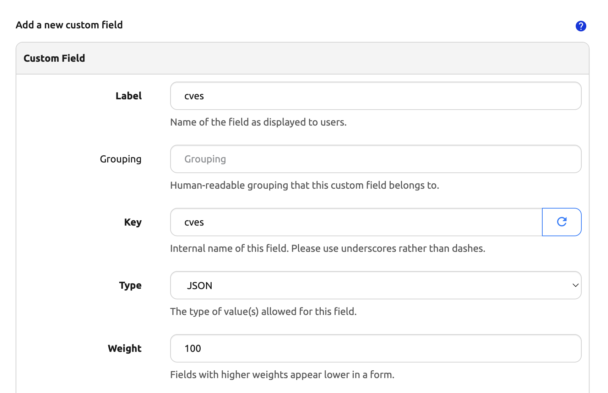
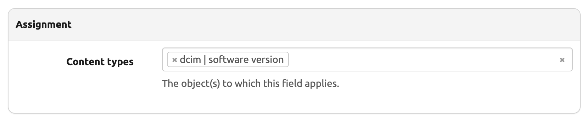
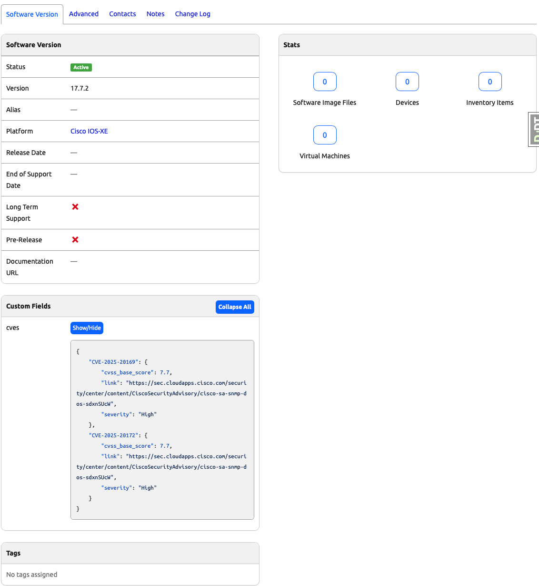

# Capstone Project Part 2. Day 81: Creating a Data Model for CVE Management in Nautobot

## Overview

In this section, we will create a **data model to store CVE information** in Nautobot. While this may not be the **optimal** approach for long-term CVE storage, it provides a solid starting point for our Nautobot plugin. 

📌 **Note:** In this initial stage, we will use **Nautobot's built-in custom fields** to store CVEs. In later sections, we will build more advanced **custom data models** to store and manage CVE data.

## Environment Setup

For the Capstone for Days 80 - 89, we will use [Scenario 2](../Lab_Setup/scenario_2_setup/README.md) lab with Codespace as we have been doing. 

Assume we built on previous day's progress, we need to enable the virtual environment with `poetry shell` and start the environment with `invoke debug`: 

```
@ericchou1 ➜ ~ $ cd nautobot-app-software-cves/
@ericchou1 ➜ ~/nautobot-app-software-cves $ poetry shell
(nautobot-software-cves-py3.10) @ericchou1 ➜ ~/nautobot-app-software-cves $ invoke debug
...
nautobot-1  | Django version 4.2.20, using settings 'nautobot_config'
nautobot-1  | Starting development server at http://0.0.0.0:8080/
nautobot-1  | Quit the server with CONTROL-C.
...
```

## Defining the CVE Data Model

For CVE storage, we will use a **dictionary of dictionaries** structured as follows:

```json
{
    {{CVE_ID}}: {
        "cvss_base_score": {{CVE_SCORE}},
        "link": {{CVE_LINK}},
        "severity": {{CVE_SEVERITY}}
    }
}
```

### Example CVE Data:
```json
{
    "CVE-2025-20169": {
        "cvss_base_score": 7.7,
        "link": "https://sec.cloudapps.cisco.com/security/center/content/CiscoSecurityAdvisory/cisco-sa-snmp-dos-sdxnSUcW",
        "severity": "High"
    },
    "CVE-2025-20172": {
        "cvss_base_score": 7.7,
        "link": "https://sec.cloudapps.cisco.com/security/center/content/CiscoSecurityAdvisory/cisco-sa-snmp-dos-sdxnSUcW",
        "severity": "High"
    }
}
```


## Creating a JSON Custom Field for CVEs

To store CVEs in Nautobot, we need to **create a custom field** of type **JSON**.

### Steps:
1. Navigate to **Extensibility > Custom Fields**.
2. Click on **"Add Custom Field"**.
3. Set the following values:
   - **Label:** `cves`
   - **Key:** `cves`
   - **Type:** `JSON`
   - **Content types**: `dcim|software version`
4. Click **Create** to save the field.





## Adding a Platform 

1. Navigate to **Devices > Platforms**.
2. Click on **Add Platform**
3. Set **Name** to `Cisco IOS-XE`

## Adding a Software Version in Nautobot

To test our CVE storage, we will **create a new software version** and populate the `cves` field.

### Steps:
1. Navigate to **Devices > Software Versions**.
2. Click on **"Add Software Version"**.
3. Set the following fields:
   - **Platform:** `Cisco IOS-XE`
   - **Version:** `17.7.2`
   - **Status:** `Active`
4. Copy and paste the example **CVE DATAs** into the `cves` custom field.
5. Click **Create** to save the software version.
6. On the SoftwareVersion detail view for Cisco IOS-XE software version 17.7.2, you should now see the CVEs listed in the JSON custom field, as shown in the following image:


---

## Summary

At this point, we have:
✔ Created a **JSON custom field** to store CVE data.  
✔ Added a **Software Version** and populated it with sample CVE information.  

🔹 **Next Steps:**  
In **Day 82**, we will start working on developing a **Nautobot plugin** to extend functionality beyond custom fields.

🚀 Keep going—your CVE management plugin is taking shape!

## Day 81 To Do

Remember to stop the codespace instance on [https://github.com/codespaces/](https://github.com/codespaces/). We highly recommend to just stop the instance, **not** deleting the instance until we completed the whole Capstone project at Day 89, as the days will build on each other.  

Go ahead and post a screenshot of the new custom field you built for today's challenge, make sure you use the tag `#100DaysOfNautobot` `#JobsToBeDone` and tag `@networktocode`, so we can share your progress! 

In tomorrow's challenge, we will continue on with the Capstone project. See you tomorrow! 

[X/Twitter](<https://twitter.com/intent/tweet?url=https://github.com/nautobot/100-days-of-nautobot&text=I+just+completed+Day+81+of+the+100+days+of+nautobot+challenge+!&hashtags=100DaysOfNautobot,JobsToBeDone>)

[LinkedIn](https://www.linkedin.com/) (Copy & Paste: I just completed Day 81 of 100 Days of Nautobot, https://github.com/nautobot/100-days-of-nautobot, challenge! @networktocode #JobsToBeDone #100DaysOfNautobot) 

