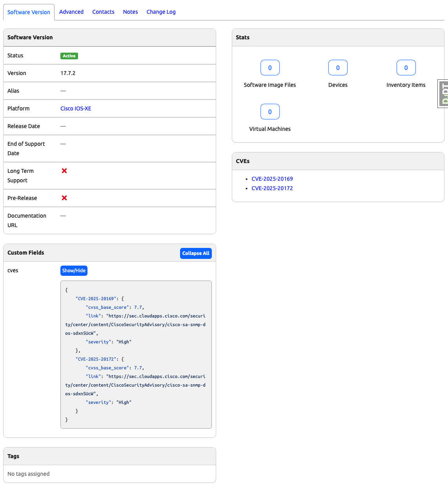

# Capstone Project Part 3. CVE Management Nautobot App - Day 82

## **Objective**
Even though we have a custom field storing CVE data, we need to present them in a better way in the **SoftwareVersion** details view, with hyperlinks to the actual CVEs on the software vendor’s website.

## Environment Setup

For the Capstone for Days 80 - 89, we will use [Scenario 2](../Lab_Setup/scenario_2_setup/README.md) lab with Codespace as we have been doing. 

Assume we built on previous day's progress, we need to enable the virtual environment with `poetry shell` and start the environment with `invoke debug`: 

```
@ericchou1 ➜ ~ $ cd nautobot-app-software-cves/
@ericchou1 ➜ ~/nautobot-app-software-cves $ poetry shell
(nautobot-software-cves-py3.10) @ericchou1 ➜ ~/nautobot-app-software-cves $ invoke debug
...
nautobot-1  | Django version 4.2.20, using settings 'nautobot_config'
nautobot-1  | Starting development server at http://0.0.0.0:8080/
nautobot-1  | Quit the server with CONTROL-C.
...
```

## **Implementation Steps**

1. **Create a `template_content.py` file**
   - In a Nautobot plugin, `template_content.py` is used to customize the UI of object detail pages. 
   - It allows adding additional content using `TemplateExtension` to extend existing views.
```
nautobot-app-software-cves/
├── nautobot_software_cves/
│   ├── __init__.py
│   ├── tests/
│   ├── template_content.py

```

2. **Create the `SoftwareVersionTemplateExtension` class**
   - This class will extend `TemplateExtension` to inject CVE-related content into the SoftwareVersion details page.
```python
"""Module to change object details view."""

from nautobot.apps.ui import TemplateExtension

class SoftwareVersionTemplateExtension(TemplateExtension):
```

3. **Define the model that this template extension will be applied to**
   - Assign the `model` attribute to **`dcim.softwareversion`**, ensuring the extension is linked to SoftwareVersion objects.
```python
"""Module to change object details view."""

from nautobot.apps.ui import TemplateExtension

class SoftwareVersionTemplateExtension(TemplateExtension):

    model = "dcim.softwareversion"
```

4. **Create a `right_page` Method**  
   - This method defines the content displayed on the right side of the **SoftwareVersion** details page.  
   - The **SoftwareVersion** object can be accessed using `self.context["object"]`.  
   - CVE data is extracted from the custom field `cves` using ORM: `software_version.custom_field_data.get("cves", {})`.  
   - The HTML output is constructed by creating an HTML panel to display the CVE data: `<div class="panel panel-default">`.  
   - If CVEs exist, an unordered list (`<ul>`) of hyperlinks is generated, with `target='_blank'` ensuring links open in a new tab.  
   - If no CVEs are found, a message is displayed instead.
```python
    def right_page(self):
        """Add content on the right side of the view."""
        # Get the object that was provided as template context;
        # in this case, the SoftwareVersion object itself.
        software_version = self.context["object"]
        
        # Get the CVEs from the JSON Custom Field:
        cves = software_version.custom_field_data.get("cves", {})
        
        # Construct the HTML to contain this data
        output = """
            <div class="panel panel-default">
            <div class="panel-heading"><strong>CVEs</strong></div>
            <div class="panel-body">
        """
        
        # Add list entries based on the available data:
        if cves:
            output += "<ul>"
            for cve_name, cve_data in cves.items():
                output += f"<li><a href='{cve_data['link']}' target='_blank'> {cve_name}</a></li>"
            output += "</ul>"
        else:
            output += "There are no CVEs for this Software Version."
        
        output += "</div></div>"
        return output
```


5. **Register the template extension**
   - Registers the class so Nautobot applies the template extension when rendering the **SoftwareVersion** details page.
```python
template_extensions = [SoftwareVersionTemplateExtension]
```

### **Verification**

- After restarting invoke debug once again.
- On the **SoftwareVersion** detail view for Cisco IOS-XE software version 17.7.2, you should now see the CVEs listed in a panel on the right section, as shown in the following image:


## **Final Code**

```python
"""Module to change object details view."""

from nautobot.apps.ui import TemplateExtension

class SoftwareVersionTemplateExtension(TemplateExtension):
    """Add CVE information to the Nautobot Software Version detail view."""

    model = "dcim.softwareversion"

    def right_page(self):
        """Add content on the right side of the view."""
        # Get the object that was provided as template context;
        # in this case, the SoftwareVersion object itself.
        software_version = self.context["object"]
        
        # Get the CVEs from the JSON Custom Field:
        cves = software_version.custom_field_data.get("cves", {})
        
        # Construct the HTML to contain this data
        output = """
            <div class="panel panel-default">
            <div class="panel-heading"><strong>CVEs</strong></div>
            <div class="panel-body">
        """
        
        # Add list entries based on the available data:
        if cves:
            output += "<ul>"
            for cve_name, cve_data in cves.items():
                output += f"<li><a href='{cve_data['link']}' target='_blank'> {cve_name}</a></li>"
            output += "</ul>"
        else:
            output += "There are no CVEs for this Software Version."
        
        output += "</div></div>"
        return output


# Register the template extension so Nautobot applies it
template_extensions = [SoftwareVersionTemplateExtension]
```

## **Conclusion**
This implementation enhances the **SoftwareVersion** detail page by:
✅ Displaying CVEs in an easy-to-read format.  
✅ Providing direct hyperlinks to official CVE references.  
✅ Seamlessly integrating with Nautobot’s UI using `TemplateExtension`.  

This approach improves the user experience by making CVE data more accessible and visually structured.

## Day 82 To Do

Remember to stop the codespace instance on [https://github.com/codespaces/](https://github.com/codespaces/). We highly recommend to just stop the instance, **not** deleting the instance until we completed the whole Capstone project at Day 89, as the days will build on each other.  

Go ahead and post a screenshot of this new app instance you have built for today's challenge, make sure you use the tag `#100DaysOfNautobot` `#JobsToBeDone` and tag `@networktocode`, so we can share your progress! 

In tomorrow's challenge, we will continue on with the Capstone project. See you tomorrow! 

[X/Twitter](<https://twitter.com/intent/tweet?url=https://github.com/nautobot/100-days-of-nautobot&text=I+just+completed+Day+82+of+the+100+days+of+nautobot+challenge+!&hashtags=100DaysOfNautobot,JobsToBeDone>)

[LinkedIn](https://www.linkedin.com/) (Copy & Paste: I just completed Day 82 of 100 Days of Nautobot, https://github.com/nautobot/100-days-of-nautobot, challenge! @networktocode #JobsToBeDone #100DaysOfNautobot) 

