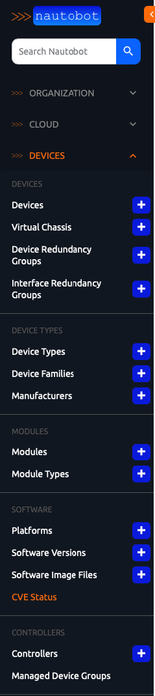
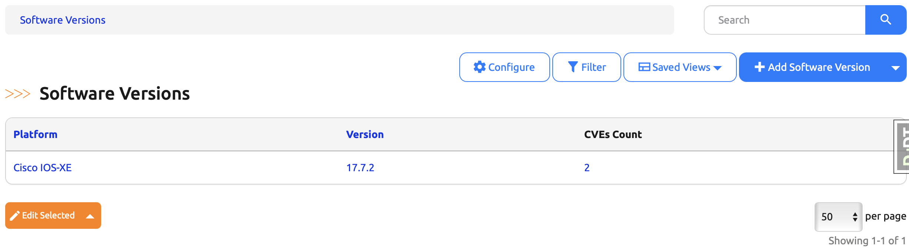

# Capstone Project Part 6. CVE Management Nautobot App - Day 85

## **Objective**
On **Day 85**, we will integrate the **CVE status table** from Day 84 into a Nautobot view. This view will display an overview of all **Software Versions** and their associated CVEs, making it easy for users to identify vulnerable versions.

To achieve this, we will:
1. **Implement a List ViewSet** to manage the view logic.
2. **Define the corresponding URL** in `urls.py` to make the view accessible.
3. **Add the view to the Nautobot navigation bar**, ensuring users can easily find it.

## Environment Setup

For the Capstone for Days 80 - 89, we will use [Scenario 2](../Lab_Setup/scenario_2_setup/README.md) lab with Codespace as we have been doing. 

Assume we built on previous day's progress, we need to enable the virtual environment with `poetry shell` and start the environment with `invoke debug`: 

```
@ericchou1 ➜ ~ $ cd nautobot-app-software-cves/
@ericchou1 ➜ ~/nautobot-app-software-cves $ poetry shell
(nautobot-software-cves-py3.10) @ericchou1 ➜ ~/nautobot-app-software-cves $ invoke debug
...
nautobot-1  | Django version 4.2.20, using settings 'nautobot_config'
nautobot-1  | Starting development server at http://0.0.0.0:8080/
nautobot-1  | Quit the server with CONTROL-C.
...
```

## **Implementation Steps**

### **1. Implement a List ViewSet**
Nautobot provides the **`ObjectListViewMixin`** class, which simplifies the implementation of list views. We will create a new ViewSet named **`SoftwareCvesStatusViewSet`** that uses the `CveStatusTable` from Day 84.

Inside **`views.py`**, add the following code:

````python
from nautobot.apps import views
from nautobot.dcim.models import SoftwareVersion
from nautobot_software_cves.tables import CveStatusTable
from nautobot.dcim.filters import SoftwareVersionFilterSet

class SoftwareCvesStatusViewSet(views.ObjectListViewMixin):
    queryset = SoftwareVersion.objects.all()
    filterset_class = SoftwareVersionFilterSet
    table_class = CveStatusTable
````

#### **How This Works**
- The **queryset** retrieves all `SoftwareVersion` objects.
- The **filterset_class** allows filtering results.
- The **table_class** specifies that the `CveStatusTable` should be used to render the results.


### **2. Add the Corresponding URL in `urls.py`**
To make this view accessible, register it in **`urls.py`**.

````python
from django.urls import path
from django.views.generic import RedirectView
from django.templatetags.static import static
from nautobot.apps.urls import NautobotUIViewSetRouter
from nautobot_software_cves import views

router = NautobotUIViewSetRouter()
router.register("softwareversions", views.SoftwareCvesStatusViewSet)

urlpatterns = [
    path(
        "docs/",
        RedirectView.as_view(url=static("nautobot_software_cves/docs/index.html")),
        name="docs",
    ),
    path(
        "softwareversions/<uuid:pk>/cves/",
        views.SoftwareCvesView.as_view(),
        name="software_cves",
    ),
]

urlpatterns += router.urls
````

#### **How This Works**
- Registers **`SoftwareCvesStatusViewSet`** under the `softwareversions/` endpoint.
- Adds the **router.urls** to the existing `urlpatterns`.


### **3. Add the View to the Nautobot Navigation Bar**
To make the **CVE Status View** easily accessible, we will add it to the **Devices → Software** menu section.

Inside the **`nautobot_software_cves/`** directory, find the **`navigation.py`** file or create it if you chose "None" on Day 80 Step 9 and add the following code:

````python
from nautobot.apps.ui import NavMenuGroup, NavMenuItem, NavMenuTab

menu_items = (
    NavMenuTab(
        name="Devices",
        groups=(
            NavMenuGroup(
                name="Software",
                items=(
                    NavMenuItem(
                        # link="plugins:nautobot_software_cves:softwareversions", # Explained Below
                        link="plugins:nautobot_software_cves:softwareversion_list",
                        name="CVE Status",
                        permissions=["dcim.view_softwareversion"],
                    ),
                ),
            ),
        ),
    ),
)
````

#### **How This Works**
- Adds a **new menu item** under **Devices → Software**.
- Links the menu item to the `SoftwareCvesStatusViewSet` view.
- Ensures that only users with **`dcim.view_softwareversion`** permission can access the menu item.

#### **Why Use `"softwareversion_list"` Instead of `"softwareversions"` in `navigation.py`?**

When registering `SoftwareCvesStatusViewSet` with `NautobotUIViewSetRouter`:
```python
router = NautobotUIViewSetRouter()
router.register("softwareversions", views.SoftwareCvesStatusViewSet)
```
Nautobot automatically generates **named URLs** following Django’s ViewSet pattern.

For example:
| **URL Pattern** | **Generated Name** |
|----------------|-------------------|
| `/softwareversions/` | `plugins:nautobot_software_cves:softwareversion_list` |
| `/softwareversions/<uuid:pk>/` | `plugins:nautobot_software_cves:softwareversion` |
| `/softwareversions/add/` | `plugins:nautobot_software_cves:softwareversion_add` |

Since the **list view** is named **`softwareversion_list`**, you must reference this name in `navigation.py`:

```python
NavMenuItem(
    link="plugins:nautobot_software_cves:softwareversion_list",
    name="CVE Status",
    permissions=["dcim.view_softwareversion"],
),
```

Using `"softwareversions"` **would not work** because Nautobot expects the **ViewSet-generated name**.  
To verify generated names, run:

```sh
nautobot-server show_urls | grep software-cves
```

### Verfification

- After restarting invoke debug once again.

- To verify that it’s working, navigate to your Nautobot instance’s main menu, click on **Devices**, and look for the **SOFTWARE** submenu. You should see a new item called **CVE Status**.



- Click on the **CVE Status** menu item and confirm that the **CVE Status table** is displayed. The URL in your browser should be `/plugins/software-cves/softwareversions/`.




## **Final Outcome**
✅ **Users can now access a list view of all software versions and their CVE status.**  
✅ **The view is registered with Nautobot and available via a URL.**  
✅ **The CVE Status view is now part of the Nautobot navigation menu.**  

With this setup, Nautobot users can easily track CVEs associated with different software versions in their network!

🚀 Stay tuned for **Day 86**, where we'll create a rest api endpoint for software cves.

## Day 85 To Do

Remember to stop the codespace instance on [https://github.com/codespaces/](https://github.com/codespaces/). We highly recommend to just stop the instance, **not** deleting the instance until we completed the whole Capstone project at Day 89, as the days will build on each other.  

Go ahead and post a screenshot of this new app instance you have built for today's challenge, make sure you use the tag `#100DaysOfNautobot` `#JobsToBeDone` and tag `@networktocode`, so we can share your progress! 

In tomorrow's challenge, we will continue on with the Capstone project. See you tomorrow! 

[X/Twitter](<https://twitter.com/intent/tweet?url=https://github.com/nautobot/100-days-of-nautobot&text=I+just+completed+Day+85+of+the+100+days+of+nautobot+challenge+!&hashtags=100DaysOfNautobot,JobsToBeDone>)

[LinkedIn](https://www.linkedin.com/) (Copy & Paste: I just completed Day 85 of 100 Days of Nautobot, https://github.com/nautobot/100-days-of-nautobot, challenge! @networktocode #JobsToBeDone #100DaysOfNautobot) 


