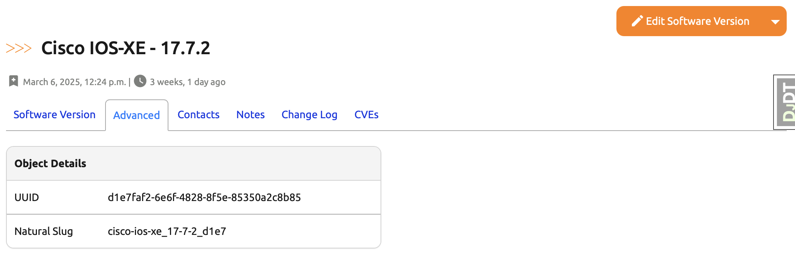
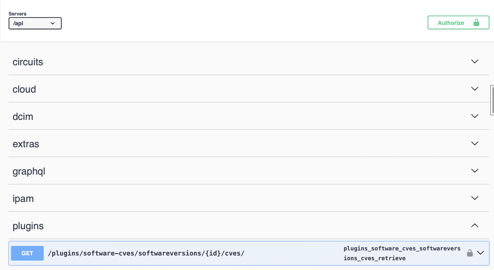
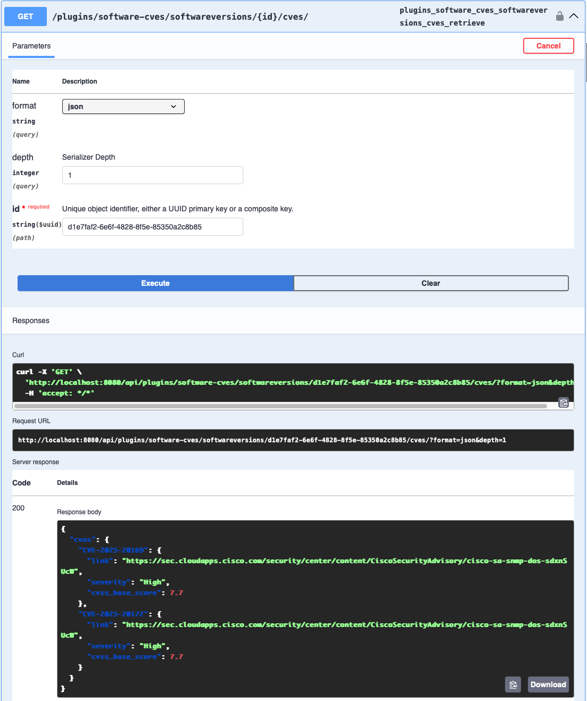

# Capstone Project Part 7. CVE Management Nautobot App - Day 86

## **Objective**
On **Day 86**, we will expose the CVE information for each individual **Software Version** via a REST API endpoint. This ensures that data visible in the UI can also be programmatically accessed, aligning with API-first best practices.

To achieve this, we will:
1. **Implement a custom API View** to serve CVE data for a specific `SoftwareVersion`.
2. **Define the corresponding API URL** in `urls.py`.
3. **Verify the API** is accessible and returns expected CVE data.

## Environment Setup

For the Capstone for Days 80 - 89, we will use [Scenario 2](../Lab_Setup/scenario_2_setup/README.md) lab with Codespace as we have been doing. 

Assume we built on previous day's progress, we need to enable the virtual environment with `poetry shell` and start the environment with `invoke debug`: 

```
@ericchou1 ➜ ~ $ cd nautobot-app-software-cves/
@ericchou1 ➜ ~/nautobot-app-software-cves $ poetry shell
(nautobot-software-cves-py3.10) @ericchou1 ➜ ~/nautobot-app-software-cves $ invoke debug
...
nautobot-1  | Django version 4.2.20, using settings 'nautobot_config'
nautobot-1  | Starting development server at http://0.0.0.0:8080/
nautobot-1  | Quit the server with CONTROL-C.
...
```

## **Implementation Steps**

### **1. Implement a Custom API View**
Since we are not using a dedicated data model for CVEs, we won’t be using a `ModelSerializer`. Instead, we’ll return the `cves` json data directly from the `custom_field_data` of each `SoftwareVersion`.

If you chose ‘None’ in Step 9 of Day 80, create a folder named `api` under the **`nautobot_software_cves/`** directory, and then create the files `views.py`, `urls.py`, and a blank `__init__.py` inside it.

Inside **`nautobot_software_cves/api/views.py`**, add the following code:

````python
from django.shortcuts import get_object_or_404
from rest_framework.permissions import IsAuthenticated
from rest_framework.response import Response
from rest_framework.views import APIView

from nautobot.dcim.models import SoftwareVersion


class SoftwareVersionCVEsView(APIView):
    permission_classes = [IsAuthenticated]

    def get(self, request, pk=None, format=None):
        software_version = get_object_or_404(
            SoftwareVersion.objects.restrict(self.request.user, "view"), pk=pk
        )
        custom_field_data = software_version.custom_field_data
        return Response({"cves": custom_field_data.get("cves", {})})
````

#### **How This Works**
- Authenticates the request using Nautobot's permission system.
- Retrieves the `SoftwareVersion` object by its UUID (`pk`).
- Extracts the `cves` from `custom_field_data`.
- Returns the `cves` as a JSON response.


### **2. Add the Corresponding URL in `nautobot_software_cves/api/urls.py`**
To make the view accessible via a REST endpoint, register it in the plugin’s **API URL config**.

>[!TIP]
> Delete or comment out the existing `urlpatterns` as shown below. 

Inside **`nautobot_software_cves/api/urls.py`**, add:

````python
from django.urls import path
from nautobot_software_cves.api.views import SoftwareVersionCVEsView

urlpatterns = [
    path(
        "softwareversions/<uuid:pk>/cves/",
        SoftwareVersionCVEsView.as_view(),
        name="software_cves",
    ),
]

# urlpatterns = router.urls
````

#### **How This Works**
- Defines a new URL pattern under `/api/plugins/software-cves/`.
- The `pk` refers to the UUID of a `SoftwareVersion` object.
- The endpoint returns the `cves` in JSON format.


### **3. Project File Structure**
After completing the steps above, your plugin’s directory structure should look like this:

````text
nautobot_software_cves/
├── __init__.py
├── api
│   ├── __init__.py
│   ├── urls.py
│   └── views.py
├── navigation.py
├── tables.py
├── template_content.py
├── templates
│   └── nautobot_software_cves
│       └── software_cves.html
├── tests
│   ├── __init__.py
│   └── test_basic.py
├── urls.py
└── views.py
````


### **Verification**

To test the API endpoint:

1. Navigate to the detail page of a **Software Version** object in the Nautobot UI.
2. Go to the **Advanced** tab to copy the **UUID**.

1. After restarting invoke debug once again and use Nautobot’s built-in OpenAPI (Swagger) UI. Navigate to http://<your-server-ip>:8080/api/docs/ and scroll down to the plugins heading, and you should see your new REST API endpoint listed:

1. Click on this endpoint to expand it, then click the Try it out button. Enter the previously obtained software version PK into the id field and click Execute. You should see the expected response containing the list of CVEs defined for this software version:
1. 

## **Final Outcome**
✅ **Users can now retrieve CVE data for a given Software Version via a REST API.**  
✅ **The API endpoint adheres to Nautobot’s permission model and URL conventions.**  
✅ **The implementation returns structured JSON directly from the software version’s `custom_field_data`.**  

This addition provides the foundation for third-party integrations, automation, or dashboards to consume CVE data programmatically.

🚀 Stay tuned for **Day 87**, where we will explore how we can get CVEs using NIST NVD database.

## Day 86 To Do

Remember to stop the codespace instance on [https://github.com/codespaces/](https://github.com/codespaces/). We highly recommend to just stop the instance, **not** deleting the instance until we completed the whole Capstone project at Day 89, as the days will build on each other.  

Go ahead and post a screenshot of this new app instance you have built for today's challenge, make sure you use the tag `#100DaysOfNautobot` `#JobsToBeDone` and tag `@networktocode`, so we can share your progress! 

In tomorrow's challenge, we will continue on with the Capstone project. See you tomorrow! 

[X/Twitter](<https://twitter.com/intent/tweet?url=https://github.com/nautobot/100-days-of-nautobot&text=I+just+completed+Day+86+of+the+100+days+of+nautobot+challenge+!&hashtags=100DaysOfNautobot,JobsToBeDone>)

[LinkedIn](https://www.linkedin.com/) (Copy & Paste: I just completed Day 86 of 100 Days of Nautobot, https://github.com/nautobot/100-days-of-nautobot, challenge! @networktocode #JobsToBeDone #100DaysOfNautobot) 

