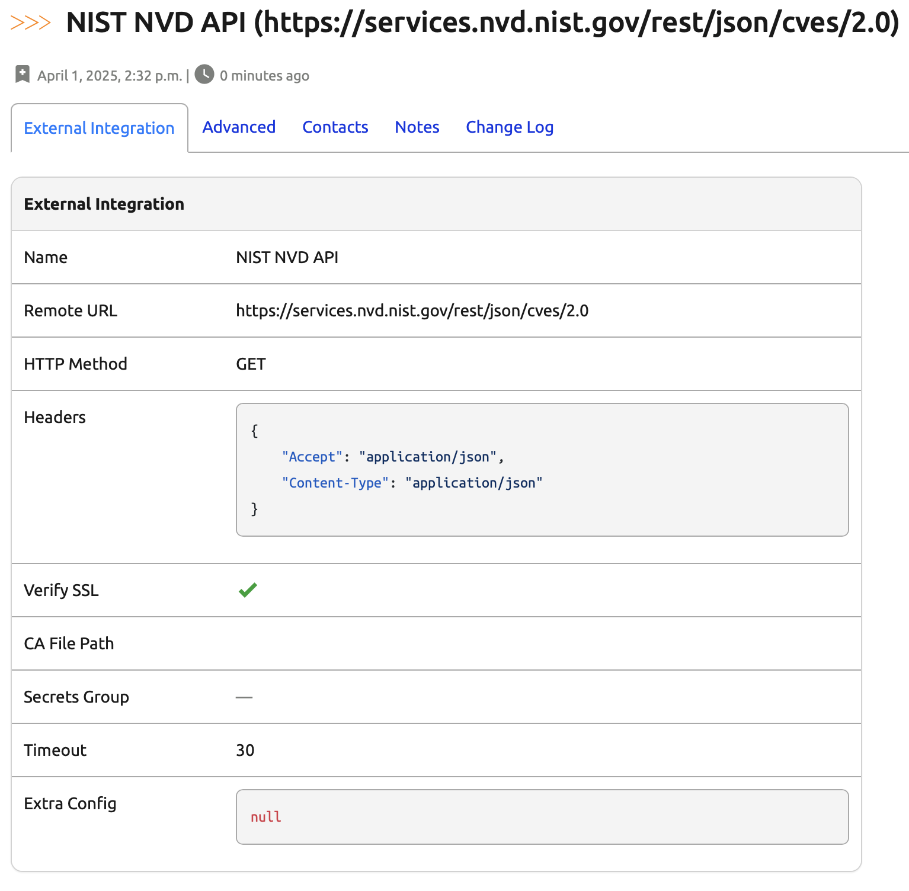

# Capstone Project Part 9. Day 88: Creating an External Integration in Nautobot for NIST NVD API

## Objective

On **Day 88**, we will explore how to create an **External Integration** in Nautobot to interact with the [National Institute of Standards and Technology (NIST) National Vulnerability Database (NVD) API](https://nvd.nist.gov/developers/vulnerabilities). This integration will enable Nautobot to fetch and utilize vulnerability data pertinent to various software versions.

## Environment Setup

For the Capstone for Days 80 - 89, we will use [Scenario 2](../Lab_Setup/scenario_2_setup/README.md) lab with Codespace as we have been doing. 

Assume we built on previous day's progress, we need to enable the virtual environment with `poetry shell` and start the environment with `invoke debug`: 

```
@ericchou1 ➜ ~ $ cd nautobot-app-software-cves/
@ericchou1 ➜ ~/nautobot-app-software-cves $ poetry shell
(nautobot-software-cves-py3.10) @ericchou1 ➜ ~/nautobot-app-software-cves $ invoke debug
...
nautobot-1  | Django version 4.2.20, using settings 'nautobot_config'
nautobot-1  | Starting development server at http://0.0.0.0:8080/
nautobot-1  | Quit the server with CONTROL-C.
...
```

## Understanding External Integrations in Nautobot

An **External Integration** in Nautobot serves as a centralized configuration that stores essential details required to interact with external systems. This includes information such as URLs, HTTP methods, headers, and other configurations. By defining these integrations, Nautobot can seamlessly communicate with external APIs or services.

For a comprehensive overview, refer to the [Nautobot Documentation on External Integrations](https://docs.nautobot.com/projects/core/en/stable/user-guide/platform-functionality/externalintegration/).

## Implementing the NIST NVD API Integration

The NIST NVD API provides access to a vast repository of vulnerability data. Integrating this API into Nautobot allows for enhanced vulnerability management and analysis. Notably, the NVD API offers unrestricted access without the need for authentication credentials, simplifying the integration process.

### Steps to Create the Integration

1. **Navigate to External Integrations:**
   - In the Nautobot UI, go to **EXTENSIBILITY** > **External Integrations**.

2. **Add a New External Integration:**
   - Click on **Add External Integration**.

3. **Configure the Integration Details:**
   - **Name:** `NIST NVD API`
   - **Remote URL:** `https://services.nvd.nist.gov/rest/json/cves/2.0`
   - **Verify SSL:** Enable to ensure secure communication.
   - **Secrets Group:** Leave empty, as no authentication is needed.
   - **Timeout:** Set an appropriate timeout value, e.g., `30` seconds.
   - **Headers:** `{"Accept": "application/json","Content-Type": "application/json"}`
   - **HTTP Method:** `GET`
   - **CA file path:** Leave empty.
   - **Extra Config:** Leave empty.

4. **Save the Integration:**
   - Click on **Create** to store the integration settings.



### Utilizing the Integration

With the external integration configured, Nautobot can now interact with the NIST NVD API. This can be leveraged in various Nautobot jobs or plugins to fetch and process vulnerability data related to specific software versions.

## Conclusion

By setting up an External Integration for the NIST NVD API in Nautobot, we establish a foundation for enhanced vulnerability management. This integration facilitates seamless retrieval and utilization of up-to-date vulnerability information, contributing to a more secure and informed network environment.

## Day 88 To Do

Remember to stop the codespace instance on [https://github.com/codespaces/](https://github.com/codespaces/). We highly recommend to just stop the instance, **not** deleting the instance until we completed the whole Capstone project at Day 89, as the days will build on each other.  

Go ahead and post a screenshot of this new app instance you have built for today's challenge, make sure you use the tag `#100DaysOfNautobot` `#JobsToBeDone` and tag `@networktocode`, so we can share your progress! 

In tomorrow's challenge, we will continue on with the Capstone project. See you tomorrow! 

[X/Twitter](<https://twitter.com/intent/tweet?url=https://github.com/nautobot/100-days-of-nautobot&text=I+just+completed+Day+88+of+the+100+days+of+nautobot+challenge+!&hashtags=100DaysOfNautobot,JobsToBeDone>)

[LinkedIn](https://www.linkedin.com/) (Copy & Paste: I just completed Day 88 of 100 Days of Nautobot, https://github.com/nautobot/100-days-of-nautobot, challenge! @networktocode #JobsToBeDone #100DaysOfNautobot) 

