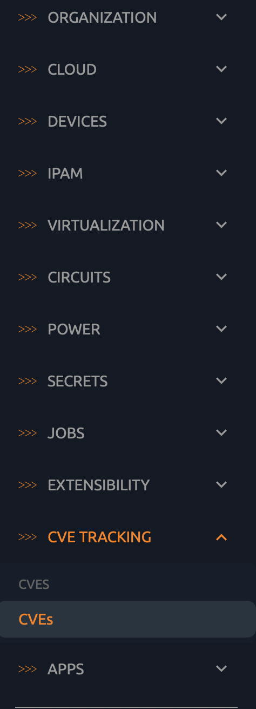
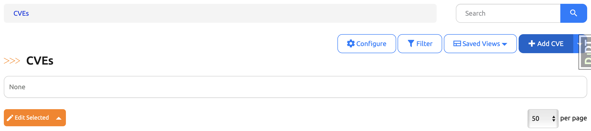
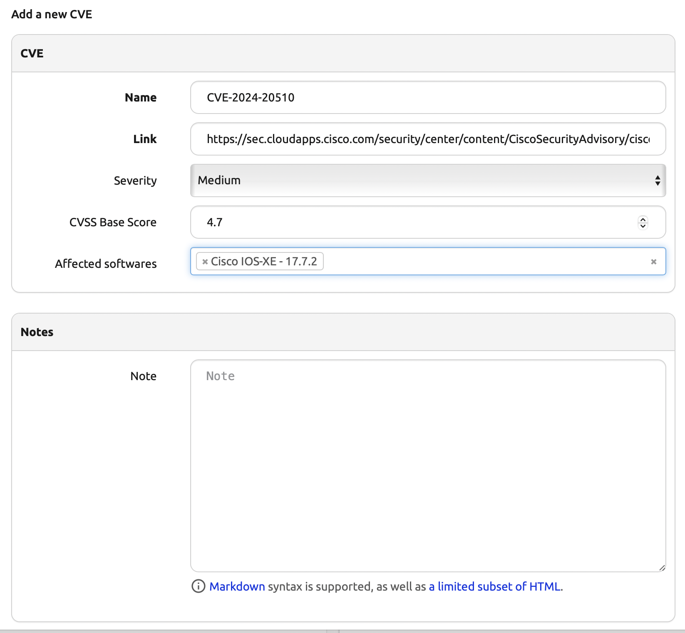
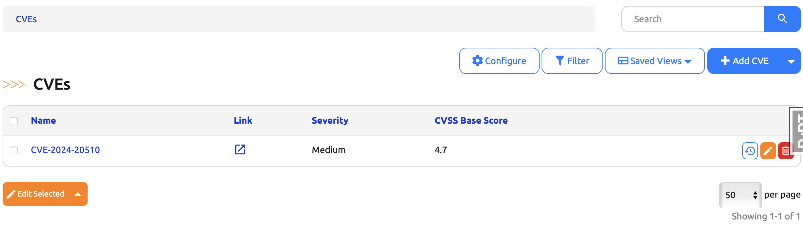
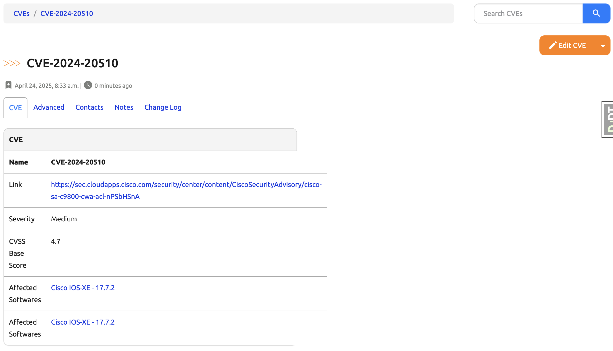

# Capstone Project Part 12. Day 91: Integrating the CVE Model into the Nautobot UI

## Objective

Today we integrate the `CVE` model into the Nautobot UI to enable full CRUD operations, listing, filtering, viewing, and linking with `SoftwareVersion` objects.

By the end of today, you will have:
- List and detail views for CVEs
- Filtering and forms support
- A CVE tab under `SoftwareVersion` objects
- CVE API and navigation menu entries

Since our CVE models is a full-fledged Nautobot data model, we can use a lot of Nautobot’s built-in functionality to define the UI for working with them. To get the full functionality you’ll need to write code for a data table, code for filtering that data, forms for editing that data, templates for displaying the data,
and views for displaying all of these.


## 1. Implementing the Tables

**File**: `nautobot_software_cves/tables.py`

```python
import django_tables2 as tables
from nautobot.apps.tables import BaseTable, ButtonsColumn, ToggleColumn, TagColumn
from django.urls import reverse
from nautobot_software_cves import models

class CveStatusTable(BaseTable):
    # unchanged, omitted here


class CVETable(BaseTable):
    """Table for listing CVEs in the UI."""

    model = models.CVE
    pk = ToggleColumn()
    name = tables.Column(linkify=True)  # Allows clicking on the CVE name
    link = tables.TemplateColumn(
        template_code="""
            <a href="{{ record.link }}" target="_blank" data-toggle="tooltip" data-placement="left" title="{{ record.link }}">
                <span class="mdi mdi-open-in-new"></span>
            </a>
        
            —
        """,
        verbose_name="Link",
    )
    actions = ButtonsColumn(models.CVE, buttons=("changelog", "edit", "delete"))
    tags = TagColumn(url_name="plugins:nautobot_software_cves:cve_list")

    class Meta(BaseTable.Meta):
        model = models.CVE
        fields = ("pk", "name", "link", "severity", "cvss", "affected_softwares", "actions")
        default_columns = ("pk", "name", "link", "severity", "cvss", "actions")
```

**Explanation**:  
This table defines how CVEs appear in list views.
 - `ToggleColumn` allows bulk actions.
 - The use of `linkify=True` on the name column makes the text in this column to automatically link to the detail view for the corresponding object.
 - `TemplateColumn` formats the CVE link nicely.
 - `ButtonsColumn` adds UI buttons for changelog/edit/delete.
 - The `actions` column provides quick Edit and Delete buttons for individual records in the table.
 - The `Meta class` defines which model the table applies to, and the `fields` attribute defines the order in which the columns will be rendered by default. In general, the `pk` column should always be first and the `actions` column should be last.
 - Note that we didn’t define a `tags` field on the **CVE model**; this comes in automatically to the model from our use of **PrimaryModel** as a base class, but we do need to explicitly include it in the table.


## 2. Implementing the FilterSets

**File**: `nautobot_software_cves/filters.py` (create this file if you chose "None" on Day 80 Step 9)

```python
import django_filters
from nautobot.apps.filters import NautobotFilterSet, SearchFilter, TagFilter
from nautobot_software_cves.models import CVE

class CVEFilterSet(NautobotFilterSet):
    class Meta:
        model = CVE
        fields = ["name", "cvss"]

    q = SearchFilter(filter_predicates={"name": "icontains"})
    cvss__gte = django_filters.NumberFilter(field_name="cvss", lookup_expr="gte")
    cvss__lte = django_filters.NumberFilter(field_name="cvss", lookup_expr="lte")
    tags = TagFilter()
```

**Explanation**:
FilterSets can be used to control the filtering of the data in both the UI and the API.
`CVEFilterSet` allows users to search and filter CVEs by name or filter by CVSS base score range. 

By using **NautobotFilterSet**, the filtering of the `CVE` table will automatically support filtering by features such as any **relationships** and **custom fields** that exist for **CVEs**. Additionally, we’re defining how free-text search of the CVE table will work (case-insensitive search of the `name` field only), and declaring the ability to filter by assigned tags as well.


## 3. Implementing the Forms

**File**: `nautobot_software_cves/forms.py` (create this file if you chose "None" on Day 80 Step 9)

```python
from django import forms
from nautobot.apps.forms import NautobotModelForm, DynamicModelMultipleChoiceField
from nautobot.dcim.models import SoftwareVersion
from nautobot_software_cves.models import CVE, CVESeverityChoices

class CVEForm(NautobotModelForm):
    """Form for creating and editing CVEs."""

    severity = forms.ChoiceField(choices=CVESeverityChoices.CHOICES, label="Severity", required=False)
    affected_softwares = DynamicModelMultipleChoiceField(queryset=SoftwareVersion.objects.all(), required=False)

    class Meta:
        model = CVE
        fields = "__all__"
```

**Explanation**:  
The form is used in the UI for adding or editing CVEs. 
- The severity is a dropdown and affected software versions can be linked dynamically.
- We use again a full-featured class `NautobotModelForm` for the CVE model.
- We use `DynamicModelMultipleChoiceField` for the affected_softwares; this class allows Nautobot to populate options for these fields on the fly, rather than pre-populating all available options when initially rendering the page, allowing the create/edit views to load much more quickly.


## 4. Implementing the Templates

**File**: `nautobot_software_cves/templates/nautobot_software_cves/cve_retrieve.html`

```html




<div class="panel panel-default">
    <div class="panel-heading">
        <strong>CVE</strong>
    </div>
    <table class="table table-hover panel-body attr-table">
        <tr style="font-weight: bold">
            <td>Name</td>
            <td>{{ object.name }}</td>
        </tr>
        <tr>
            <td>Link</td>
            <td><a href="{{ object.link }}" target="_blank">{{ object.link }}</td>
        </tr>
        <tr>
            <td>Severity</td>
            <td> {{ object.severity }}  &mdash; </td>
        </tr>
        <tr>
            <td>CVSS Base Score</td>
            <td> {{ object.cvss }}  &mdash; </td>
        </tr>
        <tr>
            <td>Affected Softwares</td>
            <td>
                
                {{ affected_software|hyperlinked_object }}, 
                
            </td>
        </tr>
    </table>
</div>

```

**Explanation**:  
Customizes the object detail view of each CVE with a simple table showing all relevant information.
For most of the basic views for our CVE model, we actually don’t need to write a template at all. Nautobot’s built-in generic templates will do the job quite well. The only exception to this is the detail view, which will need a template for each model to handle rendering its distinctive fields.

Here we’re extending the generic `generic/object_retrieve.html` and loading the set of additional template tags provided by Nautobot’s helpers module, which includes the `hyperlinked_object` tag that we’re using to automatically hyperlink to the detail views of the related `SoftwareVersion` objects.
Just as we did before, we’re not overriding the entire template but just the `content_left_page` block, which defines the left side of the rendered template.

## 5. Implementing the Serializers

**File**: `nautobot_software_cves/serializers.py` (create this file if you chose "None" on Day 80 Step 9)

```python
from nautobot.apps.api import NautobotModelSerializer
from nautobot_software_cves.models import CVE

class CVESerializer(NautobotModelSerializer):
    class Meta:
        model = CVE
        fields = ["__all__"]
```

**Explanation**:  
The serializer exposes the CVE model via the REST API but it used also on the CVE view.
Serializers are how django-rest-framework can easily translate a Django model into its JSON representation, and vice versa. Nautobot takes this a step further by defining its own Serializer base classes that provide Nautobot-specific functionality.

For most basic data models, that’s all that’s needed to create REST API serializers in Nautobot:
- Declare which model the serializer applies to. This is needed for each model.
- Declare fields = ["__all__"], which means “serialize all fields defined by this model.” You would only need to change this if you wanted to serialize extra data beyond the database fields of the model, or if you wanted to explicitly exclude certain fields, such as those that might contain sensitive data.


## 6. Implementing the Views

**File**: `nautobot_software_cves/views.py`

```python
from nautobot.apps import views
from nautobot.dcim.models import SoftwareVersion
from nautobot.dcim.filters import SoftwareVersionFilterSet
from nautobot_software_cves.tables import CveStatusTable
from nautobot_software_cves import filters, forms, models, tables
from nautobot_software_cves import serializers as software_cves_serializers


class SoftwareCvesView(views.ObjectView):
# unchanged, omitted here

class SoftwareCvesStatusViewSet(views.ObjectListViewMixin):
# unchanged, omitted here

class CVEUIViewSet(views.NautobotUIViewSet):
    filterset_class = filters.CVEFilterSet
    form_class = forms.CVEForm
    lookup_field = "pk"
    queryset = models.CVE.objects.all()
    serializer_class = software_cves_serializers.CVESerializer
    table_class = tables.CVETable
```

**Explanation**:  
The `CVEUIViewSet` ties all UI components together (forms, tables, filters).  


## 7. Implementing the URLs

**File**: `nautobot_software_cves/urls.py`

```python
from django.urls import path
from django.views.generic import RedirectView
from django.templatetags.static import static
from nautobot.apps.urls import NautobotUIViewSetRouter
from nautobot_software_cves import views

router = NautobotUIViewSetRouter()
router.register("softwareversions", views.SoftwareCvesStatusViewSet)
router.register("cves", views.CVEUIViewSet) # New Routing for CVE model

urlpatterns = [
    path(
        "docs/",
        RedirectView.as_view(
            url=static("nautobot_software_cves/docs/index.html")
        ),
        name="docs"
    ),
    path(
        "softwareversions/<uuid:pk>/cves/",
        views.SoftwareCvesView.as_view(),
        name="software_cves",
    ),
]

urlpatterns += router.urls
```

**Explanation**:  
This sets up the routing for CVE.


## 8. Implementing the Navigation Menu

**File**: `nautobot_software_cves/navigation.py`

```python
from nautobot.apps.ui import NavMenuGroup, NavMenuItem, NavMenuTab

menu_items = (
    NavMenuTab(
        name="Devices",
        groups=(
            NavMenuGroup(
                name="Software",
                items=(
                    NavMenuItem(
                        link="plugins:nautobot_software_cves:softwareversion_list",
                        name="CVE Status",
                        permissions=["dcim.view_softwareversion"],
                    ),
                ),
            ),
        ),
    ),
    NavMenuTab(
        name="CVE Tracking",
        groups=(
            NavMenuGroup(
                name="CVEs",
                items=(
                    NavMenuItem(
                        link="plugins:nautobot_software_cves:cve_list",
                        name="CVEs",
                        permissions=["nautobot_software_cves.cve"],
                    ),
                ),
            ),
        ),
    ),
)
```

**Explanation**:  
Create a new menu entry with name CVE Tracking for quick navigation to CVEs.


## ✅ Verification Steps

After implementing all the above:

1. Stop Nautobot and run invoke debug
2. Navigate to `CVE TRACKING > CVEs` in the UI.
   
1. Click **Add CVE** to create a new CVE entry.
   - Provide values for name (CVE-2024-20510), link (https://sec.cloudapps.cisco.com/security/center/content/CiscoSecurityAdvisory/cisco-sa-c9800-cwa-acl-nPSbHSnA), severity (Medium), CVSS score (4.7), and link it to one or more `SoftwareVersions` (Cisco IOS-XE - 17.7.2).
   
   
2. After saving:
   - Go to the **CVEs** to see your new entry.
   - Click it to open the **CVE detail view**.
   - Confirm the correct values on each field.
   
   


That’s it for Day 91! You now have a fully functional CVE management interface integrated into Nautobot’s UI and API.
