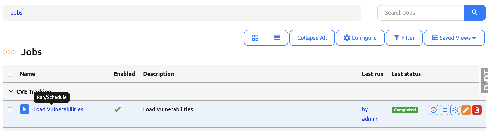
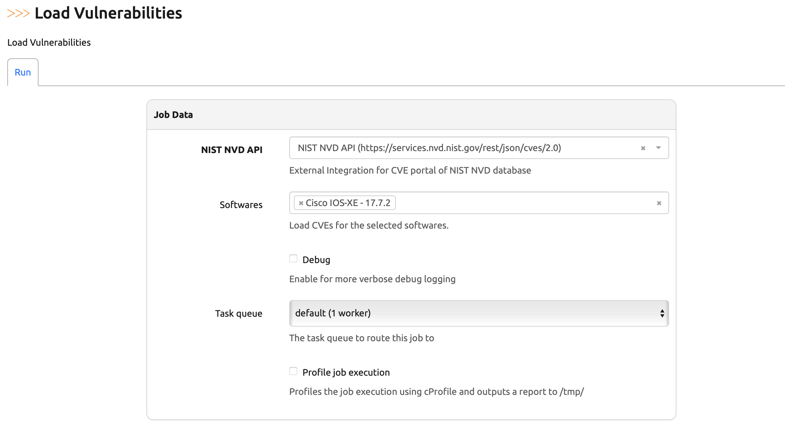
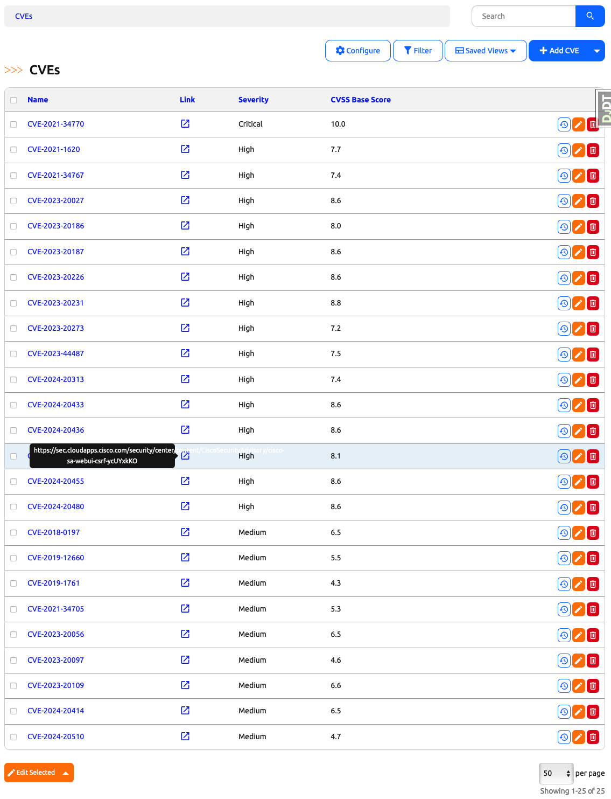

# Capstone Project Part 13. Day 92: Refactor the CVE Loader Job to Populate the New CVE Model

## ✅ Objective

On **Day 92**, we'll refactor the CVE loader job we created earlier to store CVE data in our **custom Nautobot model** (`CVE`) instead of in a custom JSON field.

By now, you should already have the `CVE` model implemented and integrated with the Nautobot UI (see Day 91). Today’s focus is updating the job to use this model properly.


## 🛠️ Why Refactor the Job?

In the original implementation, CVEs were stored in a JSON custom field like this:

```json
{
    "CVE-2023-1234": {
        "cvss_base_score": 9.8,
        "link": "https://example.com/CVE-2023-1234",
        "severity": "Critical"
    }
}
```

Now that we have a proper model for CVEs, it’s time to populate data into the `CVE` table and take full advantage of Nautobot’s relational database support and UI integrations.

## 🔄 Refactoring the Job Code

The major changes include:

- Remove logic that adds data to the JSON custom field.
- Instantiate a `CVE` object per vulnerability.
- Link each CVE to its associated `SoftwareVersion` using the many-to-many relationship.


## 📦 Updated Job Code

```python
"""
Module for managing CVEs in Nautobot using NIST NVD API.

This module defines a job for loading CVEs into Nautobot's database.
"""

import requests

from nautobot.apps.jobs import BooleanVar, Job, ObjectVar, MultiObjectVar, register_jobs
from nautobot.extras.models import ExternalIntegration
from nautobot.dcim.models.devices import SoftwareVersion, SoftwareVersionQuerySet
from nautobot_software_cves.models import CVE

name = "CVE Tracking"


class LoadCVEsJob(Job):
    nist_external_integration = ObjectVar(
        model=ExternalIntegration,
        label="NIST NVD API",
        description="External Integration for CVE portal of NIST NVD database",
        required=True,
    )
    softwares = MultiObjectVar(
        model=SoftwareVersion,
        label="Softwares",
        description="Load CVEs for the selected softwares.",
        required=False
    )
    debug = BooleanVar(description="Enable for more verbose debug logging")

    class Meta:
        name = "Load Vulnerabilities"
        description = "Load Vulnerabilities"
        has_sensitive_variables = False
        hidden = False

    def run(
        self,
        nist_external_integration: ExternalIntegration = None,
        softwares: SoftwareVersionQuerySet = None,
        debug: bool = False,
    ):
        self.logger.setLevel("DEBUG" if debug else "INFO")

        if not softwares:
            softwares = SoftwareVersion.objects.all()

        for software in softwares:
            self.logger.info("Loading CVEs from NIST NVD Database", extra={"object": software})

            software_version = software.version
            cpe_name = f"cpe:2.3:o:cisco:ios_xe:{software_version}:*:*:*:*:*:*:*"
            url = nist_external_integration.remote_url
            params = {"cpeName": cpe_name}
            headers = nist_external_integration.headers
            timeout = nist_external_integration.timeout
            http_method = nist_external_integration.http_method

            try:
                response = requests.request(
                    method=http_method,
                    url=url,
                    headers=headers,
                    params=params,
                    timeout=timeout
                )
                response.raise_for_status()
                data = response.json()
                self.logger.debug(f"NVD Response: {data}")
                vulnerabilities = data.get('vulnerabilities', [])
            except Exception as e:
                self.logger.error(f"Unexpected error: {e}")
                vulnerabilities = []

            for cve in vulnerabilities:
                cve_name = cve['cve']['id']
                self.logger.info(f"Loading CVE {cve_name}", extra={"object": software})

                cvss_versions = ['cvssMetricV32', 'cvssMetricV31', 'cvssMetricV30']
                cvss_version = next(version for version in cvss_versions if version in cve['cve']['metrics'])
                # software.custom_field_data['cves'][cve_name] = {
                #     "cvss_base_score": cve['cve']['metrics'][cvss_version][0]['cvssData']['baseScore'],
                #     "link": cve['cve']['references'][0]['url'],
                #     "severity": cve['cve']['metrics'][cvss_version][0]['cvssData']['baseSeverity'],
                # }
                # software.validated_save()
                cve_obj, created = CVE.objects.get_or_create(
                    name = cve_name,
                    defaults = {
                        'cvss' : cve['cve']['metrics'][cvss_version][0]['cvssData']['baseScore'],
                        'severity' : cve['cve']['metrics'][cvss_version][0]['cvssData']['baseSeverity'].capitalize(),
                        'link' : cve['cve']['references'][0]['url'],
                    }
                )
                cve_obj.affected_softwares.add(software)


jobs = [LoadCVEsJob]
register_jobs(*jobs)
```

---

## 🧪 Verification Steps

After implementing the changes, let’s verify that the new model is correctly populated:

1. Stop nautobot and run `invoke debug`.
2. Navigate to **Jobs** in the Nautobot UI.
3. Find the **Load Vulnerabilities** job under **CVE Tracking**.
   
4. Run the job with your **NIST NVD External Integration** selected.
   
5. After the job completes:
   - Navigate to **CVE TRACKING → CVEs** in the Nautobot UI.
   - You should see the populated CVEs listed.
   - Click on any CVE to view its details (CVSS, Severity, Link, Affected Software Versions).
  

## ✅ Outcome

You’ve now successfully:

- Refactored the CVE loader job to write to a custom model.
- Linked CVEs to software versions using a proper many-to-many relationship.
- Verified the changes in the UI.
