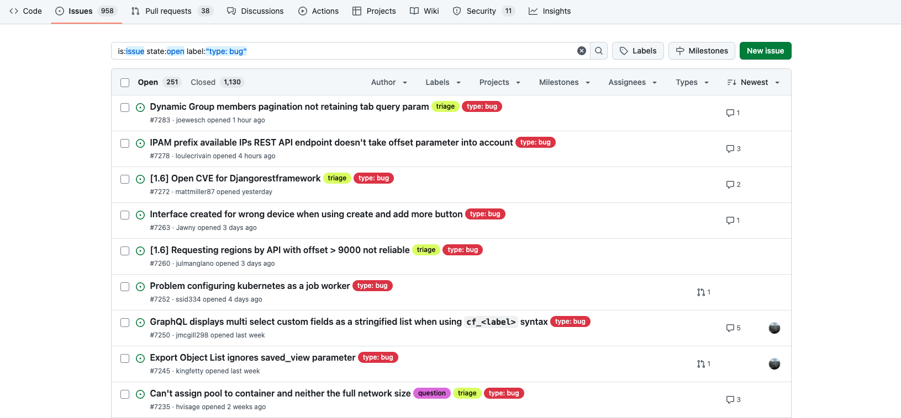

# Day 94: Nautobot Best Practices for Code Contribution

## Objective
Welcome to Day 94! Today we will discuss best practices for contributing code to the Nautobot project.

## Community Contribution in Nautobot

Nautobot thrives on community-driven development as a Free Open Source Software (FOSS) supported by [Network to Code (NTC)](https://www.networktocode.com). Engaging with the community through contribution is both encouraged and valuable. As a matter of fact, the "100 Days of Nautobot" project is a community engagement project from the start.  

As someone who have been working on Nautobot code for the last 90+ days, taking the next step of contributing code would be a great next step. This can be working in conjunction with your own project. While working on your project, you might discover a bug, missing features, or a better way to accomplish intended goals, they are all great points for code contribution to the Nautobot project. 

Here are practical guidelines and best practices for making impactful contribution to Nautobot. 

## Communication Platforms

1. Slack:

    - Engage in the #nautobot channel on [Network to Code Slack](https://slack.networktocode.com/) for real-time discussions.
    - Limit discussions on transient topics, as chat history isn't permanently saved.

2. GitHub:

    - Use [Nautobot GitHub repository](https://github.com/nautobot/) for changes like feature requests or bug reports.
    - Participate in GitHub discussions for general inquiries and refining feature requests before submission.

## Bug Reporting Process

1. Check Version:

    - Ensure you're operating on the latest stable version to avoid reporting already resolved issues.

2. Existing Issues Review:

    - Examine the GitHub issues list for existing reports on your bug. If found, react and comment on its impact on your setup.

3. [Issue Submission](https://github.com/nautobot/nautobot/issues):

    - When reporting a new bug, include:
        - **Include stack traces, if any**
        - Environment details
        - Steps to reproduce the issue
        - Expected vs. actual behavior
        - Screenshots and error messages

## Feature Request Guidelines

1. Review Existing Requests:

    - Read the GitHub issues list and Discussions for similar requests. Engage and add justification if applicable.

2. Initiate a Discussion:

    - If there is no existing discussion, start one with GitHub Discussion to validate and refine the proposal before formal submission.

3. Feature Request Submission:

    - Provide details such as:
        - Proposed functionality
        - Use case
        - Necessary changes to database schema (if any)
        - Involved third-party libraries

## Pull Request Process

Please reference [Submitting Pull Requests](https://docs.nautobot.com/projects/core/en/stable/development/core/#submitting-pull-requests). 

1. Start with an Issue:

    - Prioritize opening an issue to discuss ideas with maintainers and avoid redundant efforts.

2. [Fork the repoisitory](https://github.com/nautobot/nautobot/blob/develop/nautobot/docs/development/core/getting-started.md#forking-the-repo)

    - When developing Nautobot or other project, it is a good idea to work on your own fork for local development. 

3. Develop on a Feature Branch:

    - Create a feature branch with a descriptive name (e.g., feature/add-new-feature).

4. Coding Practices:

    - Adhere to coding standards, provide clear docstrings, and add meaningful comments.
    - Please reference Nautobot [Style Guide](https://github.com/nautobot/nautobot/blob/develop/nautobot/docs/development/core/style-guide.md) and [Best Practices](https://github.com/nautobot/nautobot/blob/develop/nautobot/docs/development/core/best-practices.md).

5. Testing:

    - Develop unit tests for your enhancement or fix and make sure all tests pass.

6. Documentation Updates:

    - Edit documentation to incorporate new changes and observe style guidelines.

7. Changelog:

    - Draft a changelog for your update. Follow existing formats, please reference document [Creating Changelog Fraements](https://docs.nautobot.com/projects/core/en/stable/development/core/#creating-changelog-fragments).

8. Open a Pull Request:

    - Document your pull request thoroughly, ensuring it includes tests and meets all guidelines.

## Resources
- [Nautobot Documentation](https://docs.nautobot.com/)
- [Nautobot GitHub Repository](https://github.com/nautobot/nautobot)

## Day 94 To Do 

How's it going on your own project, feel free to post something about your own project! 

Alternatively for the to-do, read through one of the following: Nautobot Issues, roadmap, release schedule, and comment on an issue you feel strongly about on a social media of your choice. Make sure you use the tag `#100DaysOfNautobot` `#JobsToBeDone` and tag `@networktocode`, so we can share your progress! 

In tomorrow's challenge, we will be discussing Nautobot Governance. See you tomorrow! 

[X/Twitter](<https://twitter.com/intent/tweet?url=https://github.com/nautobot/100-days-of-nautobot&text=I+jst+completed+Day+94+of+the+100+days+of+nautobot+challenge+!&hashtags=100DaysOfNautobot,JobsToBeDone>)

[LinkedIn](https://www.linkedin.com/) (Copy & Paste: I just completed Day 94 of 100 Days of Nautobot, https://github.com/nautobot/100-days-of-nautobot, challenge! @networktocode #JobsToBeDone #100DaysOfNautobot) 